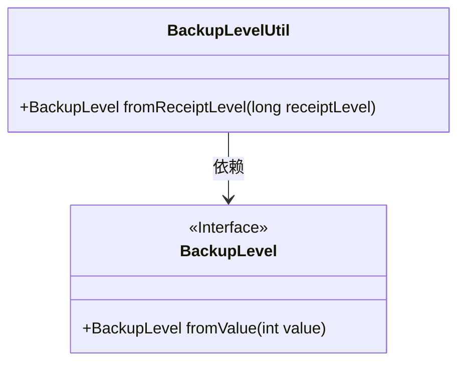
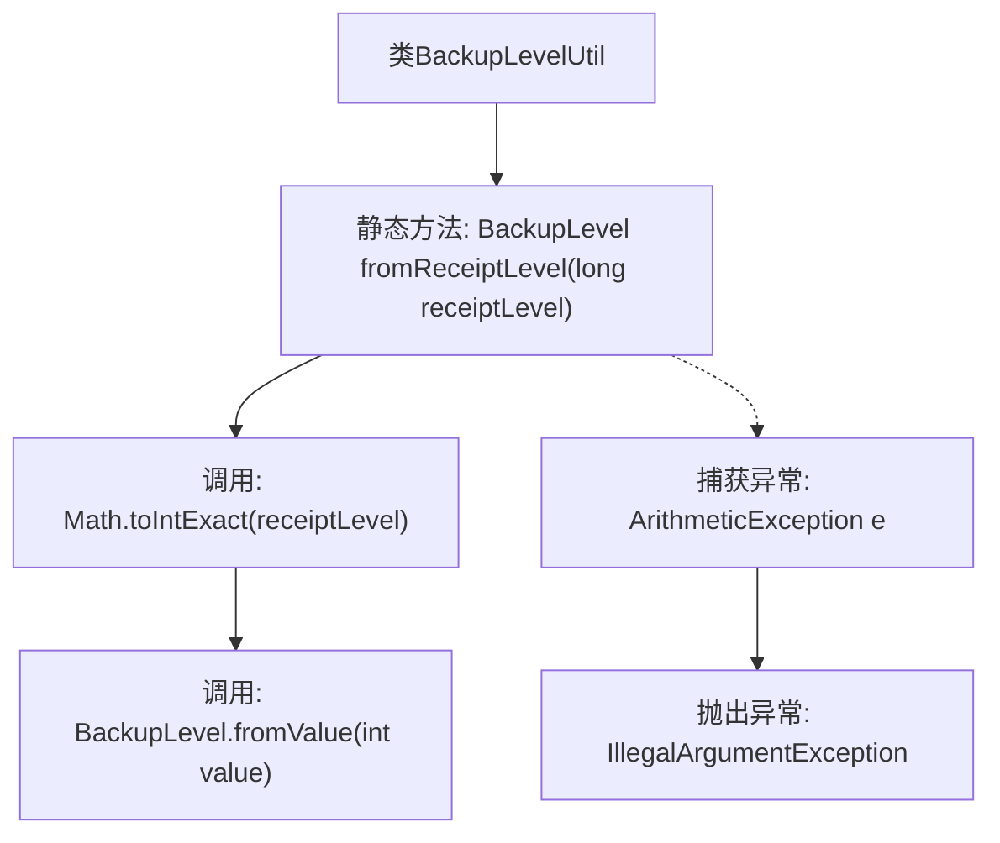

# 基础信息

|      |      |
|------|------|
| 名称 | BackupLevelUtil |
| 编码语言 | .java |
| 代码路径 | Signal-Server/service/src/main/java/org/whispersystems/textsecuregcm/backup/BackupLevelUtil.java |
| 包名 | org.whispersystems.textsecuregcm.backup |
| 依赖项 | ['org.signal.libsignal.zkgroup.backups.BackupLevel'] |
| 概述说明 | BackupLevelUtil类将receiptLevel转换为BackupLevel，溢出时抛出异常。 |

# 说明

BackupLevelUtil类负责将长整型receiptLevel转换为BackupLevel类型。在进行转换时，如果receiptLevel的值超出BackupLevel类型的范围，即发生溢出情况，该类会抛出异常以确保数据的有效性和安全性。

# 类列表 Class Summary

| 名称   | 类型  | 说明 |
|-------|------|-------------|
| BackupLevelUtil | class | BackupLevelUtil类将长整型receiptLevel转换为BackupLevel，若溢出则抛出异常。 |

## 类 BackupLevelUtil

|      |      |
|------|------|
| 访问范围 | public |
| 类型 | class |
| 名称 | BackupLevelUtil |
| 说明 | BackupLevelUtil类将长整型receiptLevel转换为BackupLevel，若溢出则抛出异常。 |

### UML类图

这段代码定义了一个名为 `BackupLevelUtil` 的工具类，其中包含一个静态方法 `fromReceiptLevel`，用于将 `long` 类型的 `receiptLevel` 转换为 `BackupLevel` 类型。方法内部通过调用 `BackupLevel.fromValue` 方法进行转换，并在转换过程中捕获可能的 `ArithmeticException` 异常，如果发生异常则抛出 `IllegalArgumentException`。`BackupLevel` 是一个接口，定义了 `fromValue` 方法，用于从 `int` 值生成 `BackupLevel` 实例。

### 内部方法调用关系图

这段代码定义了一个名为 `BackupLevelUtil` 的类，其中包含一个静态方法 `fromReceiptLevel`。该方法接收一个 `long` 类型的参数 `receiptLevel`，并尝试将其转换为 `int` 类型，然后调用 `BackupLevel.fromValue` 方法。如果转换过程中发生溢出（即 `ArithmeticException`），则抛出 `IllegalArgumentException` 异常，提示无效的 `receiptLevel`。流程图清晰地展示了方法的执行流程及异常处理路径。

### 字段列表 Field List

| 名称  | 类型  | 说明 |
|-------|-------|------|

### 方法列表 Method List

| 名称  | 类型  | 说明 |
|-------|-------|------|
| fromReceiptLevel | BackupLevel | 将收据级别转换为备份级别，若无效则抛出异常。 |

