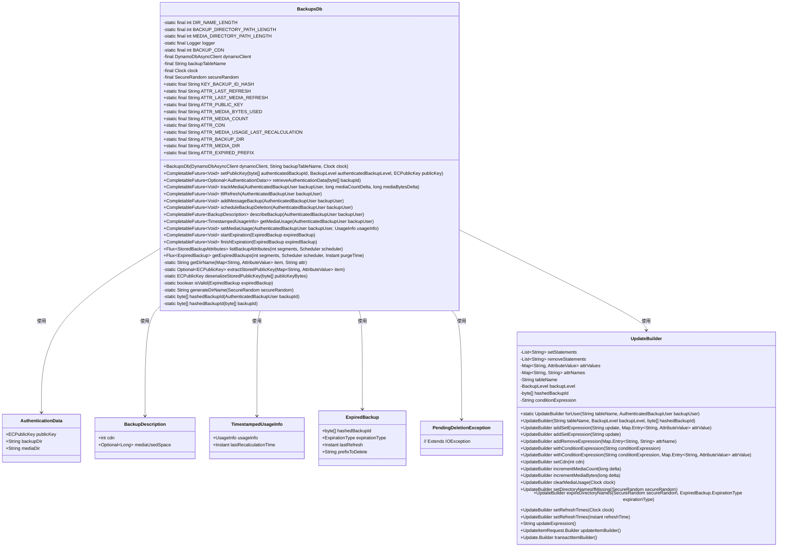

# 基础信息

|      |      |
|------|------|
| 名称 | BackupsDb |
| 编码语言 | .java |
| 代码路径 | Signal-Server/service/src/main/java/org/whispersystems/textsecuregcm/backup/BackupsDb.java |
| 包名 | org.whispersystems.textsecuregcm.backup |
| 依赖项 | ['io.grpc.Status', 'java.io.IOException', 'java.security.MessageDigest', 'java.security.NoSuchAlgorithmException', 'java.security.SecureRandom', 'java.time.Clock', 'java.time.Instant', 'java.util.ArrayList', 'java.util.Arrays', 'java.util.Base64', 'java.util.HashMap', 'java.util.HexFormat', 'java.util.List', 'java.util.Map', 'java.util.Optional', 'java.util.concurrent.CompletableFuture', 'java.util.function.Predicate', 'org.signal.libsignal.protocol.InvalidKeyException', 'org.signal.libsignal.protocol.ecc.ECPublicKey', 'org.signal.libsignal.zkgroup.backups.BackupLevel', 'org.slf4j.Logger', 'org.slf4j.LoggerFactory', 'org.whispersystems.textsecuregcm.auth.AuthenticatedBackupUser', 'org.whispersystems.textsecuregcm.util.AttributeValues', 'org.whispersystems.textsecuregcm.util.ExceptionUtils', 'org.whispersystems.textsecuregcm.util.Util', 'reactor.core.publisher.Flux', 'reactor.core.scheduler.Scheduler', 'software.amazon.awssdk.core.SdkBytes', 'software.amazon.awssdk.services.dynamodb.DynamoDbAsyncClient', 'software.amazon.awssdk.services.dynamodb.model.AttributeValue', 'software.amazon.awssdk.services.dynamodb.model.ConditionalCheckFailedException', 'software.amazon.awssdk.services.dynamodb.model.DeleteItemRequest', 'software.amazon.awssdk.services.dynamodb.model.GetItemRequest', 'software.amazon.awssdk.services.dynamodb.model.ScanRequest', 'software.amazon.awssdk.services.dynamodb.model.Update', 'software.amazon.awssdk.services.dynamodb.model.UpdateItemRequest'] |
| 概述说明 | BackupsDb类负责管理备份数据库操作，涵盖公钥设置、认证数据检索、媒体跟踪及备份删除。 |

# 说明

BackupsDb类负责管理备份数据库的各种操作，主要功能包括设置公钥、检索认证数据、跟踪媒体信息以及删除备份等。该类提供了一套完整的方法来确保备份数据库的安全性和高效管理，涵盖了从数据验证到存储清理的关键环节。

# 类列表 Class Summary

| 名称   | 类型  | 说明 |
|-------|------|-------------|
| BackupsDb | class | BackupsDb类管理备份数据库操作，包括公钥设置、认证数据检索、媒体跟踪、备份删除等。 |

## 类 BackupsDb

|      |      |
|------|------|
| 访问范围 | public |
| 类型 | class |
| 名称 | BackupsDb |
| 说明 | BackupsDb类管理备份数据库操作，包括公钥设置、认证数据检索、媒体跟踪、备份删除等。 |

### UML类图

### 描述
`BackupsDb` 类是一个用于管理备份数据的类，主要功能包括设置公钥、检索认证数据、跟踪媒体使用情况、刷新TTL、添加消息备份、调度备份删除、描述备份、获取媒体使用信息、设置媒体使用信息、启动和完成备份过期等操作。它依赖于 `DynamoDbAsyncClient` 来与 DynamoDB 进行异步交互，并通过 `UpdateBuilder` 类构建更新请求。`BackupsDb` 类还定义了多个内部类，如 `AuthenticationData`、`BackupDescription`、`TimestampedUsageInfo` 和 `ExpiredBackup`，用于封装和管理备份相关的数据。

### 内部方法调用关系图

这段代码定义了一个名为 `BackupsDb` 的类，用于管理与备份相关的数据库操作。类中包含多个常量、属性和方法，用于处理备份数据的存储、更新、删除和查询等操作。类中还定义了两个内部类 `UpdateBuilder` 和 `PendingDeletionException`，分别用于构建数据库更新请求和处理删除操作的异常。代码通过 `DynamoDbAsyncClient` 与 DynamoDB 进行异步交互，支持备份数据的多种操作，如设置公钥、更新媒体使用量、刷新 TTL、描述备份信息等。

### 字段列表 Field List

| 名称  | 类型  | 说明 |
|-------|-------|------|
| dynamoClient | DynamoDbAsyncClient | 私有异步DynamoDB客户端实例。 |
| secureRandom | SecureRandom | 私有且不可变的SecureRandom对象实例。 |
| BACKUP_DIRECTORY_PATH_LENGTH = DIR_NAME_LENGTH | int | 备份目录路径长度与目录名称长度相同。 |
| BACKUP_CDN = 3 | int | 定义静态常量BACKUP_CDN，值为3。 |
| ATTR_LAST_REFRESH = "R" | String | 定义常量ATTR_LAST_REFRESH，值为"R"。 |
| ATTR_EXPIRED_PREFIX = "EP" | String | 定义常量字符串ATTR_EXPIRED_PREFIX值为"EP"。 |
| ATTR_MEDIA_COUNT = "MC" | String | 定义常量ATTR_MEDIA_COUNT，值为"MC"。 |
| MEDIA_DIRECTORY_PATH_LENGTH = BACKUP_DIRECTORY_PATH_LENGTH + "/".length() + DIR_NAME_LENGTH | int | 媒体目录路径长度为备份目录路径长度加斜杠长度加目录名长度。 |
| ATTR_LAST_MEDIA_REFRESH = "MR" | String | 常量ATTR_LAST_MEDIA_REFRESH定义为"MR"。 |
| ATTR_CDN = "CDN" | String | 定义常量字符串ATTR_CDN，值为"CDN"。 |
| DIR_NAME_LENGTH = generateDirName(new SecureRandom()).length() | int | 定义常量DIR_NAME_LENGTH为随机生成目录名的长度。 |
| clock | Clock | 定义了一个私有且不可变的Clock类型变量clock。 |
| backupTableName | String | 定义了一个私有不可变的字符串变量backupTableName。 |
| logger = LoggerFactory.getLogger(BackupsDb.class) | Logger | BackupsDb类中定义了一个静态日志记录器logger。 |
| ATTR_MEDIA_DIR = "MD" | String | 定义常量字符串ATTR_MEDIA_DIR，值为"MD"。 |
| ATTR_BACKUP_DIR = "BD" | String | 定义静态常量ATTR_BACKUP_DIR，值为"BD"。 |
| KEY_BACKUP_ID_HASH = "U" | String | 定义常量字符串KEY_BACKUP_ID_HASH，值为"U"。 |
| ATTR_MEDIA_USAGE_LAST_RECALCULATION = "MBTS" | String | 定义常量ATTR_MEDIA_USAGE_LAST_RECALCULATION值为MBTS。 |
| ATTR_MEDIA_BYTES_USED = "MB" | String | 定义常量ATTR_MEDIA_BYTES_USED，值为"MB"。 |
| ATTR_PUBLIC_KEY = "P" | String | 定义了一个名为ATTR_PUBLIC_KEY的静态常量字符串，值为"P"。 |

### 方法列表 Method List

| 名称  | 类型  | 说明 |
|-------|-------|------|
| getDirName | String | 私有方法获取目录名，若无则抛异常。 |
| hashedBackupId | byte[] | 静态方法生成备份ID的哈希值。 |
| isValid | boolean | 验证过期备份前缀长度是否符合特定路径长度要求。 |
| hashedBackupId | byte[] | 使用SHA-256哈希算法处理备份ID并截取前16字节。 |
| extractStoredPublicKey | Optional<ECPublicKey> | 从Map中提取并反序列化存储的公钥。 |
| ttlRefresh | CompletableFuture<Void> | 更新用户备份TTL并返回空结果。 |
| deserializeStoredPublicKey | ECPublicKey | 方法反序列化公钥，失败时记录错误并抛出异常。 |
| startExpiration | CompletableFuture<Void> | 根据过期备份类型更新或删除CDN数据。 |
| getExpiredBackups | Flux<ExpiredBackup> | 获取过期备份数据，过滤无效项并返回有效备份信息。 |
| trackMedia | CompletableFuture<Void> | 更新用户媒体配额和TTL，记录媒体数量和字节变化。 |
| setMediaUsage | CompletableFuture<Void> | 更新用户媒体使用信息并返回CompletableFuture。 |
| generateDirName | String | 生成16字节随机数，Base64编码后返回无填充目录名。 |
| listBackupAttributes | Flux<StoredBackupAttributes> | 方法检查段数，并行扫描DynamoDB表，过滤并映射备份属性。 |
| retrieveAuthenticationData | CompletableFuture<Optional<AuthenticationData>> | 通过备份ID从DynamoDB获取认证数据并返回包含公钥和目录信息的Optional对象。 |
| finishExpiration | CompletableFuture<Void> | 根据过期备份类型删除或更新DynamoDB表中的记录。 |
| getMediaUsage | CompletableFuture<TimestampedUsageInfo> | 通过DynamoDB查询获取用户媒体使用信息并返回时间戳数据。 |
| addMessageBackup | CompletableFuture<Void> | 异步更新用户备份信息，设置刷新时间和CDN，最终执行空操作。 |
| describeBackup | CompletableFuture<BackupDescription> | 该方法通过DynamoDB获取备份描述，若未找到则抛出异常，返回CDN和媒体使用量信息。 |
| setPublicKey | CompletableFuture<Void> | 方法`setPublicKey`更新DynamoDB中的公钥，确保备份目录存在，并处理公钥冲突。 |
| scheduleBackupDeletion | CompletableFuture<Void> | 方法`scheduleBackupDeletion`用于计划备份删除，更新DynamoDB记录，处理异常并抛出待删除异常。 |

