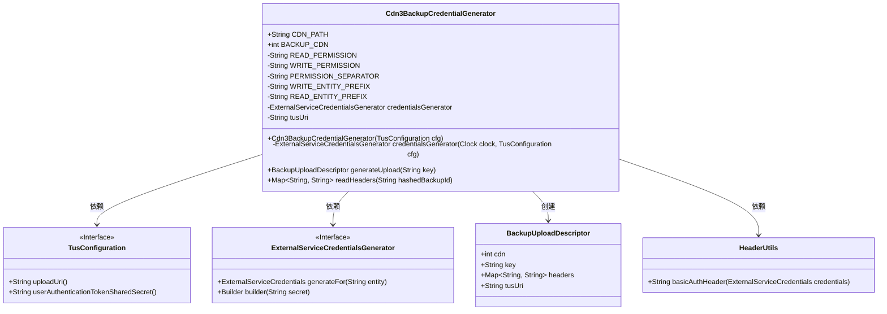

# 基础信息

|      |      |
|------|------|
| 名称 | Cdn3BackupCredentialGenerator |
| 编码语言 | .java |
| 代码路径 | Signal-Server/service/src/main/java/org/whispersystems/textsecuregcm/backup/Cdn3BackupCredentialGenerator.java |
| 包名 | org.whispersystems.textsecuregcm.backup |
| 依赖项 | ['org.apache.http.HttpHeaders', 'org.whispersystems.textsecuregcm.attachments.TusConfiguration', 'org.whispersystems.textsecuregcm.auth.ExternalServiceCredentials', 'org.whispersystems.textsecuregcm.auth.ExternalServiceCredentialsGenerator', 'org.whispersystems.textsecuregcm.util.HeaderUtils', 'java.nio.charset.StandardCharsets', 'java.time.Clock', 'java.util.Base64', 'java.util.Map'] |
| 概述说明 | Cdn3BackupCredentialGenerator类生成CDN备份凭证，支持读写权限和上传描述符。 |

# 说明

Cdn3BackupCredentialGenerator类主要用于生成CDN备份凭证，具备配置读写权限和生成上传描述符的功能。该类通过权限设置确保凭证的安全性，并通过生成描述符简化上传流程，确保备份操作的顺利进行。

# 类列表 Class Summary

| 名称   | 类型  | 说明 |
|-------|------|-------------|
| Cdn3BackupCredentialGenerator | class | Cdn3BackupCredentialGenerator类用于生成CDN备份凭证，包含读写权限配置和上传描述符生成功能。 |

## 类 Cdn3BackupCredentialGenerator

|      |      |
|------|------|
| 访问范围 | public |
| 类型 | class |
| 名称 | Cdn3BackupCredentialGenerator |
| 说明 | Cdn3BackupCredentialGenerator类用于生成CDN备份凭证，包含读写权限配置和上传描述符生成功能。 |

### UML类图

### 描述
`Cdn3BackupCredentialGenerator`类用于生成备份上传凭证和读取头信息。它依赖于`TusConfiguration`接口获取配置信息，并通过`ExternalServiceCredentialsGenerator`生成凭证。`generateUpload`方法生成包含授权头信息和上传元数据的`BackupUploadDescriptor`对象，而`readHeaders`方法生成读取备份所需的授权头信息。`HeaderUtils`类用于生成基本的授权头信息。

### 内部方法调用关系图

这段代码定义了一个名为 `Cdn3BackupCredentialGenerator` 的类，用于生成备份上传的描述符和读取头信息。类中包含常量、变量、构造方法和两个主要方法 `generateUpload` 和 `readHeaders`。`generateUpload` 方法生成上传描述符，包括权限、编码后的密钥和头信息，而 `readHeaders` 方法生成读取头信息。整个过程涉及权限字符串的拼接、凭证的生成以及头信息的构建。

### 字段列表 Field List

| 名称  | 类型  | 说明 |
|-------|-------|------|
| BACKUP_CDN = 3 | int | BACKUP_CDN是一个值为3的静态常量。 |
| tusUri | String | 私有不可变的字符串变量tusUri。 |
| READ_PERMISSION = "read" | String | 定义了一个私有的静态字符串常量，值为"read"。 |
| CDN_PATH = "backups" | String | CDN路径设置为backups。 |
| WRITE_PERMISSION = "write" | String | 定义私有静态字符串常量WRITE_PERMISSION，值为"write"。 |
| credentialsGenerator | ExternalServiceCredentialsGenerator | 私有且不可变的凭证生成器实例。 |
| PERMISSION_SEPARATOR = "$" | String | 定义私有静态字符串常量PERMISSION_SEPARATOR，值为"$"。 |
| READ_ENTITY_PREFIX = String.format("%s%s%s/", READ_PERMISSION, PERMISSION_SEPARATOR,      CDN_PATH) | String | 定义私有静态字符串常量，用于拼接读取权限和CDN路径前缀。 |
| WRITE_ENTITY_PREFIX = String.format("%s%s%s/", WRITE_PERMISSION, PERMISSION_SEPARATOR,      CDN_PATH) | String | 定义静态字符串常量WRITE_ENTITY_PREFIX，由WRITE_PERMISSION、PERMISSION_SEPARATOR和CDN_PATH拼接而成。 |

### 方法列表 Method List

| 名称  | 类型  | 说明 |
|-------|-------|------|
| credentialsGenerator | ExternalServiceCredentialsGenerator | 静态方法生成外部服务凭证，使用时钟和配置构建。 |
| readHeaders | Map<String, String> | 读取指定哈希备份ID的请求头信息，需非空。 |
| generateUpload | BackupUploadDescriptor | 生成上传描述符，验证非空密钥，生成凭证和请求头，返回上传描述符。 |

