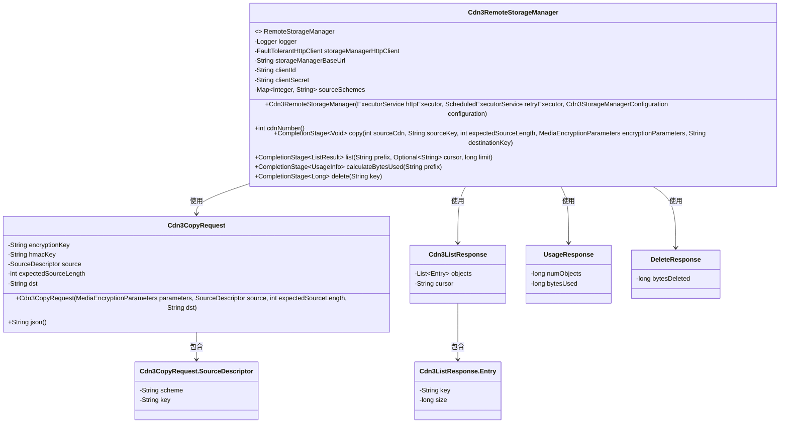

# 基础信息

|      |      |
|------|------|
| 名称 | Cdn3RemoteStorageManager |
| 编码语言 | .java |
| 代码路径 | Signal-Server/service/src/main/java/org/whispersystems/textsecuregcm/backup/Cdn3RemoteStorageManager.java |
| 包名 | org.whispersystems.textsecuregcm.backup |
| 依赖项 | ['com.fasterxml.jackson.core.JsonProcessingException', 'io.micrometer.core.instrument.Metrics', 'io.micrometer.core.instrument.Timer', 'jakarta.validation.constraints.NotNull', 'jakarta.ws.rs.core.Response', 'java.io.IOException', 'java.io.InputStream', 'java.net.URI', 'java.net.http.HttpClient', 'java.net.http.HttpRequest', 'java.net.http.HttpResponse', 'java.time.Duration', 'java.util.ArrayList', 'java.util.Base64', 'java.util.HashMap', 'java.util.List', 'java.util.Map', 'java.util.Optional', 'java.util.concurrent.CompletableFuture', 'java.util.concurrent.CompletionStage', 'java.util.concurrent.ExecutorService', 'java.util.concurrent.ScheduledExecutorService', 'javax.annotation.Nullable', 'org.apache.commons.lang3.StringUtils', 'org.slf4j.Logger', 'org.slf4j.LoggerFactory', 'org.whispersystems.textsecuregcm.configuration.Cdn3StorageManagerConfiguration', 'org.whispersystems.textsecuregcm.http.FaultTolerantHttpClient', 'org.whispersystems.textsecuregcm.metrics.MetricsUtil', 'org.whispersystems.textsecuregcm.util.ExceptionUtils', 'org.whispersystems.textsecuregcm.util.HttpUtils', 'org.whispersystems.textsecuregcm.util.SystemMapper'] |
| 概述说明 | Cdn3RemoteStorageManager实现远程存储管理，支持复制、列表、统计和删除操作，使用HTTP通信。 |

# 说明

Cdn3RemoteStorageManager是一个用于远程存储管理的实现，支持多种操作，包括复制、列表、使用统计和删除。该管理器通过HTTP客户端与远程存储进行通信，确保各项操作能够顺利执行。其主要功能涵盖了存储资源的管理和监控，提供了一种高效的方式来处理远程存储任务。

# 类列表 Class Summary

| 名称   | 类型  | 说明 |
|-------|------|-------------|
| Cdn3RemoteStorageManager | class | Cdn3RemoteStorageManager实现远程存储管理，支持复制、列表、使用统计和删除操作，使用HTTP客户端进行通信。 |

## 类 Cdn3RemoteStorageManager

|      |      |
|------|------|
| 访问范围 | public |
| 类型 | class |
| 名称 | Cdn3RemoteStorageManager |
| 说明 | Cdn3RemoteStorageManager实现远程存储管理，支持复制、列表、使用统计和删除操作，使用HTTP客户端进行通信。 |

### UML类图

该类图展示了 `Cdn3RemoteStorageManager` 类及其相关内部类和接口的关系。`Cdn3RemoteStorageManager` 实现了 `RemoteStorageManager` 接口，负责与远程存储管理器的交互。它包含多个私有成员和方法，用于处理复制、列表、计算使用量和删除操作。内部类 `Cdn3CopyRequest`、`Cdn3ListResponse`、`UsageResponse` 和 `DeleteResponse` 用于序列化和反序列化请求和响应数据。

### 内部方法调用关系图

```mermaid
graph TD
    A["类Cdn3RemoteStorageManager"]
    B["属性: Logger logger"]
    C["属性: FaultTolerantHttpClient storageManagerHttpClient"]
    D["属性: String storageManagerBaseUrl"]
    E["属性: String clientId"]
    F["属性: String clientSecret"]
    G["属性: Map<Integer, String> sourceSchemes"]
    H["构造方法: Cdn3RemoteStorageManager(ExecutorService, ScheduledExecutorService, Cdn3StorageManagerConfiguration)"]
    I["方法: int cdnNumber()"]
    J["方法: CompletionStage<Void> copy(int, String, int, MediaEncryptionParameters, String)"]
    K["方法: CompletionStage<ListResult> list(String, Optional<String>, long)"]
    L["方法: CompletionStage<UsageInfo> calculateBytesUsed(String)"]
    M["方法: CompletionStage<Long> delete(String)"]
    N["方法: String deleteUrl(String)"]
    O["方法: String usageUrl()"]
    P["方法: String listUrl()"]
    Q["方法: String copyUrl()"]
    R["内部类: Cdn3CopyRequest"]
    S["内部类: Cdn3ListResponse"]
    T["内部类: UsageResponse"]
    U["内部类: DeleteResponse"]

    A --> B
    A --> C
    A --> D
    A --> E
    A --> F
    A --> G
    A --> H
    A --> I
    A --> J
    A --> K
    A --> L
    A --> M
    A --> N
    A --> O
    A --> P
    A --> Q
    A -.-> R
    A -.-> S
    A -.-> T
    A -.-> U
```

这段代码定义了一个名为 `Cdn3RemoteStorageManager` 的类，用于管理与 CDN3 存储管理器的交互。该类包含多个属性，如 `storageManagerHttpClient`、`storageManagerBaseUrl` 等，以及多个方法，如 `copy`、`list`、`calculateBytesUsed` 和 `delete`，用于执行不同的操作。代码还包含多个内部类，如 `Cdn3CopyRequest`、`Cdn3ListResponse` 等，用于序列化请求和响应。整体结构清晰，功能明确，适用于处理与 CDN3 存储管理器的各种交互任务。

### 字段列表 Field List

| 名称  | 类型  | 说明 |
|-------|-------|------|
| STORAGE_MANAGER_STATUS_COUNTER_NAME = MetricsUtil.name(Cdn3RemoteStorageManager.class,      "storageManagerStatus") | String | 定义存储管理器状态计数器名称的静态常量。 |
| storageManagerBaseUrl | String | 私有字符串变量存储管理基础URL。 |
| clientId | String | 声明了一个私有且不可变的字符串变量clientId。 |
| OPERATION_TAG_NAME = "op" | String | 定义私有静态常量OPERATION_TAG_NAME，值为"op"。 |
| CLIENT_SECRET_HEADER = "CF-Access-Client-Secret" | String | 客户端密钥头标识为CF-Access-Client-Secret。 |
| sourceSchemes | Map<Integer, String> | 私有不可变的整数到字符串映射变量sourceSchemes。 |
| logger = LoggerFactory.getLogger(Cdn3RemoteStorageManager.class) | Logger | Cdn3RemoteStorageManager类中定义了一个静态日志记录器。 |
| storageManagerHttpClient | FaultTolerantHttpClient | 私有不可变的容错HTTP客户端存储管理器。 |
| clientSecret | String | 声明了一个私有的不可变字符串变量clientSecret。 |
| STATUS_TAG_NAME = "status" | String | 定义了一个私有静态常量字符串变量，命名为STATUS_TAG_NAME，其值为"status"。 |
| STORAGE_MANAGER_TIMER_NAME = MetricsUtil.name(Cdn3RemoteStorageManager.class,      "storageManager") | String | 定义私有静态常量STORAGE_MANAGER_TIMER_NAME，用于CDN3远程存储管理器的计时器名称。 |
| CLIENT_ID_HEADER = "CF-Access-Client-Id" | String | 定义静态常量CLIENT_ID_HEADER，值为"CF-Access-Client-Id"。 |

### 方法列表 Method List

| 名称  | 类型  | 说明 |
|-------|-------|------|
| delete | CompletionStage<Long> | 异步删除指定键，发送HTTP请求并处理响应。 |
| usageUrl | String | 方法返回格式化后的使用情况URL。 |
| cdnNumber | int | 该方法返回CDN数量为3。 |
| listUrl | String | 生成私有方法，返回格式化后的URL路径。 |
| deleteUrl | String | 该方法生成删除URL，拼接基础URL、CDN路径和键值。 |
| calculateBytesUsed | CompletionStage<UsageInfo> | 异步计算指定前缀的字节使用量，记录请求状态和耗时。 |
| copyUrl | String | 该方法返回格式化后的复制URL，基于storageManagerBaseUrl拼接。 |
| parseDeleteResponse | long | 解析删除响应，检查状态码，失败则抛异常，成功返回删除字节数。 |
| parseListResponse | ListResult | 解析HTTP列表响应，验证前缀并返回处理后的对象列表。 |
| list | CompletionStage<ListResult> | 方法`list`用于异步获取列表结果，支持前缀、游标和限制参数，并记录性能指标。 |
| copy | CompletionStage<Void> | 该方法异步复制文件，处理源CDN、密钥、长度、加密参数，验证响应状态并记录计时。 |
| parseUsageResponse | UsageInfo | 解析HTTP响应，检查状态码，读取并返回使用信息。 |

