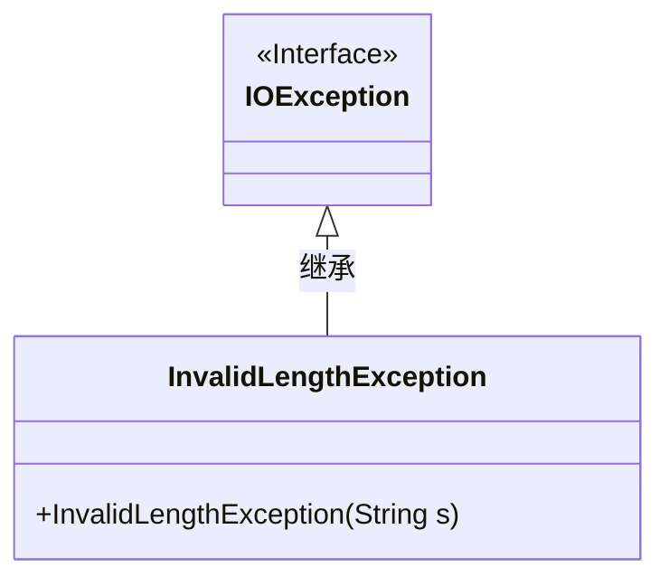
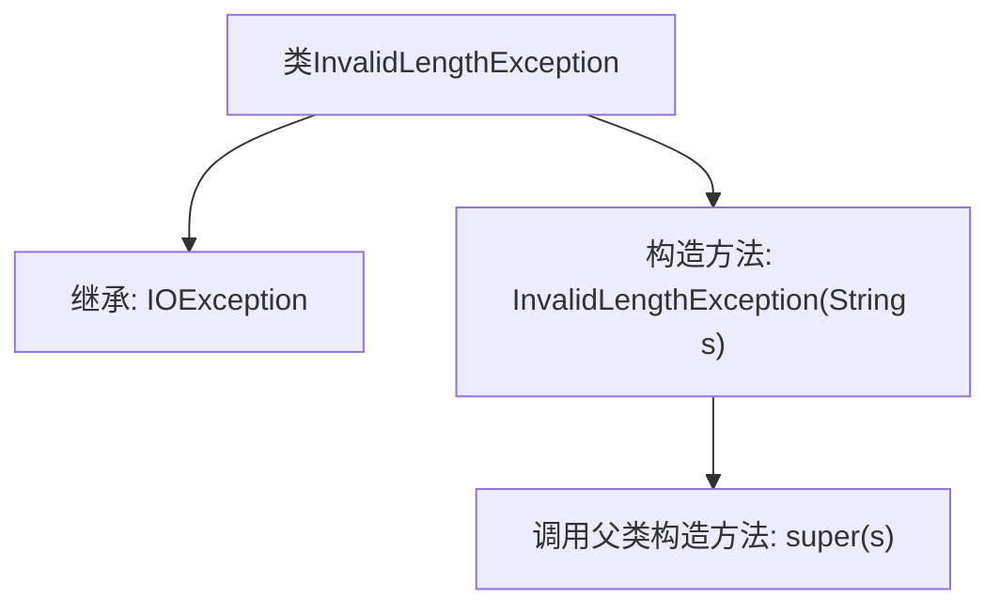

# 基础信息

|      |      |
|------|------|
| 名称 | InvalidLengthException |
| 编码语言 | .java |
| 代码路径 | Signal-Server/service/src/main/java/org/whispersystems/textsecuregcm/backup/InvalidLengthException.java |
| 包名 | org.whispersystems.textsecuregcm.backup |
| 依赖项 | ['java.io.IOException'] |
| 概述说明 | InvalidLengthException继承IOException，处理无效长度异常。 |

# 说明

InvalidLengthException是一个继承自IOException的异常类，专门用于处理无效长度的情况。当程序检测到某个输入或数据的长度不符合预期或规定的范围时，会抛出此异常。通过继承IOException，InvalidLengthException能够利用其父类的异常处理机制，确保在出现无效长度问题时，程序能够捕获并处理该异常，从而提高代码的健壮性和可维护性。

# 类列表 Class Summary

| 名称   | 类型  | 说明 |
|-------|------|-------------|
| InvalidLengthException | class | InvalidLengthException继承IOException，用于处理无效长度异常。 |

## 类 InvalidLengthException

|      |      |
|------|------|
| 访问范围 | public |
| 类型 | class |
| 名称 | InvalidLengthException |
| 说明 | InvalidLengthException继承IOException，用于处理无效长度异常。 |

### UML类图

这段代码定义了一个名为 `InvalidLengthException` 的异常类，它继承自 `IOException`。`InvalidLengthException` 类包含一个构造函数，该构造函数接受一个字符串参数并将其传递给父类的构造函数。这个异常类通常用于处理与长度相关的错误情况，例如当输入的字符串长度不符合预期时抛出此异常。通过继承 `IOException`，`InvalidLengthException` 类可以捕获和处理与输入输出操作相关的异常。

### 内部方法调用关系图

这段代码定义了一个名为 `InvalidLengthException` 的异常类，它继承自 `IOException`。该类包含一个构造方法 `InvalidLengthException(String s)`，该方法调用父类 `IOException` 的构造方法 `super(s)`，以便在抛出异常时传递错误信息。这个类主要用于处理与长度相关的异常情况，确保在程序中出现无效长度时能够抛出特定的异常信息。

### 字段列表 Field List

| 名称  | 类型  | 说明 |
|-------|-------|------|

### 方法列表 Method List

| 名称  | 类型  | 说明 |
|-------|-------|------|

