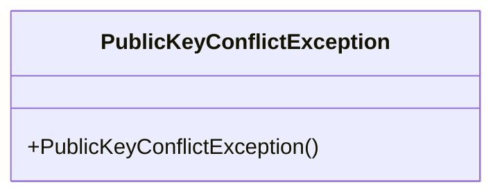
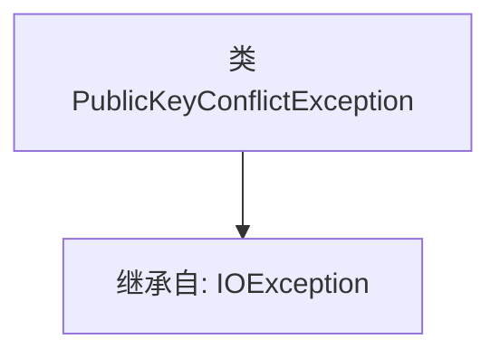

# 基础信息

|      |      |
|------|------|
| 名称 | PublicKeyConflictException |
| 编码语言 | .java |
| 代码路径 | Signal-Server/service/src/main/java/org/whispersystems/textsecuregcm/backup/PublicKeyConflictException.java |
| 包名 | org.whispersystems.textsecuregcm.backup |
| 依赖项 | ['java.io.IOException'] |
| 概述说明 | 公共密钥冲突异常继承自IO异常。 |

# 说明

公共密钥冲突异常是一种特定的异常类型，它继承自IO异常。这意味着当在处理与公共密钥相关的操作时发生冲突或错误，系统会抛出这种异常。由于它继承自IO异常，因此它也属于输入输出异常的范畴，通常与文件操作、数据传输或网络通信中的密钥管理问题相关。这种异常的出现通常表明在密钥的使用或验证过程中存在不一致或冲突，需要进一步排查和解决。

# 类列表 Class Summary

| 名称   | 类型  | 说明 |
|-------|------|-------------|
| PublicKeyConflictException | class | 公共密钥冲突异常继承自IO异常。 |

## 类 PublicKeyConflictException

|      |      |
|------|------|
| 访问范围 | public |
| 类型 | class |
| 名称 | PublicKeyConflictException |
| 说明 | 公共密钥冲突异常继承自IO异常。 |

### UML类图

这段代码定义了一个名为 `PublicKeyConflictException` 的类，它继承自 `IOException`。该类没有定义任何额外的成员变量或方法，仅继承了 `IOException` 的所有功能。这个异常类通常用于表示在公钥处理过程中发生的冲突或错误情况。由于它继承自 `IOException`，因此可以用于处理与输入输出相关的异常场景。

### 内部方法调用关系图

这段代码定义了一个名为 `PublicKeyConflictException` 的类，该类继承自 `IOException`。`PublicKeyConflictException` 是一个自定义异常类，通常用于表示与公钥冲突相关的异常情况。由于它继承自 `IOException`，因此它可以捕获和处理与输入输出操作相关的异常，并在此基础上扩展特定的公钥冲突逻辑。这种设计使得异常处理更加模块化和可扩展。

### 字段列表 Field List

| 名称  | 类型  | 说明 |
|-------|-------|------|

### 方法列表 Method List

| 名称  | 类型  | 说明 |
|-------|-------|------|

