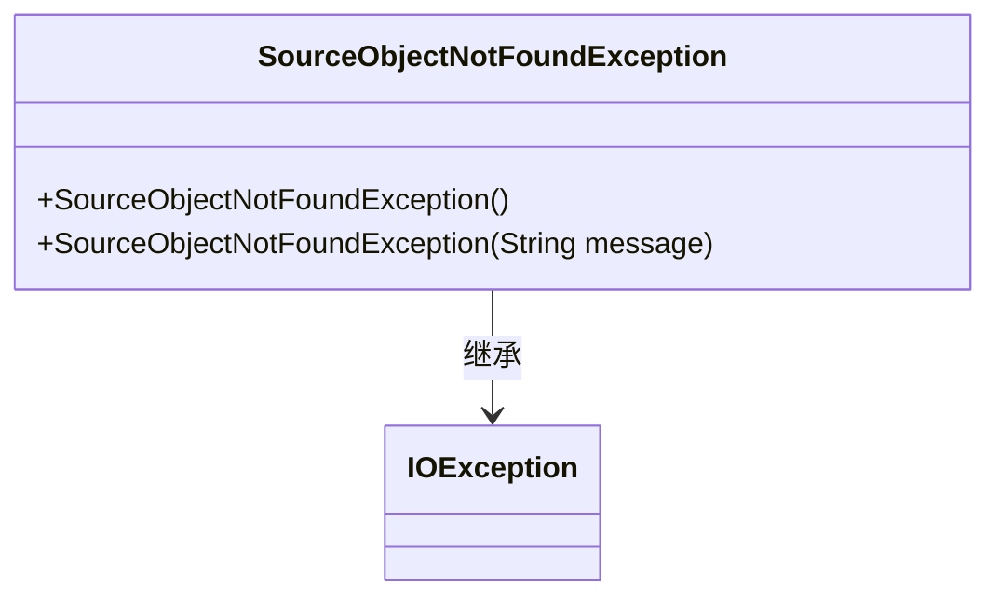
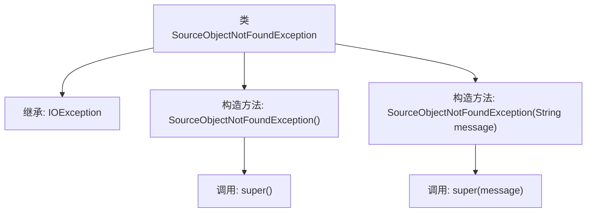

# 基础信息

|      |      |
|------|------|
| 名称 | SourceObjectNotFoundException |
| 编码语言 | .java |
| 代码路径 | Signal-Server/service/src/main/java/org/whispersystems/textsecuregcm/backup/SourceObjectNotFoundException.java |
| 包名 | org.whispersystems.textsecuregcm.backup |
| 依赖项 | ['java.io.IOException'] |
| 概述说明 | SourceObjectNotFoundException继承IOException，提供默认和带消息的构造方法。 |

# 说明

SourceObjectNotFoundException是IOException的子类，提供了两种构造方法：默认构造方法和带消息的构造方法。默认构造方法用于创建没有特定错误信息的异常对象，而带消息的构造方法允许在创建异常对象时指定一条详细的错误信息。这种设计使得在捕获和处理该异常时，能够根据具体情况提供更详细的错误描述，便于调试和问题定位。

# 类列表 Class Summary

| 名称   | 类型  | 说明 |
|-------|------|-------------|
| SourceObjectNotFoundException | class | SourceObjectNotFoundException继承IOException，提供默认和带消息的构造方法。 |

## 类 SourceObjectNotFoundException

|      |      |
|------|------|
| 访问范围 | public |
| 类型 | class |
| 名称 | SourceObjectNotFoundException |
| 说明 | SourceObjectNotFoundException继承IOException，提供默认和带消息的构造方法。 |

### UML类图

**描述：**  
`SourceObjectNotFoundException` 是一个自定义异常类，继承自 `IOException`。它提供了两个构造函数：一个无参构造函数和一个接受 `String` 类型参数的构造函数，用于传递异常信息。这个类的主要作用是在源对象未找到时抛出异常，帮助开发者更好地处理错误情况。

### 内部方法调用关系图

这段代码定义了一个名为 `SourceObjectNotFoundException` 的异常类，它继承自 `IOException`。该类提供了两个构造方法：一个无参构造方法，调用父类的无参构造方法 `super()`；另一个带参构造方法，接受一个 `String` 类型的 `message` 参数，并调用父类的带参构造方法 `super(message)`。该异常类用于表示源对象未找到的情况，适合在文件或资源处理时使用。

### 字段列表 Field List

| 名称  | 类型  | 说明 |
|-------|-------|------|

### 方法列表 Method List

| 名称  | 类型  | 说明 |
|-------|-------|------|

