# 基础信息

|      |      |
|------|------|
| 名称 | backup |
| 编码语言 | .java |
| 代码路径 | Signal-Server/service/src/main/java/org/whispersystems/textsecuregcm/backup |
| 包名 | Signal-Server.service.src.main.java.org.whispersystems.textsecuregcm.backup |
| 概述说明 | 公共密钥冲突异常继承自IO异常，处理密钥操作冲突。Cdn3BackupCredentialGenerator生成CDN备份凭证。BackupManager管理备份操作，支持认证、配额、上传、删除和恢复。BackupsDb管理备份数据库操作。BackupAuthManager管理备份认证。Cdn3RemoteStorageManager管理远程存储操作。 |

# 说明

## 概述
该代码模块主要围绕备份管理系统的实现展开，涵盖了从备份凭证生成、备份操作管理、数据库操作到远程存储管理的完整流程。模块中的各个类协同工作，确保备份操作的安全性、高效性和可靠性。通过异常处理机制，模块能够有效应对密钥冲突、无效长度等问题，确保系统的健壮性。此外，模块还提供了灵活的凭证管理和远程存储操作功能，支持备份数据的存储、检索和删除等关键操作。

## 主要业务场景
1. **备份凭证生成与管理**：通过`Cdn3BackupCredentialGenerator`类生成CDN备份凭证，并通过`BackupAuthManager`类管理备份认证流程，包括凭证的生成、验证和有效期延长。
2. **备份操作管理**：`BackupManager`类负责管理备份操作的全流程，包括认证、配额管理、上传、删除和恢复功能，确保备份操作的顺利进行。
3. **数据库管理**：`BackupsDb`类负责管理备份数据库的操作，包括公钥设置、认证数据检索、媒体信息跟踪和备份删除，确保备份数据的安全性和高效管理。
4. **远程存储管理**：`Cdn3RemoteStorageManager`类通过HTTP客户端与远程存储进行通信，支持复制、列表、使用统计和删除等操作，提供高效的远程存储管理功能。
5. **异常处理**：模块中定义了多种异常类，如`PublicKeyConflictException`、`InvalidLengthException`和`SourceObjectNotFoundException`，用于处理密钥冲突、无效长度和对象未找到等问题，确保系统的健壮性和可维护性。
6. **数据转换与验证**：`BackupLevelUtil`类负责将长整型`receiptLevel`转换为`BackupLevel`类型，并在发生溢出时抛出异常，确保数据的有效性和安全性。

通过这些功能，该模块为备份管理系统提供了全面的支持，确保备份操作的安全、高效和可靠。

### 包内部结构视图

```mermaid
graph TD
    backup --> PublicKeyConflictException.java
    backup --> Cdn3BackupCredentialGenerator.java
    backup --> BackupManager.java
    backup --> BackupUploadDescriptor.java
    backup --> InvalidLengthException.java
    backup --> BackupsDb.java
    backup --> MediaEncryptionParameters.java
    backup --> UsageInfo.java
    backup --> BackupAuthManager.java
    backup --> BackupLevelUtil.java
    backup --> CopyParameters.java
    backup --> CopyResult.java
    backup --> SourceObjectNotFoundException.java
    backup --> Cdn3RemoteStorageManager.java
    backup --> RemoteStorageManager.java
    backup --> ExpiredBackup.java
    backup --> StoredBackupAttributes.java
```

该流程图展示了`backup`目录下的所有文件和类，这些文件和类都与备份功能相关。每个节点代表一个文件或类，直接连接到`backup`目录，显示了它们在项目中的层级关系和功能分布。

# 文件列表 File List

| 名称   | 类型  | 说明 |
|-------|------|-------------|
| [StoredBackupAttributes.java](StoredBackupAttributes.md) | file | 无内容可总结。 |
| [RemoteStorageManager.java](RemoteStorageManager.md) | file | 无内容，无法生成概要描述。 |
| [CopyResult.java](CopyResult.md) | file | 信息为空，无法生成概要描述。 |
| [CopyParameters.java](CopyParameters.md) | file | 信息为空，无法生成概要描述。 |
| [UsageInfo.java](UsageInfo.md) | file | 无内容可总结。 |
| [MediaEncryptionParameters.java](MediaEncryptionParameters.md) | file | 信息为空，无法生成概要描述。 |
| [BackupUploadDescriptor.java](BackupUploadDescriptor.md) | file | 无内容，无法生成概要描述。 |
| [Cdn3BackupCredentialGenerator.java](Cdn3BackupCredentialGenerator.md) | file | Cdn3BackupCredentialGenerator类生成CDN备份凭证，支持读写权限和上传描述符。 |
| [ExpiredBackup.java](ExpiredBackup.md) | file | 信息为空，无法生成概要描述。 |
| [Cdn3RemoteStorageManager.java](Cdn3RemoteStorageManager.md) | file | Cdn3RemoteStorageManager实现远程存储管理，支持复制、列表、统计和删除操作，使用HTTP通信。 |
| [SourceObjectNotFoundException.java](SourceObjectNotFoundException.md) | file | SourceObjectNotFoundException继承IOException，提供默认和带消息的构造方法。 |
| [BackupLevelUtil.java](BackupLevelUtil.md) | file | BackupLevelUtil类将receiptLevel转换为BackupLevel，溢出时抛出异常。 |
| [BackupAuthManager.java](BackupAuthManager.md) | file | BackupAuthManager类管理备份认证，处理凭证请求、生成、验证及有效期扩展。 |
| [BackupsDb.java](BackupsDb.md) | file | BackupsDb类负责管理备份数据库操作，涵盖公钥设置、认证数据检索、媒体跟踪及备份删除。 |
| [InvalidLengthException.java](InvalidLengthException.md) | file | InvalidLengthException继承IOException，处理无效长度异常。 |
| [BackupManager.java](BackupManager.md) | file | BackupManager类管理备份操作，含认证、配额、上传、删除和恢复功能。 |
| [PublicKeyConflictException.java](PublicKeyConflictException.md) | file | 公共密钥冲突异常继承自IO异常。 |

