# 基础信息

|      |      |
|------|------|
| 名称 | ConfiguredProfileBadgeConverter |
| 编码语言 | .java |
| 代码路径 | Signal-Server/service/src/main/java/org/whispersystems/textsecuregcm/badges/ConfiguredProfileBadgeConverter.java |
| 包名 | org.whispersystems.textsecuregcm.badges |
| 依赖项 | ['com.google.common.annotations.VisibleForTesting', 'java.time.Clock', 'java.time.Duration', 'java.time.Instant', 'java.util.ArrayList', 'java.util.List', 'java.util.Locale', 'java.util.Map', 'java.util.ResourceBundle', 'java.util.function.Function', 'java.util.stream.Collectors', 'org.signal.i18n.HeaderControlledResourceBundleLookup', 'org.whispersystems.textsecuregcm.configuration.BadgeConfiguration', 'org.whispersystems.textsecuregcm.configuration.BadgesConfiguration', 'org.whispersystems.textsecuregcm.entities.Badge', 'org.whispersystems.textsecuregcm.entities.BadgeSvg', 'org.whispersystems.textsecuregcm.entities.SelfBadge', 'org.whispersystems.textsecuregcm.storage.AccountBadge'] |
| 概述说明 | 配置类实现多语言徽章转换与动态生成功能。 |

# 说明

配置类实现了徽章转换和翻译功能，支持多语言环境和动态徽章生成。该功能允许系统根据不同的语言需求自动转换徽章内容，并生成适应不同场景的动态徽章，确保在全球范围内提供一致且灵活的用户体验。

# 类列表 Class Summary

| 名称   | 类型  | 说明 |
|-------|------|-------------|
| ConfiguredProfileBadgeConverter | class | 配置类实现徽章转换和翻译功能，支持多语言和动态徽章生成。 |

## 类 ConfiguredProfileBadgeConverter

|      |      |
|------|------|
| 访问范围 | public |
| 类型 | class |
| 名称 | ConfiguredProfileBadgeConverter |
| 说明 | 配置类实现徽章转换和翻译功能，支持多语言和动态徽章生成。 |

### UML类图

```mermaid
classDiagram
    class ConfiguredProfileBadgeConverter {
        -Clock clock
        -Map~String, BadgeConfiguration~ knownBadges
        -List~String~ badgeIdsEnabledForAll
        -HeaderControlledResourceBundleLookup headerControlledResourceBundleLookup
        +ConfiguredProfileBadgeConverter(Clock clock, BadgesConfiguration badgesConfiguration, HeaderControlledResourceBundleLookup headerControlledResourceBundleLookup)
        +Badge translate(List~Locale~ acceptableLanguages, String badgeId)
        +List~Badge~ convert(List~Locale~ acceptableLanguages, List~AccountBadge~ accountBadges, boolean isSelf)
        -Badge newBadge(boolean isSelf, String id, String category, String name, String description, List~String~ sprites, String svg, List~BadgeSvg~ svgs, Instant expiration, boolean visible)
    }

    class ProfileBadgeConverter {
        <<Interface>>
        +List~Badge~ convert(List~Locale~ acceptableLanguages, List~AccountBadge~ accountBadges, boolean isSelf)
    }

    class BadgeTranslator {
        <<Interface>>
        +Badge translate(List~Locale~ acceptableLanguages, String badgeId)
    }

    class Badge {
        +String id
        +String category
        +String name
        +String description
        +List~String~ sprites
        +String svg
        +List~BadgeSvg~ svgs
    }

    class SelfBadge {
        +String id
        +String category
        +String name
        +String description
        +List~String~ sprites
        +String svg
        +List~BadgeSvg~ svgs
        +Instant expiration
        +boolean visible
    }

    class BadgeConfiguration {
        +String id
        +String category
        +List~String~ sprites
        +String svg
        +List~BadgeSvg~ svgs
    }

    class AccountBadge {
        +String id()
        +Instant expiration()
        +boolean visible()
    }

    class HeaderControlledResourceBundleLookup {
        +ResourceBundle getResourceBundle(String baseName, List~Locale~ acceptableLanguages)
    }

    class Clock {
        +Instant instant()
    }

    class BadgesConfiguration {
        +List~BadgeConfiguration~ getBadges()
        +List~String~ getBadgeIdsEnabledForAll()
    }

    class ResourceBundle {
        +String getString(String key)
    }

    ConfiguredProfileBadgeConverter --> ProfileBadgeConverter : 实现
    ConfiguredProfileBadgeConverter --> BadgeTranslator : 实现
    ConfiguredProfileBadgeConverter --> Clock : 依赖
    ConfiguredProfileBadgeConverter --> BadgesConfiguration : 依赖
    ConfiguredProfileBadgeConverter --> HeaderControlledResourceBundleLookup : 依赖
    Badge <|-- SelfBadge
    BadgesConfiguration --> BadgeConfiguration : 包含
    ConfiguredProfileBadgeConverter --> Badge : 创建
    ConfiguredProfileBadgeConverter --> SelfBadge : 创建
    ConfiguredProfileBadgeConverter --> AccountBadge : 处理
    ConfiguredProfileBadgeConverter --> ResourceBundle : 使用
```

### 描述
`ConfiguredProfileBadgeConverter` 类实现了 `ProfileBadgeConverter` 和 `BadgeTranslator` 接口，用于将 `AccountBadge` 转换为 `Badge` 或 `SelfBadge`。它依赖于 `Clock`、`BadgesConfiguration` 和 `HeaderControlledResourceBundleLookup` 来获取配置和资源。该类通过 `newBadge` 方法根据是否为自身创建不同类型的徽章，并处理徽章的可见性和过期时间。

### 内部方法调用关系图

**描述：**
`ConfiguredProfileBadgeConverter`类实现了`ProfileBadgeConverter`和`BadgeTranslator`接口，用于处理用户徽章的转换和翻译。类中包含构造方法用于初始化属性，`translate`方法用于根据语言和徽章ID翻译徽章，`convert`方法用于将账户徽章转换为标准徽章格式，`newBadge`方法用于根据是否为自我徽章创建不同类型的徽章对象。流程图展示了类的属性和方法之间的调用关系，以及内部方法的具体实现逻辑。

### 字段列表 Field List

| 名称  | 类型  | 说明 |
|-------|-------|------|
| clock | Clock | 定义了一个私有且不可变的时钟变量。 |
| headerControlledResourceBundleLookup | HeaderControlledResourceBundleLookup | 私有最终变量headerControlledResourceBundleLookup用于资源包查找。 |
| BASE_NAME = "org.signal.badges.Badges" | String | 测试可见的静态常量BASE_NAME定义为org.signal.badges.Badges。 |
| knownBadges | Map<String, BadgeConfiguration> | 私有映射存储已知徽章配置。 |
| badgeIdsEnabledForAll | List<String> | 私有且不可变列表，存储所有启用的徽章ID。 |

### 方法列表 Method List

| 名称  | 类型  | 说明 |
|-------|-------|------|
| convert | List<Badge> | 转换徽章列表，过滤有效项并添加新徽章，返回最终列表。 |
| translate | Badge | 方法根据语言和徽章ID翻译徽章信息，返回新徽章对象。 |
| newBadge | Badge | 根据isSelf参数创建SelfBadge或Badge对象，包含ID、类别、名称等属性。 |

