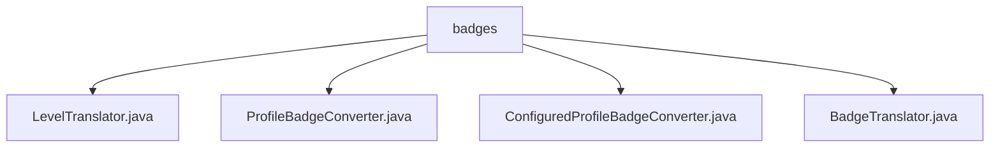

# 基础信息

|      |      |
|------|------|
| 名称 | badges |
| 编码语言 | .java |
| 代码路径 | Signal-Server/service/src/main/java/org/whispersystems/textsecuregcm/badges |
| 包名 | Signal-Server.service.src.main.java.org.whispersystems.textsecuregcm.badges |
| 概述说明 | ProfileBadgeConverter类实现多语言徽章转换和动态生成功能。 |

# 说明

## 概述

该代码模块主要处理与用户徽章（Badge）相关的功能，包括徽章的转换、翻译以及多语言环境下的动态生成。模块通过多个类实现了徽章在不同语言和场景下的灵活适配，确保全球用户在使用过程中能够获得一致且个性化的体验。

## 主要业务场景

1. **徽章转换与翻译**：模块中的`ProfileBadgeConverter`类负责实现徽章的转换和翻译功能。它支持多语言环境，能够根据用户的语言偏好自动转换徽章内容，确保徽章信息在不同语言下保持一致。

2. **动态徽章生成**：该模块支持动态生成徽章，能够根据不同的场景需求生成适配的徽章。这种灵活性使得系统能够应对多样化的用户需求，提供更加个性化的用户体验。

3. **多语言支持**：通过`BadgeTranslator`等类，模块实现了对多语言环境的支持。系统能够根据用户的语言设置自动选择相应的徽章翻译，确保全球用户在使用过程中不会遇到语言障碍。

4. **配置管理与扩展**：虽然`ConfiguredProfileBadgeConverter`和`LevelTranslator`的具体内容未提供，但可以推测这些类可能涉及徽章的配置管理和扩展功能，进一步增强了模块的灵活性和可维护性。

总体而言，该模块通过多个类的协作，实现了徽章的多语言支持、动态生成和灵活转换，为用户提供了更加个性化和一致的使用体验。

### 包内部结构视图

该流程图展示了`badges`文件夹与其包含的四个Java文件之间的层级关系。`badges`作为根节点，直接包含`LevelTranslator.java`、`ProfileBadgeConverter.java`、`ConfiguredProfileBadgeConverter.java`和`BadgeTranslator.java`四个文件，清晰反映了文件结构。

# 文件列表 File List

| 名称   | 类型  | 说明 |
|-------|------|-------------|
| [BadgeTranslator.java](BadgeTranslator.md) | file | 信息为空，无法生成概要描述。 |
| [ProfileBadgeConverter.java](ProfileBadgeConverter.md) | file | 无内容可总结。 |
| [ConfiguredProfileBadgeConverter.java](ConfiguredProfileBadgeConverter.md) | file | 配置类实现多语言徽章转换与动态生成功能。 |
| [LevelTranslator.java](LevelTranslator.md) | file | 无内容可总结。 |

