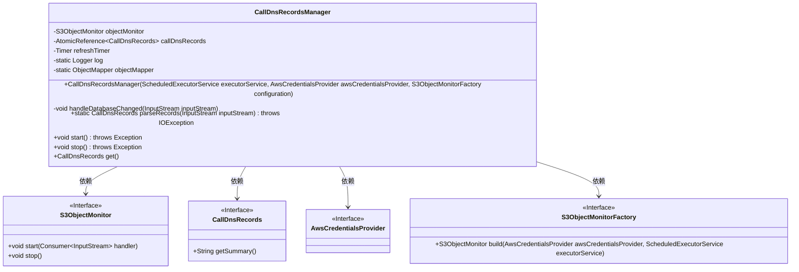
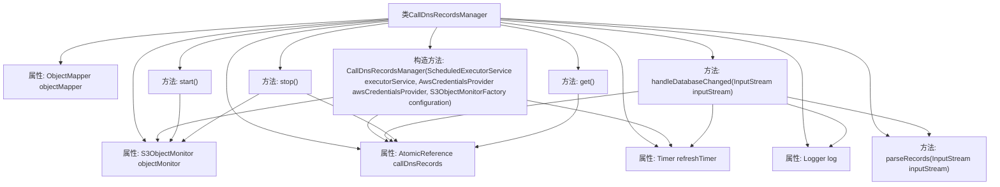

# 基础信息

|      |      |
|------|------|
| 名称 | CallDnsRecordsManager |
| 编码语言 | .java |
| 代码路径 | Signal-Server/service/src/main/java/org/whispersystems/textsecuregcm/calls/routing/CallDnsRecordsManager.java |
| 包名 | org.whispersystems.textsecuregcm.calls.routing |
| 依赖项 | ['com.fasterxml.jackson.core.StreamReadFeature', 'com.fasterxml.jackson.databind.ObjectMapper', 'com.fasterxml.jackson.databind.json.JsonMapper', 'io.dropwizard.lifecycle.Managed', 'io.micrometer.core.instrument.Metrics', 'io.micrometer.core.instrument.Timer', 'java.io.BufferedInputStream', 'java.io.IOException', 'java.io.InputStream', 'java.util.concurrent.ScheduledExecutorService', 'java.util.concurrent.atomic.AtomicReference', 'java.util.function.Supplier', 'org.slf4j.Logger', 'org.slf4j.LoggerFactory', 'org.whispersystems.textsecuregcm.configuration.S3ObjectMonitorFactory', 'org.whispersystems.textsecuregcm.metrics.MetricsUtil', 'org.whispersystems.textsecuregcm.s3.S3ObjectMonitor', 'software.amazon.awssdk.auth.credentials.AwsCredentialsProvider'] |
| 概述说明 | CallDnsRecordsManager类管理DNS记录，支持启动、停止和获取，利用S3监控和定时器更新。 |

# 说明

CallDnsRecordsManager类负责管理DNS记录，通过S3监控和定时器机制实现记录的更新。该类提供启动、停止和获取记录的功能，确保DNS记录的及时更新和管理。

# 类列表 Class Summary

| 名称   | 类型  | 说明 |
|-------|------|-------------|
| CallDnsRecordsManager | class | CallDnsRecordsManager类管理DNS记录，使用S3监控和定时器更新记录，支持启动、停止和获取记录。 |

## 类 CallDnsRecordsManager

|      |      |
|------|------|
| 访问范围 | public |
| 类型 | class |
| 名称 | CallDnsRecordsManager |
| 说明 | CallDnsRecordsManager类管理DNS记录，使用S3监控和定时器更新记录，支持启动、停止和获取记录。 |

### UML类图

**描述：**  
`CallDnsRecordsManager` 类实现了 `Supplier<CallDnsRecords>` 和 `Managed` 接口，用于管理 `CallDnsRecords` 数据的加载和更新。它依赖于 `S3ObjectMonitor` 来监控 S3 对象的变化，并通过 `AwsCredentialsProvider` 和 `S3ObjectMonitorFactory` 进行配置和初始化。该类通过 `handleDatabaseChanged` 方法处理数据库变化，并使用 `parseRecords` 方法解析输入流中的数据。`start` 和 `stop` 方法分别用于启动和停止监控，`get` 方法用于获取当前的 `CallDnsRecords` 数据。

### 内部方法调用关系图

这段代码定义了一个名为 `CallDnsRecordsManager` 的类，该类实现了 `Supplier<CallDnsRecords>` 和 `Managed` 接口。它主要负责管理 `CallDnsRecords` 对象，通过 `S3ObjectMonitor` 监控数据变化，并在数据变化时更新记录。代码中包含了构造方法、处理数据库变化的方法、解析记录的方法以及启动、停止和获取记录的方法。流程图展示了类中各属性、方法之间的调用关系，帮助理解类的结构和功能。

### 字段列表 Field List

| 名称  | 类型  | 说明 |
|-------|-------|------|
| objectMonitor | S3ObjectMonitor | 私有S3对象监控器实例。 |
| refreshTimer | Timer | 私有定时器用于刷新操作。 |
| callDnsRecords = new AtomicReference<>() | AtomicReference<CallDnsRecords> | 使用AtomicReference封装CallDnsRecords对象，确保线程安全。 |
| objectMapper = JsonMapper.builder()      .enable(StreamReadFeature.INCLUDE_SOURCE_IN_LOCATION)      .build() | ObjectMapper | 定义私有静态ObjectMapper对象，启用流读取功能。 |
| log = LoggerFactory.getLogger(CallDnsRecordsManager.class) | Logger | CallDnsRecordsManager类初始化日志记录器。 |

### 方法列表 Method List

| 名称  | 类型  | 说明 |
|-------|-------|------|
| parseRecords | CallDnsRecords | 解析输入流为CallDnsRecords对象。 |
| get | CallDnsRecords | 重写get方法，返回callDnsRecords对象。 |
| stop | void | 该方法停止对象监控并清空DNS记录。 |
| handleDatabaseChanged | void | 处理数据库变更，解析新DNS记录，替换旧记录并记录日志。 |
| start | void | 重写start方法，调用objectMonitor.start并传入handleDatabaseChanged处理数据库变更。 |

