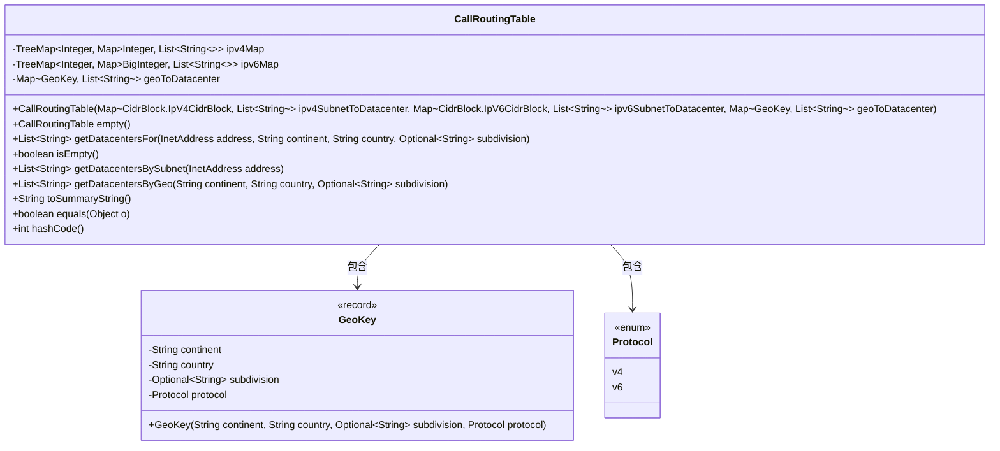

# 基础信息

|      |      |
|------|------|
| 名称 | CallRoutingTable |
| 编码语言 | .java |
| 代码路径 | Signal-Server/service/src/main/java/org/whispersystems/textsecuregcm/calls/routing/CallRoutingTable.java |
| 包名 | org.whispersystems.textsecuregcm.calls.routing |
| 依赖项 | ['jakarta.validation.constraints.NotBlank', 'jakarta.validation.constraints.NotNull', 'java.math.BigInteger', 'java.net.Inet4Address', 'java.net.Inet6Address', 'java.net.InetAddress', 'java.util.Collections', 'java.util.HashMap', 'java.util.List', 'java.util.Map', 'java.util.Objects', 'java.util.Optional', 'java.util.TreeMap', 'java.util.function.Function', 'java.util.stream.Stream'] |
| 概述说明 | CallRoutingTable类通过IP和地理位置信息路由呼叫，支持IPv4、IPv6和地理数据，返回最快数据中心。 |

# 说明

CallRoutingTable类是一个用于根据IP地址和地理位置信息进行呼叫路由的工具。它支持IPv4和IPv6协议，并能够处理地理数据映射。该类的主要功能是分析输入的IP地址和地理位置信息，并根据这些信息确定并返回最快的数据中心列表，从而优化呼叫路由的效率。

# 类列表 Class Summary

| 名称   | 类型  | 说明 |
|-------|------|-------------|
| CallRoutingTable | class | CallRoutingTable类用于根据IP和地理位置信息路由呼叫，支持IPv4、IPv6和地理数据映射，返回最快数据中心列表。 |

## 类 CallRoutingTable

|      |      |
|------|------|
| 访问范围 | public |
| 类型 | class |
| 名称 | CallRoutingTable |
| 说明 | CallRoutingTable类用于根据IP和地理位置信息路由呼叫，支持IPv4、IPv6和地理数据映射，返回最快数据中心列表。 |

### UML类图

这段代码定义了一个 `CallRoutingTable` 类，用于根据IP地址和地理信息路由呼叫到最合适的数据中心。类中包含两个 `TreeMap`，分别用于存储IPv4和IPv6的子网到数据中心的映射，以及一个 `Map` 用于存储地理信息到数据中心的映射。`GeoKey` 是一个记录类，用于表示地理信息，`Protocol` 是一个枚举类，表示IP协议版本。`CallRoutingTable` 提供了多种方法来根据IP地址和地理信息获取最合适的数据中心列表，并提供了空表创建、空表检查、数据汇总等功能。

### 内部方法调用关系图

```mermaid
graph TD
    A["类CallRoutingTable"]
    B["属性: TreeMap<Integer, Map<Integer, List<String>>> ipv4Map"]
    C["属性: TreeMap<Integer, Map<BigInteger, List<String>>> ipv6Map"]
    D["属性: Map<GeoKey, List<String>> geoToDatacenter"]
    E["构造方法: CallRoutingTable(Map<CidrBlock.IpV4CidrBlock, List<String>> ipv4SubnetToDatacenter, Map<CidrBlock.IpV6CidrBlock, List<String>> ipv6SubnetToDatacenter, Map<GeoKey, List<String>> geoToDatacenter)"]
    F["方法: static CallRoutingTable empty()"]
    G["枚举: Protocol"]
    H["记录: GeoKey"]
    I["方法: List<String> getDatacentersFor(InetAddress address, String continent, String country, Optional<String> subdivision)"]
    J["方法: boolean isEmpty()"]
    K["方法: List<String> getDatacentersBySubnet(InetAddress address)"]
    L["方法: List<String> getDatacentersByGeo(String continent, String country, Optional<String> subdivision)"]
    M["方法: String toSummaryString()"]
    N["方法: boolean equals(Object o)"]
    O["方法: int hashCode()"]

    A --> B
    A --> C
    A --> D
    A --> E
    A --> F
    A --> G
    A --> H
    A --> I
    A --> J
    A --> K
    A --> L
    A --> M
    A --> N
    A --> O
```

这段代码定义了一个`CallRoutingTable`类，用于管理基于IP地址和地理位置的呼叫路由表。该类包含三个主要属性：`ipv4Map`、`ipv6Map`和`geoToDatacenter`，分别用于存储IPv4、IPv6和地理位置的映射关系。类中的方法包括构造方法、空表生成方法、数据获取方法、判断表是否为空的方法、以及用于生成字符串表示、判断相等性和生成哈希码的方法。代码通过复杂的逻辑来处理IP地址和地理位置的映射，并返回最优的数据中心列表。

### 字段列表 Field List

| 名称  | 类型  | 说明 |
|-------|-------|------|
| geoToDatacenter | Map<GeoKey, List<String>> | 私有地图存储地理位置键到数据中心列表的映射。 |
| ipv4Map | TreeMap<Integer, Map<Integer, List<String>>> | 私有树映射存储IPv4地址及关联数据。 |
| ipv6Map | TreeMap<Integer, Map<BigInteger, List<String>>> | IPv6映射使用TreeMap存储整数键和包含大整数与字符串列表的嵌套映射。 |

### 方法列表 Method List

| 名称  | 类型  | 说明 |
|-------|-------|------|
| isEmpty | boolean | 检查IPv4、IPv6和地理数据中心映射是否为空。 |
| getDatacentersBySubnet | List<String> | 根据IP地址类型查询对应子网的数据中心列表。 |
| getDatacentersByGeo | List<String> | 根据地理位置和协议获取数据中心列表，支持IPv4和IPv6。 |
| equals | boolean | 重写equals方法，比较ipv4Map、ipv6Map和geoToDatacenter是否相等。 |
| hashCode | int | 重写hashCode方法，使用ipv4Map、ipv6Map和geoToDatacenter生成哈希值。 |
| empty | CallRoutingTable | 创建并返回一个空的呼叫路由表实例。 |
| toSummaryString | String | IPv4表、IPv6表和地理表分别包含的行数。 |
| getDatacentersFor | List<String> | 根据IP地址、洲、国家及可选区域获取最多3个数据中心列表。 |

