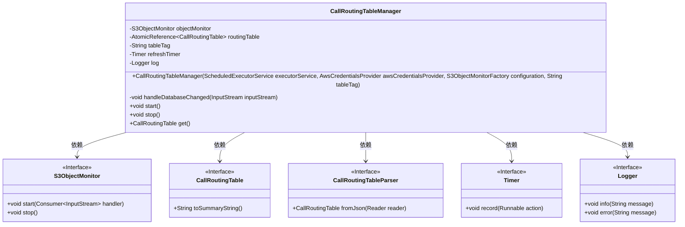
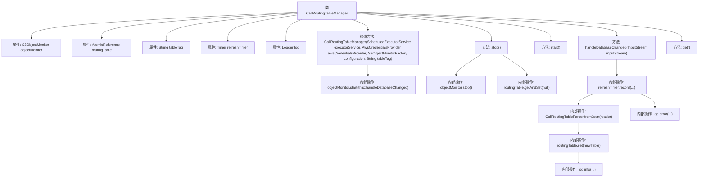

# 基础信息

|      |      |
|------|------|
| 名称 | CallRoutingTableManager |
| 编码语言 | .java |
| 代码路径 | Signal-Server/service/src/main/java/org/whispersystems/textsecuregcm/calls/routing/CallRoutingTableManager.java |
| 包名 | org.whispersystems.textsecuregcm.calls.routing |
| 依赖项 | ['io.dropwizard.lifecycle.Managed', 'io.micrometer.core.instrument.Metrics', 'io.micrometer.core.instrument.Timer', 'java.io.IOException', 'java.io.InputStream', 'java.io.InputStreamReader', 'java.util.concurrent.ScheduledExecutorService', 'java.util.concurrent.atomic.AtomicReference', 'java.util.function.Supplier', 'org.slf4j.Logger', 'org.slf4j.LoggerFactory', 'org.whispersystems.textsecuregcm.configuration.S3ObjectMonitorFactory', 'org.whispersystems.textsecuregcm.metrics.MetricsUtil', 'org.whispersystems.textsecuregcm.s3.S3ObjectMonitor', 'software.amazon.awssdk.auth.credentials.AwsCredentialsProvider'] |
| 概述说明 | CallRoutingTableManager负责监控S3对象并动态更新呼叫路由表。 |

# 说明

CallRoutingTableManager负责管理与S3对象监控相关的任务，确保呼叫路由表的动态更新和提供。该管理器通过监控S3对象的变化，实时调整和更新路由表，以保证系统的路由信息始终准确和最新。这一过程涉及对S3存储中对象的持续监控，以及在检测到变化时自动触发路由表的更新机制，从而确保呼叫路由的高效性和可靠性。

# 类列表 Class Summary

| 名称   | 类型  | 说明 |
|-------|------|-------------|
| CallRoutingTableManager | class | CallRoutingTableManager管理S3对象监控，动态更新和提供呼叫路由表。 |

## 类 CallRoutingTableManager

|      |      |
|------|------|
| 访问范围 | public |
| 类型 | class |
| 名称 | CallRoutingTableManager |
| 说明 | CallRoutingTableManager管理S3对象监控，动态更新和提供呼叫路由表。 |

### UML类图

**描述**：`CallRoutingTableManager` 类负责管理呼叫路由表，通过 `S3ObjectMonitor` 监控 S3 对象的变化，并在变化时更新路由表。该类实现了 `Supplier<CallRoutingTable>` 和 `Managed` 接口，提供了启动、停止和获取路由表的功能。`S3ObjectMonitor` 是一个接口，用于监控 S3 对象的变化。`CallRoutingTable` 和 `CallRoutingTableParser` 分别表示路由表和路由表解析器。`Timer` 和 `Logger` 分别用于记录操作时间和日志信息。

### 内部方法调用关系图

**描述：**  
`CallRoutingTableManager`类负责管理呼叫路由表，通过`S3ObjectMonitor`监控数据库变化，并在变化时更新路由表。类中包含构造方法初始化对象，`handleDatabaseChanged`方法处理数据库变化并更新路由表，`start`和`stop`方法分别启动和停止监控，`get`方法返回当前路由表。流程图中展示了类的属性、方法及其内部调用关系，清晰描述了类的结构和功能。

### 字段列表 Field List

| 名称  | 类型  | 说明 |
|-------|-------|------|
| objectMonitor | S3ObjectMonitor | 私有不可变的S3对象监控器实例。 |
| refreshTimer | Timer | 私有定时器用于刷新操作。 |
| tableTag | String | 声明了一个私有的不可变字符串变量tableTag。 |
| routingTable = new AtomicReference<>() | AtomicReference<CallRoutingTable> | 私有原子引用变量存储CallRoutingTable对象。 |
| log = LoggerFactory.getLogger(CallRoutingTableManager.class) | Logger | 在CallRoutingTableManager类中定义了一个私有的静态日志记录器。 |

### 方法列表 Method List

| 名称  | 类型  | 说明 |
|-------|-------|------|
| handleDatabaseChanged | void | 处理数据库变更，解析并更新路由表，记录日志。 |
| get | CallRoutingTable | 重写get方法，返回当前路由表。 |
| start | void | 重写start方法，调用objectMonitor.start并处理数据库变更。 |
| stop | void | 该方法停止对象监控并清空路由表。 |

