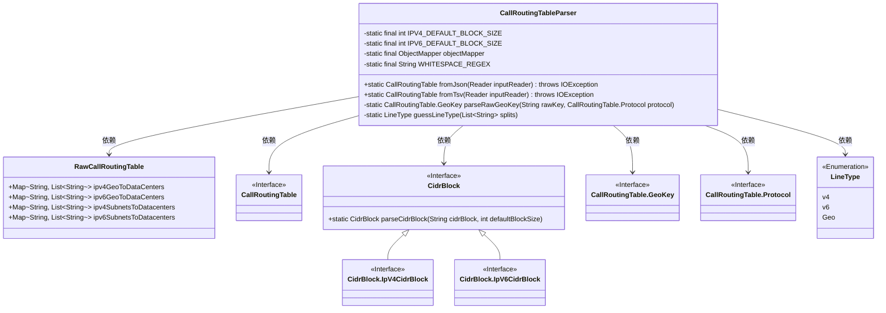

# 基础信息

|      |      |
|------|------|
| 名称 | CallRoutingTableParser |
| 编码语言 | .java |
| 代码路径 | Signal-Server/service/src/main/java/org/whispersystems/textsecuregcm/calls/routing/CallRoutingTableParser.java |
| 包名 | org.whispersystems.textsecuregcm.calls.routing |
| 依赖项 | ['com.fasterxml.jackson.core.StreamReadFeature', 'com.fasterxml.jackson.databind.ObjectMapper', 'com.fasterxml.jackson.databind.json.JsonMapper', 'java.io.BufferedReader', 'java.io.IOException', 'java.io.Reader', 'java.util.Arrays', 'java.util.HashMap', 'java.util.List', 'java.util.Map', 'java.util.Optional', 'java.util.stream.Collectors', 'java.util.stream.Stream'] |
| 概述说明 | 解析JSON和TSV格式的呼叫路由表，支持IPv4、IPv6及地理区域映射。 |

# 说明

该功能解析JSON和TSV格式的呼叫路由表，支持IPv4和IPv6地址映射，并能根据地理区域进行路由配置。通过解析这两种格式的文件，系统能够准确识别和处理不同网络协议的呼叫路由需求，同时结合地理区域信息，实现更精准的路由决策。该功能适用于需要处理多种网络协议和地理区域映射的呼叫路由场景，确保路由表的高效管理和灵活配置。

# 类列表 Class Summary

| 名称   | 类型  | 说明 |
|-------|------|-------------|
| CallRoutingTableParser | class | 解析JSON和TSV格式的呼叫路由表，支持IPv4、IPv6和地理区域映射。 |

## 类 CallRoutingTableParser

|      |      |
|------|------|
| 访问范围 | final |
| 类型 | class |
| 名称 | CallRoutingTableParser |
| 说明 | 解析JSON和TSV格式的呼叫路由表，支持IPv4、IPv6和地理区域映射。 |

### UML类图

这段代码定义了一个 `CallRoutingTableParser` 类，用于从 JSON 和 TSV 格式的文件中解析并生成 `CallRoutingTable` 对象。`CallRoutingTableParser` 类依赖于 `RawCallRoutingTable` 类来解析 JSON 数据，并通过 `CidrBlock` 类处理 IP 地址的 CIDR 块。`LineType` 枚举用于区分不同类型的输入行。代码的核心功能是将输入文件中的 IP 地址和地理位置信息映射到数据中心，并生成一个路由表对象。

### 内部方法调用关系图

```mermaid
graph TD
    A["类CallRoutingTableParser"]
    B["常量: IPV4_DEFAULT_BLOCK_SIZE = 24"]
    C["常量: IPV6_DEFAULT_BLOCK_SIZE = 48"]
    D["常量: objectMapper = JsonMapper.builder().enable(StreamReadFeature.INCLUDE_SOURCE_IN_LOCATION).build()"]
    E["内部类: RawCallRoutingTable"]
    F["常量: WHITESPACE_REGEX = '\\s+'"]
    G["方法: fromJson(Reader inputReader)"]
    H["方法: parseRawGeoKey(String rawKey, CallRoutingTable.Protocol protocol)"]
    I["方法: fromTsv(Reader inputReader)"]
    J["方法: guessLineType(List<String> splits)"]
    K["枚举: LineType"]

    A --> B
    A --> C
    A --> D
    A --> E
    A --> F
    A --> G
    A --> H
    A --> I
    A --> J
    A --> K

    G --> L["读取输入流: BufferedReader reader"]
    G --> M["解析JSON: objectMapper.readValue(reader, RawCallRoutingTable.class)"]
    G --> N["处理IPv4子网: rawTable.ipv4SubnetsToDatacenters.entrySet().stream()"]
    G --> O["处理IPv6子网: rawTable.ipv6SubnetsToDatacenters.entrySet().stream()"]
    G --> P["处理IPv4地理数据: rawTable.ipv4GeoToDataCenters.entrySet().stream()"]
    G --> Q["处理IPv6地理数据: rawTable.ipv6GeoToDataCenters.entrySet().stream()"]
    G --> R["创建CallRoutingTable对象: new CallRoutingTable(ipv4SubnetToDatacenter, ipv6SubnetToDatacenter, geoToDatacenter)"]

    I --> S["读取输入流: BufferedReader reader"]
    I --> T["初始化映射: ipv4Map, ipv6Map, ipGeoTable"]
    I --> U["逐行读取: while((line = reader.readLine()) != null)"]
    I --> V["处理空行: if(line.isBlank())"]
    I --> W["分割行数据: Arrays.stream(line.split(WHITESPACE_REGEX)).filter(s -> !s.isBlank()).toList()"]
    I --> X["处理IPv4数据: case v4"]
    I --> Y["处理IPv6数据: case v6"]
    I --> Z["处理地理数据: case Geo"]
    I --> AA["创建CallRoutingTable对象: new CallRoutingTable(ipv4Map, ipv6Map, ipGeoTable)"]

    J --> AB["判断行类型: if (first.contains('-'))"]
    J --> AC["判断行类型: else if(first.contains(':'))"]
    J --> AD["判断行类型: else if (first.contains('.'))"]
    J --> AE["抛出异常: throw new IllegalArgumentException"]
```

这段代码是一个用于解析呼叫路由表的工具类，支持从JSON和TSV格式的文件中读取数据，并将其转换为内部数据结构。代码主要包含两个解析方法：`fromJson`和`fromTsv`，分别用于处理JSON和TSV格式的输入。`fromJson`方法通过Jackson库解析JSON数据，并将其映射到内部数据结构；`fromTsv`方法逐行读取TSV文件，根据行内容类型（IPv4、IPv6或地理数据）进行解析。代码还包含一个辅助方法`guessLineType`，用于判断TSV文件中每一行的数据类型。整体代码结构清晰，功能明确，适用于处理复杂的路由表数据。

### 字段列表 Field List

| 名称  | 类型  | 说明 |
|-------|-------|------|
| IPV4_DEFAULT_BLOCK_SIZE = 24 | int | IPV4默认块大小为24。 |
| IPV6_DEFAULT_BLOCK_SIZE = 48 | int | 私有静态常量IPV6默认块大小为48。 |
| objectMapper = JsonMapper.builder()      .enable(StreamReadFeature.INCLUDE_SOURCE_IN_LOCATION)      .build() | ObjectMapper | 使用ObjectMapper启用流读取功能并构建实例。 |
| WHITESPACE_REGEX = "\\s+" | String | 定义私有静态常量WHITESPACE_REGEX，用于匹配所有空白字符。 |

### 方法列表 Method List

| 名称  | 类型  | 说明 |
|-------|-------|------|
| guessLineType | LineType | 根据首字符判断行类型：-为Geo，:为v6，.为v4，否则报错。 |
| parseRawGeoKey | CallRoutingTable.GeoKey | 解析原始地理键字符串，生成GeoKey对象。 |
| fromJson | CallRoutingTable | 方法从JSON解析生成呼叫路由表，包含IPv4、IPv6子网和地理位置的映射。 |
| fromTsv | CallRoutingTable | 从TSV文件读取并解析生成CallRoutingTable，支持IPv4、IPv6和地理路由数据。 |

