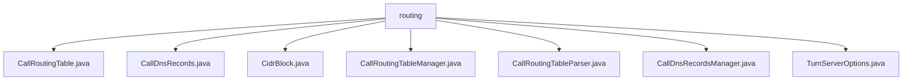

# 基础信息

|      |      |
|------|------|
| 名称 | routing |
| 编码语言 | .java |
| 代码路径 | Signal-Server/service/src/main/java/org/whispersystems/textsecuregcm/calls/routing |
| 包名 | Signal-Server.service.src.main.java.org.whispersystems.textsecuregcm.calls.routing |
| 概述说明 | CallRoutingTable类根据IP和地理位置优化呼叫路由，支持IPv4/IPv6。 |

# 说明

## 概述

该代码模块主要围绕呼叫路由的管理和优化展开，涉及IP地址解析、地理位置映射、DNS记录管理以及路由表的动态更新等功能。模块中的各个类协同工作，确保呼叫路由的高效性、准确性和可靠性。核心功能包括根据IP地址和地理位置信息选择最优数据中心、解析多种格式的路由表、动态更新路由表以及管理DNS记录等。

## 主要业务场景

1. **呼叫路由优化**：
   - `CallRoutingTable`类通过分析IP地址和地理位置信息，确定并返回最快的数据中心列表，优化呼叫路由效率。支持IPv4和IPv6协议，并能处理地理数据映射。
   - `CallRoutingTableParser`类解析JSON和TSV格式的呼叫路由表，支持IPv4和IPv6地址映射，并根据地理区域进行路由配置，确保路由决策的精准性。

2. **动态路由表管理**：
   - `CallRoutingTableManager`类负责监控S3对象的变化，实时调整和更新路由表，确保路由信息的准确性和最新性。通过持续监控S3存储中的对象，自动触发路由表更新机制，提升系统的可靠性。

3. **DNS记录管理**：
   - `CallDnsRecordsManager`类通过S3监控和定时器机制管理DNS记录，提供启动、停止和获取记录的功能，确保DNS记录的及时更新和管理。

4. **CIDR块处理**：
   - `CidrBlock`类（未提供具体细节，推测）可能用于处理IP地址块（CIDR）的相关逻辑，支持IP地址的划分和匹配。

5. **TURN服务器配置**：
   - `TurnServerOptions`类（未提供具体细节，推测）可能用于配置和管理TURN服务器，支持呼叫路由中的网络穿透功能。

该模块适用于需要高效、精准呼叫路由的场景，特别是在处理多种网络协议、地理区域映射以及动态路由更新的系统中。通过模块化的设计，各功能组件能够灵活配置和扩展，满足复杂的业务需求。

### 包内部结构视图

该流程图展示了Signal-Server项目中`calls/routing`目录下的文件层级关系。所有文件都直接位于`routing`目录下，包括`CallRoutingTable.java`、`CallDnsRecords.java`、`CidrBlock.java`、`CallRoutingTableManager.java`、`CallRoutingTableParser.java`、`CallDnsRecordsManager.java`和`TurnServerOptions.java`。这些文件共同组成了呼叫路由功能的核心组件。

# 文件列表 File List

| 名称   | 类型  | 说明 |
|-------|------|-------------|
| [CidrBlock.java](CidrBlock.md) | file | 无内容提供，无法生成概要描述。 |
| [TurnServerOptions.java](TurnServerOptions.md) | file | 无内容提供，无法生成概要描述。 |
| [CallDnsRecordsManager.java](CallDnsRecordsManager.md) | file | CallDnsRecordsManager类管理DNS记录，支持启动、停止和获取，利用S3监控和定时器更新。 |
| [CallRoutingTableParser.java](CallRoutingTableParser.md) | file | 解析JSON和TSV格式的呼叫路由表，支持IPv4、IPv6及地理区域映射。 |
| [CallRoutingTableManager.java](CallRoutingTableManager.md) | file | CallRoutingTableManager负责监控S3对象并动态更新呼叫路由表。 |
| [CallDnsRecords.java](CallDnsRecords.md) | file | 信息为空，无法生成概要描述。 |
| [CallRoutingTable.java](CallRoutingTable.md) | file | CallRoutingTable类通过IP和地理位置信息路由呼叫，支持IPv4、IPv6和地理数据，返回最快数据中心。 |

