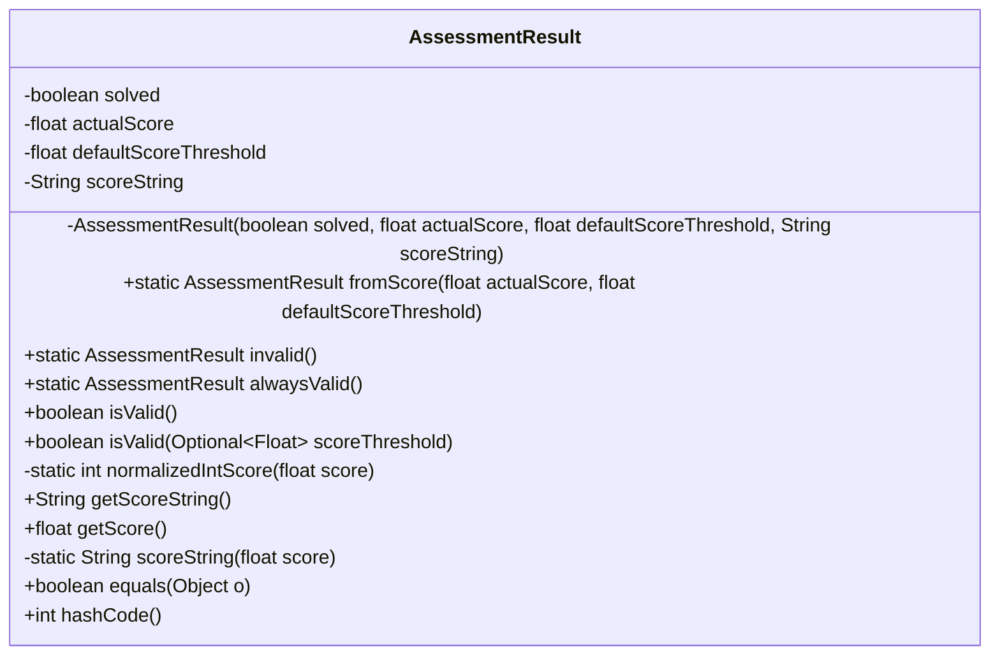

# 基础信息

|      |      |
|------|------|
| 名称 | AssessmentResult |
| 编码语言 | .java |
| 代码路径 | Signal-Server/service/src/main/java/org/whispersystems/textsecuregcm/captcha/AssessmentResult.java |
| 包名 | org.whispersystems.textsecuregcm.captcha |
| 依赖项 | ['java.util.Objects', 'java.util.Optional'] |
| 概述说明 | 评估结果类包含验证状态、实际分数、默认阈值和分数字符串，支持分数比较和有效性检查。 |

# 说明

评估结果类用于存储和验证评估数据，包含验证状态、实际分数、默认阈值和分数字符串。它支持比较分数大小，并检查评估结果的有效性。验证状态指示评估是否通过，实际分数为评估得分，默认阈值用于判断是否合格，分数字符串则用于显示分数。该类确保评估结果的准确性和可操作性。

# 类列表 Class Summary

| 名称   | 类型  | 说明 |
|-------|------|-------------|
| AssessmentResult | class | 评估结果类，包含验证状态、实际分数、默认阈值和分数字符串，支持分数比较和有效性检查。 |

## 类 AssessmentResult

|      |      |
|------|------|
| 访问范围 | public |
| 类型 | class |
| 名称 | AssessmentResult |
| 说明 | 评估结果类，包含验证状态、实际分数、默认阈值和分数字符串，支持分数比较和有效性检查。 |

### UML类图

**描述：**
`AssessmentResult` 类用于表示验证码评估结果，包含验证码是否成功解决、实际得分、默认得分阈值和得分字符串。类提供了多个静态方法用于创建不同类型的评估结果实例，并提供了验证结果是否有效的方法。类还实现了 `equals` 和 `hashCode` 方法以确保对象比较和哈希计算的一致性。

### 内部方法调用关系图

```mermaid
graph TD
    A["类AssessmentResult"]
    B["属性: boolean solved"]
    C["属性: float actualScore"]
    D["属性: float defaultScoreThreshold"]
    E["属性: String scoreString"]
    F["构造方法: AssessmentResult(boolean solved, float actualScore, float defaultScoreThreshold, String scoreString)"]
    G["方法: static AssessmentResult fromScore(float actualScore, float defaultScoreThreshold)"]
    H["方法: static AssessmentResult invalid()"]
    I["方法: static AssessmentResult alwaysValid()"]
    J["方法: boolean isValid()"]
    K["方法: boolean isValid(Optional<Float> scoreThreshold)"]
    L["方法: private static int normalizedIntScore(float score)"]
    M["方法: String getScoreString()"]
    N["方法: float getScore()"]
    O["方法: private static String scoreString(float score)"]
    P["重写方法: boolean equals(Object o)"]
    Q["重写方法: int hashCode()"]

    A --> B
    A --> C
    A --> D
    A --> E
    A --> F
    A --> G
    A --> H
    A --> I
    A --> J
    A --> K
    A --> L
    A --> M
    A --> N
    A --> O
    A --> P
    A --> Q
```

这段代码定义了一个名为 `AssessmentResult` 的类，用于处理验证码评估结果。类中包含多个属性和方法，用于表示评估结果的有效性、实际得分、默认得分阈值以及得分字符串。代码提供了多种构造方法，如 `fromScore`、`invalid` 和 `alwaysValid`，用于创建不同的评估结果实例。此外，类中还包含了用于验证评估结果是否有效的方法 `isValid`，以及用于获取得分字符串和实际得分的方法 `getScoreString` 和 `getScore`。代码还重写了 `equals` 和 `hashCode` 方法，以便在对象比较时使用。

### 字段列表 Field List

| 名称  | 类型  | 说明 |
|-------|-------|------|
| solved | boolean | 私有布尔变量solved，表示问题是否已解决。 |
| actualScore | float | 实际分数的私有浮点型变量。 |
| defaultScoreThreshold | float | 私有浮点型变量默认分数阈值。 |
| scoreString | String | 私有且不可变的字符串变量scoreString。 |

### 方法列表 Method List

| 名称  | 类型  | 说明 |
|-------|-------|------|
| alwaysValid | AssessmentResult | 静态方法返回始终有效的评估结果对象。 |
| getScoreString | String | 获取分数字符串的方法。 |
| isValid | boolean | 该方法检查有效性，默认不传入参数。 |
| equals | boolean | 重写equals方法，比较对象属性是否相等。 |
| getScore | float | 获取当前实际分数的浮点数值。 |
| invalid | AssessmentResult | 创建无效评估结果实例，返回失败状态及空值。 |
| fromScore | AssessmentResult | 根据分数生成评估结果，验证分数范围。 |
| hashCode | int | 重写hashCode方法，使用Objects.hash计算solved等字段的哈希值。 |
| normalizedIntScore | int | 将浮点数分数转换为整数，乘以100后四舍五入。 |
| isValid | boolean | 验证未解决或实际分数低于阈值时返回假，否则返回真。 |
| scoreString | String | 将浮点数分数转换为0到100的整数，步长为10。 |

