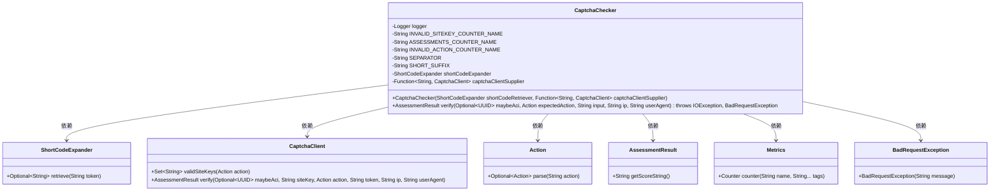
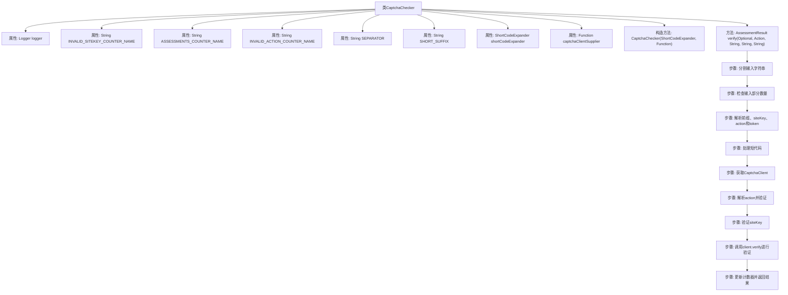

# 基础信息

|      |      |
|------|------|
| 名称 | CaptchaChecker |
| 编码语言 | .java |
| 代码路径 | Signal-Server/service/src/main/java/org/whispersystems/textsecuregcm/captcha/CaptchaChecker.java |
| 包名 | org.whispersystems.textsecuregcm.captcha |
| 依赖项 | ['org.whispersystems.textsecuregcm.metrics.MetricsUtil.name', 'com.google.common.annotations.VisibleForTesting', 'io.micrometer.core.instrument.Metrics', 'jakarta.ws.rs.BadRequestException', 'java.io.IOException', 'java.util.Locale', 'java.util.Optional', 'java.util.Set', 'java.util.UUID', 'java.util.function.Function', 'org.slf4j.Logger', 'org.slf4j.LoggerFactory'] |
| 概述说明 | CaptchaChecker类验证验证码，检查输入、密钥和动作，返回结果。 |

# 说明

CaptchaChecker类的主要功能是验证验证码，通过检查输入的格式、站点密钥和动作来确保验证码的有效性，并最终返回验证结果。该类专注于验证码的准确性和合规性，确保输入符合预期的标准。

# 类列表 Class Summary

| 名称   | 类型  | 说明 |
|-------|------|-------------|
| CaptchaChecker | class | CaptchaChecker类用于验证验证码，检查输入格式、站点密钥和动作，并返回验证结果。 |

## 类 CaptchaChecker

|      |      |
|------|------|
| 访问范围 | public |
| 类型 | class |
| 名称 | CaptchaChecker |
| 说明 | CaptchaChecker类用于验证验证码，检查输入格式、站点密钥和动作，并返回验证结果。 |

### UML类图

### 描述
`CaptchaChecker` 类用于验证用户提交的验证码是否有效。它依赖于 `ShortCodeExpander` 来扩展短代码，`CaptchaClient` 来执行验证码验证，`Action` 来解析和验证动作，`AssessmentResult` 来返回验证结果，`Metrics` 来记录指标，以及 `BadRequestException` 来处理无效请求。该类通过 `verify` 方法处理输入，检查验证码的有效性，并返回验证结果。

### 内部方法调用关系图

**描述：** 该流程图展示了`CaptchaChecker`类的结构和`verify`方法的执行流程。`verify`方法首先分割输入字符串并检查其部分数量，然后解析前缀、siteKey、action和token。如果输入包含短代码，则进行处理。接着获取`CaptchaClient`，解析并验证action和siteKey，最后调用`client.verify`进行验证，更新计数器并返回结果。

### 字段列表 Field List

| 名称  | 类型  | 说明 |
|-------|-------|------|
| INVALID_SITEKEY_COUNTER_NAME = name(CaptchaChecker.class, "invalidSiteKey") | String | CaptchaChecker类中定义无效站点键计数器名称。 |
| logger = LoggerFactory.getLogger(CaptchaChecker.class) | Logger | CaptchaChecker类中定义了一个私有的静态日志记录器。 |
| SHORT_SUFFIX = "-short" | String | 定义私有静态常量SHORT_SUFFIX，值为"-short"。 |
| INVALID_ACTION_COUNTER_NAME = name(CaptchaChecker.class, "invalidActions") | String | 定义常量INVALID_ACTION_COUNTER_NAME，用于记录无效操作计数。 |
| SEPARATOR = "." | String | 测试可见的静态字符串常量SEPARATOR，值为"."。 |
| captchaClientSupplier | Function<String, CaptchaClient> | 私有最终函数，用于提供验证码客户端实例。 |
| ASSESSMENTS_COUNTER_NAME = name(CaptchaChecker.class, "assessments") | String | 定义了一个私有静态常量ASSESSMENTS_COUNTER_NAME，用于存储CaptchaChecker类的计数器名称。 |
| shortCodeExpander | ShortCodeExpander | 私有最终短码扩展器实例。 |

### 方法列表 Method List

| 名称  | 类型  | 说明 |
|-------|-------|------|
| verify | AssessmentResult | 验证输入参数，处理短码，调用验证客户端，检查动作和站点密钥，返回验证结果。 |

