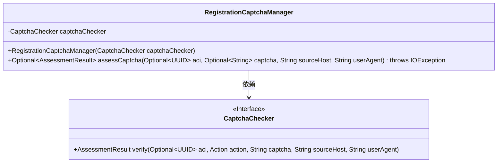
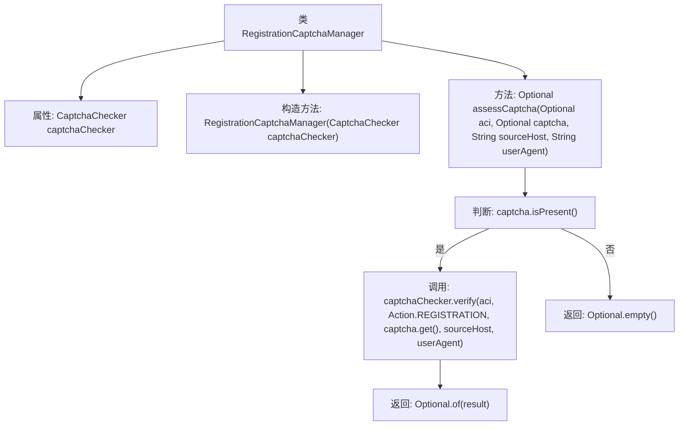

# 基础信息

|      |      |
|------|------|
| 名称 | RegistrationCaptchaManager |
| 编码语言 | .java |
| 代码路径 | Signal-Server/service/src/main/java/org/whispersystems/textsecuregcm/captcha/RegistrationCaptchaManager.java |
| 包名 | org.whispersystems.textsecuregcm.captcha |
| 依赖项 | ['java.io.IOException', 'java.util.Optional', 'java.util.UUID'] |
| 概述说明 | 注册验证码管理器依赖验证码检查器，具备验证码评估功能。 |

# 说明

注册验证码管理器类是一个用于管理验证码的组件，它依赖于验证码检查器来执行验证码的检查操作。该管理器类的主要功能是提供验证码的评估服务，确保验证码的有效性和正确性。通过集成验证码检查器，管理器能够对用户输入的验证码进行验证，并返回评估结果，从而保证系统的安全性和用户体验。

# 类列表 Class Summary

| 名称   | 类型  | 说明 |
|-------|------|-------------|
| RegistrationCaptchaManager | class | 注册验证码管理器类，依赖验证码检查器，提供验证码评估功能。 |

## 类 RegistrationCaptchaManager

|      |      |
|------|------|
| 访问范围 | public |
| 类型 | class |
| 名称 | RegistrationCaptchaManager |
| 说明 | 注册验证码管理器类，依赖验证码检查器，提供验证码评估功能。 |

### UML类图

这段代码定义了一个 `RegistrationCaptchaManager` 类，该类依赖于 `CaptchaChecker` 接口来验证用户注册时的验证码。`RegistrationCaptchaManager` 类包含一个构造函数和一个 `assessCaptcha` 方法，该方法接收多个可选参数并返回一个 `Optional<AssessmentResult>` 对象。`CaptchaChecker` 接口定义了一个 `verify` 方法，用于执行实际的验证码验证逻辑。

### 内部方法调用关系图

这段代码定义了一个`RegistrationCaptchaManager`类，用于管理注册过程中的验证码验证。类中包含一个`CaptchaChecker`属性，用于实际执行验证码验证。`assessCaptcha`方法接收多个参数，包括可选的`aci`和`captcha`，以及`sourceHost`和`userAgent`。方法首先检查`captcha`是否存在，如果存在则调用`captchaChecker.verify`方法进行验证，并返回结果；如果不存在，则返回`Optional.empty()`。

### 字段列表 Field List

| 名称  | 类型  | 说明 |
|-------|-------|------|
| captchaChecker | CaptchaChecker | 私有且不可变的验证码检查器实例。 |

### 方法列表 Method List

| 名称  | 类型  | 说明 |
|-------|-------|------|
| assessCaptcha | Optional<AssessmentResult> | 方法验证验证码，存在则返回结果，否则返回空。 |

