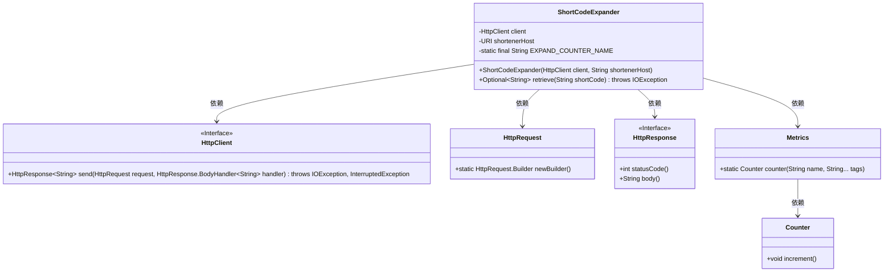
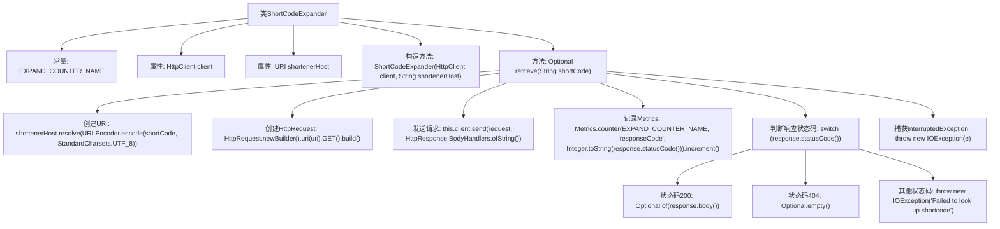

# 基础信息

|      |      |
|------|------|
| 名称 | ShortCodeExpander |
| 编码语言 | .java |
| 代码路径 | Signal-Server/service/src/main/java/org/whispersystems/textsecuregcm/captcha/ShortCodeExpander.java |
| 包名 | org.whispersystems.textsecuregcm.captcha |
| 依赖项 | ['io.micrometer.core.instrument.Metrics', 'org.apache.http.HttpStatus', 'java.io.IOException', 'java.net.URI', 'java.net.URLEncoder', 'java.net.http.HttpClient', 'java.net.http.HttpRequest', 'java.net.http.HttpResponse', 'java.nio.charset.StandardCharsets', 'java.util.Optional', 'org.whispersystems.textsecuregcm.metrics.MetricsUtil.name'] |
| 概述说明 | ShortCodeExpander类用HttpClient解析短码并返回结果。 |

# 说明

ShortCodeExpander类利用HttpClient工具解析短码，并最终返回解析后的结果。该类的主要功能是通过HTTP请求处理短码，确保能够准确地获取并返回所需的数据。

# 类列表 Class Summary

| 名称   | 类型  | 说明 |
|-------|------|-------------|
| ShortCodeExpander | class | ShortCodeExpander类通过HttpClient解析短码并返回结果。 |

## 类 ShortCodeExpander

|      |      |
|------|------|
| 访问范围 | public |
| 类型 | class |
| 名称 | ShortCodeExpander |
| 说明 | ShortCodeExpander类通过HttpClient解析短码并返回结果。 |

### UML类图

### 描述
`ShortCodeExpander`类用于扩展短码，通过`HttpClient`发送HTTP请求到指定的短码服务主机，并根据响应状态码返回相应的结果。该类依赖于`HttpClient`、`HttpRequest`、`HttpResponse`和`Metrics`等接口和类。`retrieve`方法处理HTTP请求，并根据响应状态码返回`Optional<String>`类型的结果，同时使用`Metrics`类记录请求的计数器。

### 内部方法调用关系图

这段代码定义了一个名为`ShortCodeExpander`的类，用于通过HTTP请求扩展短链接。类中包含一个常量`EXPAND_COUNTER_NAME`用于记录Metrics，两个属性`client`和`shortenerHost`分别表示HTTP客户端和短链接服务的主机地址。`retrieve`方法通过构建URI、发送HTTP请求并根据响应状态码返回结果或抛出异常。如果请求成功（状态码200），返回扩展后的链接；如果未找到（状态码404），返回空；其他情况抛出异常。

### 字段列表 Field List

| 名称  | 类型  | 说明 |
|-------|-------|------|
| client | HttpClient | 私有不可变的HttpClient客户端实例。 |
| shortenerHost | URI | 私有常量存储短链接服务的主机地址。 |
| EXPAND_COUNTER_NAME = name(ShortCodeExpander.class, "expand") | String | 定义静态常量EXPAND_COUNTER_NAME，值为ShortCodeExpander类的expand方法名。 |

### 方法列表 Method List

| 名称  | 类型  | 说明 |
|-------|-------|------|
| retrieve | Optional<String> | 根据短码获取URL，处理HTTP响应，返回结果或异常。 |

