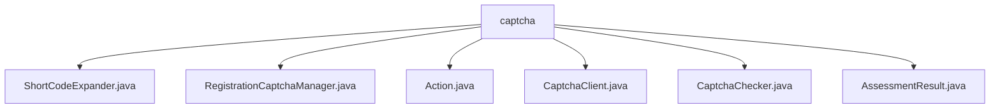

# 基础信息

|      |      |
|------|------|
| 名称 | captcha |
| 编码语言 | .java |
| 代码路径 | Signal-Server/service/src/main/java/org/whispersystems/textsecuregcm/captcha |
| 包名 | Signal-Server.service.src.main.java.org.whispersystems.textsecuregcm.captcha |
| 概述说明 | ShortCodeExpander类解析短码，返回结果。注册验证码管理器评估验证码有效性。CaptchaChecker验证验证码准确性。评估结果类存储验证数据，确保准确性。 |

# 说明

## 概述
该代码模块主要涉及验证码的管理和验证功能，旨在确保系统在处理用户验证码时的安全性和准确性。模块中的各个类协同工作，提供从验证码的解析、验证到评估结果管理的完整流程。通过HTTP请求处理短码、验证码的检查与评估，模块能够有效地管理验证码的生命周期，确保用户输入的验证码符合预期标准。

## 主要业务场景
1. **短码解析**：`ShortCodeExpander`类通过HTTP请求解析短码，并返回解析后的结果，确保系统能够准确地获取所需的数据。
2. **验证码管理**：`RegistrationCaptchaManager`类负责管理验证码的评估服务，依赖于`CaptchaChecker`类来执行验证码的检查操作，确保验证码的有效性和正确性。
3. **验证码验证**：`CaptchaChecker`类专注于验证码的验证，通过检查输入的格式、站点密钥和动作来确保验证码的有效性，并返回验证结果。
4. **评估结果管理**：`AssessmentResult`类用于存储和验证评估数据，包含验证状态、实际分数、默认阈值和分数字符串，确保评估结果的准确性和可操作性。

该模块广泛应用于需要验证码验证的场景，如用户注册、登录等，确保系统的安全性和用户体验。

### 包内部结构视图

该流程图展示了Signal-Server项目中`captcha`目录下的文件层级关系。`captcha`作为根节点，包含了多个Java文件，如`ShortCodeExpander.java`、`RegistrationCaptchaManager.java`等。这些文件均位于`captcha`目录下，没有进一步的子目录层级。

# 文件列表 File List

| 名称   | 类型  | 说明 |
|-------|------|-------------|
| [CaptchaChecker.java](CaptchaChecker.md) | file | CaptchaChecker类验证验证码，检查输入、密钥和动作，返回结果。 |
| [CaptchaClient.java](CaptchaClient.md) | file | 信息为空，无法生成概要描述。 |
| [Action.java](Action.md) | file | 信息为空，无法生成概要描述。 |
| [AssessmentResult.java](AssessmentResult.md) | file | 评估结果类包含验证状态、实际分数、默认阈值和分数字符串，支持分数比较和有效性检查。 |
| [RegistrationCaptchaManager.java](RegistrationCaptchaManager.md) | file | 注册验证码管理器依赖验证码检查器，具备验证码评估功能。 |
| [ShortCodeExpander.java](ShortCodeExpander.md) | file | ShortCodeExpander类用HttpClient解析短码并返回结果。 |

