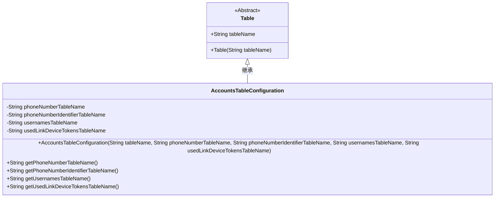
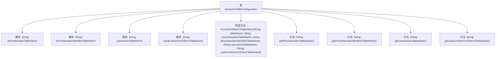

# 基础信息

|      |      |
|------|------|
| 名称 | AccountsTableConfiguration |
| 编码语言 | .java |
| 代码路径 | Signal-Server/service/src/main/java/org/whispersystems/textsecuregcm/configuration/AccountsTableConfiguration.java |
| 包名 | org.whispersystems.textsecuregcm.configuration |
| 依赖项 | ['com.fasterxml.jackson.annotation.JsonCreator', 'com.fasterxml.jackson.annotation.JsonProperty', 'jakarta.validation.constraints.NotBlank', 'org.whispersystems.textsecuregcm.configuration.DynamoDbTables.Table'] |
| 概述说明 | AccountsTableConfiguration继承Table，包含四个表名属性及getter方法。 |

# 说明

AccountsTableConfiguration类继承自Table类，包含四个表名属性。这些属性分别用于存储不同表的名字，并通过相应的getter方法进行访问。该类的设计旨在管理多个表名的配置，以便在需要时能够方便地获取和使用这些表名信息。

# 类列表 Class Summary

| 名称   | 类型  | 说明 |
|-------|------|-------------|
| AccountsTableConfiguration | class | AccountsTableConfiguration类继承Table，包含四个表名属性及其getter方法。 |

## 类 AccountsTableConfiguration

|      |      |
|------|------|
| 访问范围 | public |
| 类型 | class |
| 名称 | AccountsTableConfiguration |
| 说明 | AccountsTableConfiguration类继承Table，包含四个表名属性及其getter方法。 |

### UML类图

**描述：**  
`AccountsTableConfiguration` 类继承自 `Table` 类，用于配置账户相关的表名。它包含四个私有属性：`phoneNumberTableName`、`phoneNumberIdentifierTableName`、`usernamesTableName` 和 `usedLinkDeviceTokensTableName`，分别表示电话号码表、电话号码标识表、用户名表和已使用链接设备令牌表的名称。通过构造函数初始化这些表名，并提供相应的 getter 方法获取这些表名。该类通过 `@JsonCreator` 和 `@JsonProperty` 注解支持 JSON 反序列化，确保表名在配置时可以被正确解析。

### 内部方法调用关系图

这段代码定义了一个名为 `AccountsTableConfiguration` 的类，该类继承自 `Table` 类。它包含四个私有字符串属性，分别表示电话号码表名、电话号码标识表名、用户名表名和已使用的链接设备令牌表名。通过带注解的构造方法初始化这些属性，并提供了四个公共方法来获取这些属性的值。该类的设计用于配置和管理与账户相关的表名信息。

### 字段列表 Field List

| 名称  | 类型  | 说明 |
|-------|-------|------|
| phoneNumberTableName | String | 定义私有常量字符串变量phoneNumberTableName。 |
| usernamesTableName | String | 私有字符串变量存储用户名表名。 |
| usedLinkDeviceTokensTableName | String | 私有字符串变量存储设备令牌表名。 |
| phoneNumberIdentifierTableName | String | 私有常量字符串存储电话号码标识符表名。 |

### 方法列表 Method List

| 名称  | 类型  | 说明 |
|-------|-------|------|
| getPhoneNumberTableName | String | 方法返回电话号码表名称。 |
| getPhoneNumberIdentifierTableName | String | 获取电话号码标识符表名称的方法。 |
| getUsedLinkDeviceTokensTableName | String | 该方法返回已使用链接设备令牌的表名。 |
| getUsernamesTableName | String | 该方法返回用户表名称。 |

