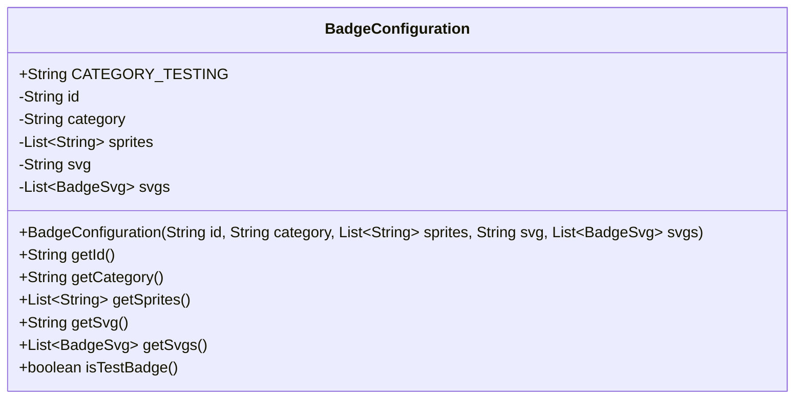
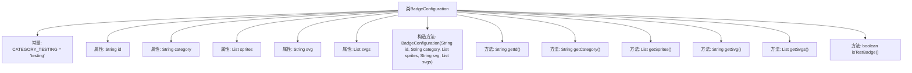

# 基础信息

|      |      |
|------|------|
| 名称 | BadgeConfiguration |
| 编码语言 | .java |
| 代码路径 | Signal-Server/service/src/main/java/org/whispersystems/textsecuregcm/configuration/BadgeConfiguration.java |
| 包名 | org.whispersystems.textsecuregcm.configuration |
| 依赖项 | ['com.fasterxml.jackson.annotation.JsonCreator', 'com.fasterxml.jackson.annotation.JsonProperty', 'jakarta.validation.constraints.NotEmpty', 'jakarta.validation.constraints.NotNull', 'java.util.List', 'org.whispersystems.textsecuregcm.entities.BadgeSvg', 'org.whispersystems.textsecuregcm.util.ExactlySize'] |
| 概述说明 | BadgeConfiguration类包含ID、类别、精灵列表、SVG及SVG列表，提供获取和测试方法。 |

# 说明

BadgeConfiguration类包含多个关键属性，包括ID、类别、精灵列表、SVG及SVG列表。该类提供了获取这些属性的方法，并包含用于测试和判断相关功能的方法。这些属性和方法共同构成了该类的核心功能，使其能够有效管理和操作徽章配置数据。

# 类列表 Class Summary

| 名称   | 类型  | 说明 |
|-------|------|-------------|
| BadgeConfiguration | class | BadgeConfiguration类包含ID、类别、精灵列表、SVG及SVG列表，提供获取方法和测试判断。 |

## 类 BadgeConfiguration

|      |      |
|------|------|
| 访问范围 | public |
| 类型 | class |
| 名称 | BadgeConfiguration |
| 说明 | BadgeConfiguration类包含ID、类别、精灵列表、SVG及SVG列表，提供获取方法和测试判断。 |

### UML类图

**描述：**  
`BadgeConfiguration` 类用于配置徽章的相关信息，包含徽章的ID、类别、精灵图列表、SVG字符串以及SVG对象列表。类中定义了一个常量 `CATEGORY_TESTING` 用于标识测试类别的徽章。通过构造函数初始化这些属性，并提供了相应的getter方法来获取属性值。`isTestBadge` 方法用于判断当前徽章是否属于测试类别。

### 内部方法调用关系图

这段代码定义了一个名为`BadgeConfiguration`的类，用于管理徽章的配置信息。类中包含常量、属性和方法，分别用于存储和获取徽章的ID、类别、精灵图、SVG图像以及SVG对象列表。`isTestBadge`方法用于判断徽章是否属于测试类别。代码通过构造方法和注解实现了对象的初始化和数据验证。

### 字段列表 Field List

| 名称  | 类型  | 说明 |
|-------|-------|------|
| category | String | 私有不可变字符串变量category。 |
| CATEGORY_TESTING = "testing" | String | 定义常量字符串CATEGORY_TESTING，值为"testing"。 |
| sprites | List<String> | 私有不可变字符串列表变量sprites。 |
| svg | String | 私有不可变的字符串变量svg。 |
| id | String | 声明一个私有且不可变的字符串类型变量id。 |
| svgs | List<BadgeSvg> | 私有不可变列表存储BadgeSvg对象。 |

### 方法列表 Method List

| 名称  | 类型  | 说明 |
|-------|-------|------|
| isTestBadge | boolean | 判断徽章类别是否为测试类别。 |
| getSprites | List<String> | 该方法返回一个包含6个非空字符串的列表。 |
| getSvg | String | 方法 `getSvg` 返回字符串 `svg` 的值。 |
| getId | String | 获取对象ID的方法。 |
| getCategory | String | 获取类别信息的公共方法。 |
| getSvgs | List<BadgeSvg> | 返回不可为空的徽章SVG列表。 |

