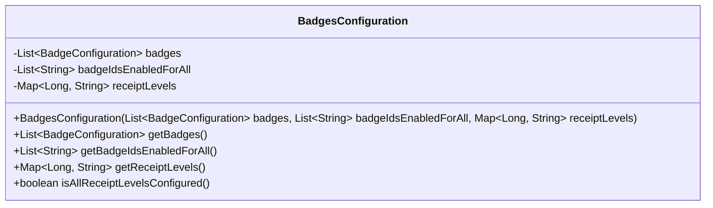
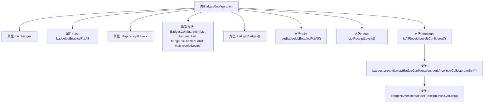

# 基础信息

|      |      |
|------|------|
| 名称 | BadgesConfiguration |
| 编码语言 | .java |
| 代码路径 | Signal-Server/service/src/main/java/org/whispersystems/textsecuregcm/configuration/BadgesConfiguration.java |
| 包名 | org.whispersystems.textsecuregcm.configuration |
| 依赖项 | ['com.fasterxml.jackson.annotation.JsonCreator', 'com.fasterxml.jackson.annotation.JsonIgnore', 'com.fasterxml.jackson.annotation.JsonProperty', 'com.fasterxml.jackson.annotation.JsonSetter', 'com.fasterxml.jackson.annotation.Nulls', 'io.dropwizard.validation.ValidationMethod', 'jakarta.validation.Valid', 'jakarta.validation.constraints.NotNull', 'java.util.List', 'java.util.Map', 'java.util.Objects', 'java.util.Set', 'java.util.stream.Collectors'] |
| 概述说明 | BadgesConfiguration类管理徽章配置，验证收据级别配置。 |

# 说明

BadgesConfiguration类负责管理徽章配置，主要功能包括维护徽章列表、全局启用徽章ID以及收据级别映射。该类还负责验证收据级别是否已正确配置，确保徽章系统的完整性和一致性。

# 类列表 Class Summary

| 名称   | 类型  | 说明 |
|-------|------|-------------|
| BadgesConfiguration | class | BadgesConfiguration类管理徽章配置，包含徽章列表、全局启用徽章ID和收据级别映射，并验证收据级别是否配置。 |

## 类 BadgesConfiguration

|      |      |
|------|------|
| 访问范围 | public |
| 类型 | class |
| 名称 | BadgesConfiguration |
| 说明 | BadgesConfiguration类管理徽章配置，包含徽章列表、全局启用徽章ID和收据级别映射，并验证收据级别是否配置。 |

### UML类图

这段代码定义了一个名为 `BadgesConfiguration` 的类，用于管理徽章配置。该类包含三个私有成员变量：`badges`（徽章配置列表）、`badgeIdsEnabledForAll`（所有用户启用的徽章ID列表）和 `receiptLevels`（收据级别映射）。类通过构造函数初始化这些变量，并提供了相应的 getter 方法。此外，`isAllReceiptLevelsConfigured` 方法用于验证所有收据级别是否都已配置为徽章。该类主要用于处理与徽章相关的配置和验证逻辑。

### 内部方法调用关系图

这段代码定义了一个名为`BadgesConfiguration`的类，用于管理徽章配置。类中包含三个主要属性：`badges`（徽章配置列表）、`badgeIdsEnabledForAll`（所有用户启用的徽章ID列表）和`receiptLevels`（收据级别映射）。类通过构造方法初始化这些属性，并提供了相应的getter方法。此外，`isAllReceiptLevelsConfigured`方法用于验证所有收据级别是否都在配置的徽章中，确保数据一致性。

### 字段列表 Field List

| 名称  | 类型  | 说明 |
|-------|-------|------|
| receiptLevels | Map<Long, String> | 私有不可变映射，键为长整型，值为字符串。 |
| badges | List<BadgeConfiguration> | 私有最终列表存储徽章配置信息。 |
| badgeIdsEnabledForAll | List<String> | 私有列表存储所有启用的徽章ID。 |

### 方法列表 Method List

| 名称  | 类型  | 说明 |
|-------|-------|------|
| getBadges | List<BadgeConfiguration> | 获取非空的徽章配置列表。 |
| getReceiptLevels | Map<Long, String> | 方法返回非空的收据级别映射。 |
| getBadgeIdsEnabledForAll | List<String> | 返回所有启用的徽章ID列表，确保非空。 |
| isAllReceiptLevelsConfigured | boolean | 方法验证收据级别是否配置了所有徽章。 |

