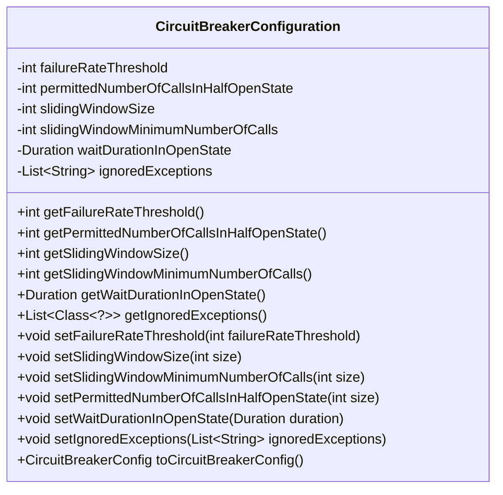

# 基础信息

|      |      |
|------|------|
| 名称 | CircuitBreakerConfiguration |
| 编码语言 | .java |
| 代码路径 | Signal-Server/service/src/main/java/org/whispersystems/textsecuregcm/configuration/CircuitBreakerConfiguration.java |
| 包名 | org.whispersystems.textsecuregcm.configuration |
| 依赖项 | ['com.fasterxml.jackson.annotation.JsonProperty', 'com.google.common.annotations.VisibleForTesting', 'io.github.resilience4j.circuitbreaker.CircuitBreakerConfig', 'jakarta.validation.constraints.Max', 'jakarta.validation.constraints.Min', 'jakarta.validation.constraints.NotNull', 'java.time.Duration', 'java.util.Collections', 'java.util.List', 'java.util.stream.Collectors'] |
| 概述说明 | 断路器配置类包含故障率、半开状态调用数、滑动窗口及最小调用数、开放状态等待时间等参数。 |

# 说明

断路器配置类是一个用于控制和管理断路器行为的类，包含多个关键参数。故障率阈值用于定义触发断路器打开的条件，当故障率超过该阈值时，断路器将进入打开状态。半开状态允许调用数指定了在断路器处于半开状态时，允许通过的请求数量，以测试系统是否恢复正常。滑动窗口大小及最小调用数用于计算故障率，滑动窗口定义了统计故障率的时间范围，最小调用数确保在窗口内有足够的调用量进行统计。开放状态等待时间定义了断路器在打开状态后，等待多长时间才进入半开状态，以便重新尝试请求。这些参数共同作用，确保系统在故障发生时能够有效地进行自我保护，并在条件允许时逐步恢复服务。

# 类列表 Class Summary

| 名称   | 类型  | 说明 |
|-------|------|-------------|
| CircuitBreakerConfiguration | class | 断路器配置类，包含故障率阈值、半开状态允许调用数、滑动窗口大小及最小调用数、开放状态等待时间等参数。 |

## 类 CircuitBreakerConfiguration

|      |      |
|------|------|
| 访问范围 | public |
| 类型 | class |
| 名称 | CircuitBreakerConfiguration |
| 说明 | 断路器配置类，包含故障率阈值、半开状态允许调用数、滑动窗口大小及最小调用数、开放状态等待时间等参数。 |

### UML类图

**描述：**  
`CircuitBreakerConfiguration` 类用于配置熔断器的各项参数，包括失败率阈值、半开状态允许的调用次数、滑动窗口大小、滑动窗口最小调用次数、开放状态的等待时间以及忽略的异常列表。该类提供了获取和设置这些参数的方法，并可以将配置转换为 `CircuitBreakerConfig` 对象。通过 `toCircuitBreakerConfig` 方法，可以将配置应用到熔断器中，确保系统在异常情况下能够自动恢复。

### 内部方法调用关系图

```mermaid
graph TD
    A["类CircuitBreakerConfiguration"]
    B["属性: int failureRateThreshold"]
    C["属性: int permittedNumberOfCallsInHalfOpenState"]
    D["属性: int slidingWindowSize"]
    E["属性: int slidingWindowMinimumNumberOfCalls"]
    F["属性: Duration waitDurationInOpenState"]
    G["属性: List<String> ignoredExceptions"]
    H["方法: int getFailureRateThreshold()"]
    I["方法: int getPermittedNumberOfCallsInHalfOpenState()"]
    J["方法: int getSlidingWindowSize()"]
    K["方法: int getSlidingWindowMinimumNumberOfCalls()"]
    L["方法: Duration getWaitDurationInOpenState()"]
    M["方法: List<Class<?>> getIgnoredExceptions()"]
    N["方法: void setFailureRateThreshold(int failureRateThreshold)"]
    O["方法: void setSlidingWindowSize(int size)"]
    P["方法: void setSlidingWindowMinimumNumberOfCalls(int size)"]
    Q["方法: void setPermittedNumberOfCallsInHalfOpenState(int size)"]
    R["方法: void setWaitDurationInOpenState(Duration duration)"]
    S["方法: void setIgnoredExceptions(List<String> ignoredExceptions)"]
    T["方法: CircuitBreakerConfig toCircuitBreakerConfig()"]

    A --> B
    A --> C
    A --> D
    A --> E
    A --> F
    A --> G
    A --> H
    A --> I
    A --> J
    A --> K
    A --> L
    A --> M
    A --> N
    A --> O
    A --> P
    A --> Q
    A --> R
    A --> S
    A --> T
```

该流程图展示了`CircuitBreakerConfiguration`类的结构，包括其属性和方法。类中定义了多个属性，如`failureRateThreshold`、`permittedNumberOfCallsInHalfOpenState`等，并提供了相应的getter和setter方法。此外，`toCircuitBreakerConfig`方法用于将当前配置转换为`CircuitBreakerConfig`对象。流程图清晰地展示了类内部各元素之间的关系，便于理解类的整体功能。

### 字段列表 Field List

| 名称  | 类型  | 说明 |
|-------|-------|------|
| failureRateThreshold = 50 | int | 失败率阈值设置为1到100之间，默认值为50。 |
| waitDurationInOpenState = Duration.ofSeconds(10) | Duration | 等待时间在开放状态下默认为10秒。 |
| slidingWindowMinimumNumberOfCalls = 100 | int | 滑动窗口最小调用次数为100，且不可为空。 |
| slidingWindowSize = 100 | int | 滑动窗口大小必须为不小于1的整数，默认值为100。 |
| ignoredExceptions = Collections.emptyList() | List<String> | 该代码定义了一个私有列表，用于存储忽略的异常，初始为空列表。 |
| permittedNumberOfCallsInHalfOpenState = 10 | int | 半开状态下允许调用次数为10，不可为空且最小值为1。 |

### 方法列表 Method List

| 名称  | 类型  | 说明 |
|-------|-------|------|
| getSlidingWindowMinimumNumberOfCalls | int | 获取滑动窗口最小调用次数的方法。 |
| getWaitDurationInOpenState | Duration | 获取开放状态下的等待时长。 |
| getFailureRateThreshold | int | 获取失败率阈值的方法。 |
| getSlidingWindowSize | int | 获取滑动窗口大小的方法。 |
| setPermittedNumberOfCallsInHalfOpenState | void | 公开方法用于设置半开状态下的允许调用次数。 |
| setWaitDurationInOpenState | void | 公开方法用于设置开放状态下的等待时长。 |
| getPermittedNumberOfCallsInHalfOpenState | int | 获取半开状态下的允许调用次数。 |
| setFailureRateThreshold | void | 测试可见方法设置失败率阈值。 |
| setSlidingWindowMinimumNumberOfCalls | void | 公开方法用于设置滑动窗口最小调用次数。 |
| setIgnoredExceptions | void | 公开方法设置忽略异常列表，供测试使用。 |
| setSlidingWindowSize | void | 公开方法用于测试时设置滑动窗口大小。 |
| getIgnoredExceptions | List<Class<?>> | 获取忽略的异常类列表，转换类名为类对象并返回。 |
| toCircuitBreakerConfig | CircuitBreakerConfig | 方法生成自定义断路器配置，包含失败率、忽略异常、半开状态调用数、开放状态等待时间和滑动窗口设置。 |

