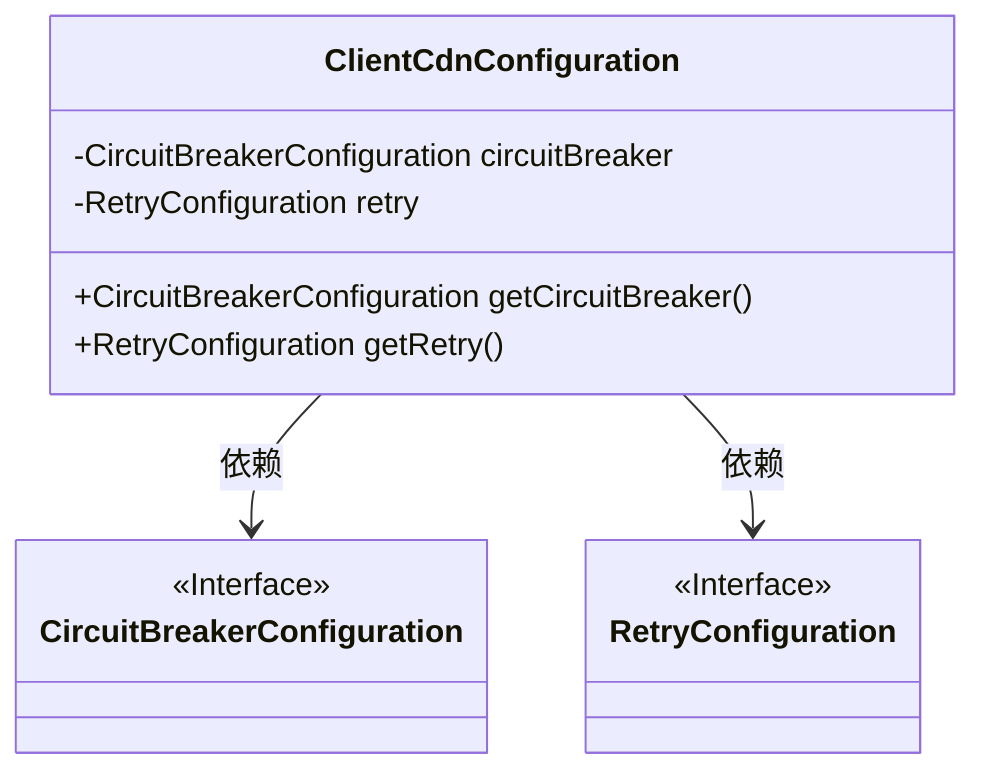
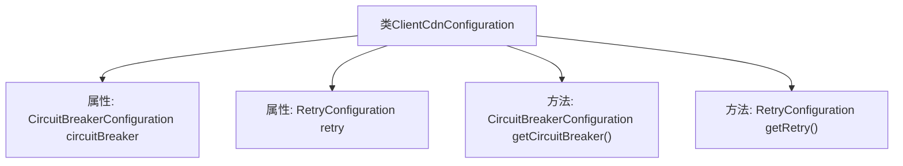

# 基础信息

|      |      |
|------|------|
| 名称 | ClientCdnConfiguration |
| 编码语言 | .java |
| 代码路径 | Signal-Server/service/src/main/java/org/whispersystems/textsecuregcm/configuration/ClientCdnConfiguration.java |
| 包名 | org.whispersystems.textsecuregcm.configuration |
| 依赖项 | ['com.fasterxml.jackson.annotation.JsonProperty', 'jakarta.validation.Valid', 'jakarta.validation.constraints.NotNull'] |
| 概述说明 | 客户端CDN配置类，支持熔断与重试功能。 |

# 说明

客户端CDN配置类是一个用于管理和优化内容分发网络（CDN）的配置模块，主要包含熔断和重试机制的设置。熔断机制用于在CDN服务出现故障或性能下降时，自动切换到备用方案或停止请求，以防止系统崩溃。重试配置则用于在请求失败时，自动进行多次重试，以提高请求的成功率。该类通过这两种机制，确保客户端在访问CDN资源时具有更高的可靠性和稳定性。

# 类列表 Class Summary

| 名称   | 类型  | 说明 |
|-------|------|-------------|
| ClientCdnConfiguration | class | 客户端CDN配置类，包含熔断和重试配置。 |

## 类 ClientCdnConfiguration

|      |      |
|------|------|
| 访问范围 | public |
| 类型 | class |
| 名称 | ClientCdnConfiguration |
| 说明 | 客户端CDN配置类，包含熔断和重试配置。 |

### UML类图

这段代码定义了一个 `ClientCdnConfiguration` 类，该类包含两个私有成员变量 `circuitBreaker` 和 `retry`，分别代表 `CircuitBreakerConfiguration` 和 `RetryConfiguration` 的实例。`ClientCdnConfiguration` 类提供了两个公有方法 `getCircuitBreaker()` 和 `getRetry()`，用于获取这两个配置实例。`CircuitBreakerConfiguration` 和 `RetryConfiguration` 被标记为接口，表示它们是抽象的配置类。`ClientCdnConfiguration` 类依赖于这两个接口来实现其功能。

### 内部方法调用关系图

这段代码定义了一个名为`ClientCdnConfiguration`的类，其中包含两个属性：`circuitBreaker`和`retry`，分别表示断路器配置和重试配置。这两个属性都使用了`@JsonProperty`、`@NotNull`和`@Valid`注解进行标记，确保它们在序列化和反序列化时被正确处理，并且不为空且有效。类中还提供了两个方法`getCircuitBreaker()`和`getRetry()`，用于获取这两个配置对象。

### 字段列表 Field List

| 名称  | 类型  | 说明 |
|-------|-------|------|
| circuitBreaker = new CircuitBreakerConfiguration() | CircuitBreakerConfiguration | 该代码定义了一个非空且有效的断路器配置对象。 |
| retry = new RetryConfiguration() | RetryConfiguration | 包含NotNull和Valid注解的RetryConfiguration实例化。 |

### 方法列表 Method List

| 名称  | 类型  | 说明 |
|-------|-------|------|
| getCircuitBreaker | CircuitBreakerConfiguration | 获取电路断路器配置的方法。 |
| getRetry | RetryConfiguration | 获取重试配置方法返回retry对象。 |

