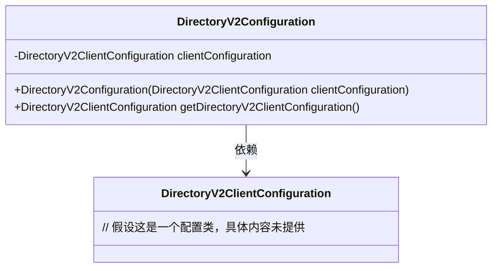
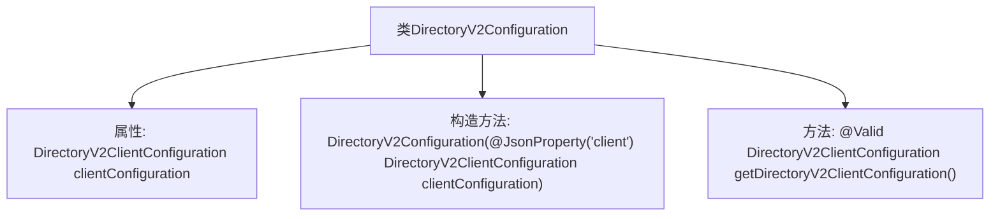

# 基础信息

|      |      |
|------|------|
| 名称 | DirectoryV2Configuration |
| 编码语言 | .java |
| 代码路径 | Signal-Server/service/src/main/java/org/whispersystems/textsecuregcm/configuration/DirectoryV2Configuration.java |
| 包名 | org.whispersystems.textsecuregcm.configuration |
| 依赖项 | ['com.fasterxml.jackson.annotation.JsonCreator', 'com.fasterxml.jackson.annotation.JsonProperty', 'jakarta.validation.Valid'] |
| 概述说明 | DirectoryV2Configuration类包含并管理DirectoryV2ClientConfiguration实例。 |

# 说明

DirectoryV2Configuration类内部包含一个DirectoryV2ClientConfiguration实例，该实例通过构造函数注入到类中，并且类中提供了获取该实例的方法。这种设计使得DirectoryV2Configuration类能够管理和访问DirectoryV2ClientConfiguration的配置信息，确保配置的灵活性和可维护性。

# 类列表 Class Summary

| 名称   | 类型  | 说明 |
|-------|------|-------------|
| DirectoryV2Configuration | class | DirectoryV2Configuration类包含一个DirectoryV2ClientConfiguration实例，通过构造函数注入并提供获取方法。 |

## 类 DirectoryV2Configuration

|      |      |
|------|------|
| 访问范围 | public |
| 类型 | class |
| 名称 | DirectoryV2Configuration |
| 说明 | DirectoryV2Configuration类包含一个DirectoryV2ClientConfiguration实例，通过构造函数注入并提供获取方法。 |

### UML类图

类图描述：`DirectoryV2Configuration` 类包含一个私有的 `DirectoryV2ClientConfiguration` 对象，并通过构造函数进行初始化。该类提供了一个公有方法 `getDirectoryV2ClientConfiguration`，用于返回该配置对象。`DirectoryV2Configuration` 依赖于 `DirectoryV2ClientConfiguration`，表示前者使用后者的配置信息。

### 内部方法调用关系图

该流程图描述了`DirectoryV2Configuration`类的结构，包括其属性、构造方法和一个公共方法。类包含一个`DirectoryV2ClientConfiguration`类型的私有属性`clientConfiguration`，并通过构造方法进行初始化。构造方法使用了`@JsonCreator`和`@JsonProperty`注解，用于JSON反序列化。类还提供了一个`@Valid`注解的公共方法`getDirectoryV2ClientConfiguration`，用于返回`clientConfiguration`属性。

### 字段列表 Field List

| 名称  | 类型  | 说明 |
|-------|-------|------|
| clientConfiguration | DirectoryV2ClientConfiguration | 私有且不可变的DirectoryV2客户端配置对象。 |

### 方法列表 Method List

| 名称  | 类型  | 说明 |
|-------|-------|------|
| getDirectoryV2ClientConfiguration | DirectoryV2ClientConfiguration | 获取DirectoryV2Client配置实例。 |

