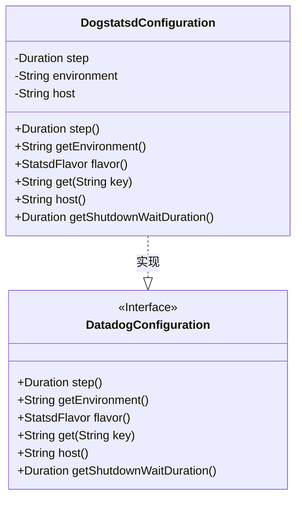
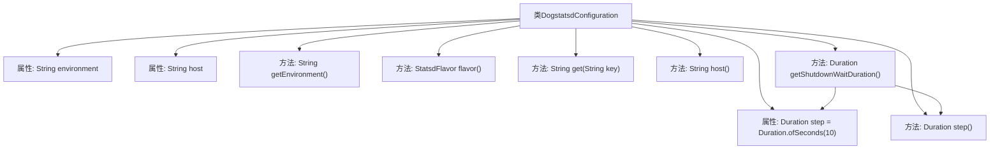

# 基础信息

|      |      |
|------|------|
| 名称 | DogstatsdConfiguration |
| 编码语言 | .java |
| 代码路径 | Signal-Server/service/src/main/java/org/whispersystems/textsecuregcm/configuration/DogstatsdConfiguration.java |
| 包名 | org.whispersystems.textsecuregcm.configuration |
| 依赖项 | ['com.fasterxml.jackson.annotation.JsonProperty', 'com.fasterxml.jackson.annotation.JsonTypeName', 'io.micrometer.statsd.StatsdFlavor', 'jakarta.validation.constraints.NotBlank', 'jakarta.validation.constraints.NotNull', 'java.time.Duration'] |
| 概述说明 | Dogstatsd配置类含步长、环境、主机属性，返回Datadog风格及关闭等待时长。 |

# 说明

Dogstatsd配置类包含三个主要属性：步长、环境和主机。步长用于定义数据采集的时间间隔，环境属性用于标识当前运行的环境类型，主机属性则用于指定当前运行的主机信息。该配置类还提供了返回Datadog风格数据的功能，确保数据格式与Datadog平台兼容。此外，配置类还支持设置关闭等待时长，用于控制在关闭操作时的等待时间，以确保资源的正确释放和系统的稳定性。

# 类列表 Class Summary

| 名称   | 类型  | 说明 |
|-------|------|-------------|
| DogstatsdConfiguration | class | Dogstatsd配置类，包含步长、环境、主机属性，返回Datadog风格和关闭等待时长。 |

## 类 DogstatsdConfiguration

|      |      |
|------|------|
| 访问范围 | @JsonTypeName("default");public |
| 类型 | class |
| 名称 | DogstatsdConfiguration |
| 说明 | Dogstatsd配置类，包含步长、环境、主机属性，返回Datadog风格和关闭等待时长。 |

### UML类图

### 描述
`DogstatsdConfiguration`类实现了`DatadogConfiguration`接口，用于配置Dogstatsd的相关参数。该类包含三个私有属性：`step`（步长）、`environment`（环境）和`host`（主机）。通过实现接口中的方法，该类提供了获取这些属性的功能，并计算了关闭等待时间。`DogstatsdConfiguration`类的主要作用是管理和提供Dogstatsd配置的详细信息。

### 内部方法调用关系图

这段代码定义了一个名为 `DogstatsdConfiguration` 的类，实现了 `DatadogConfiguration` 接口。类中包含三个属性：`step`、`environment` 和 `host`，分别表示时间间隔、环境和主机地址。类中提供了多个方法，用于获取这些属性的值以及计算关机等待时间。其中，`getShutdownWaitDuration` 方法依赖于 `step()` 方法和 `step` 属性来计算返回值。

### 字段列表 Field List

| 名称  | 类型  | 说明 |
|-------|-------|------|
| host | String | JSON属性"host"为必填字段。 |
| step = Duration.ofSeconds(10) | Duration | 属性step类型为Duration，默认值为10秒，不可为空。 |
| environment | String | 代码定义了一个非空字符串字段environment，并指定了JSON属性名。 |

### 方法列表 Method List

| 名称  | 类型  | 说明 |
|-------|-------|------|
| step | Duration | 重写step方法，返回step变量。 |
| getEnvironment | String | 重写getEnvironment方法，返回environment变量。 |
| flavor | StatsdFlavor | 重写方法返回Datadog类型的StatsdFlavor。 |
| host | String | 重写host方法，返回host变量值。 |
| get | String | 重写get方法，始终返回null，无Micrometer键值对。 |
| getShutdownWaitDuration | Duration | 重写方法，返回关闭等待时间，为基础步长加其一半。 |

