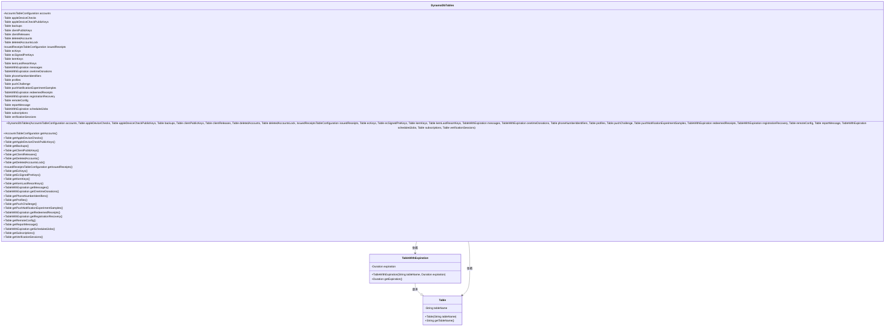

# 基础信息

|      |      |
|------|------|
| 名称 | DynamoDbTables |
| 编码语言 | .java |
| 代码路径 | Signal-Server/service/src/main/java/org/whispersystems/textsecuregcm/configuration/DynamoDbTables.java |
| 包名 | org.whispersystems.textsecuregcm.configuration |
| 依赖项 | ['com.fasterxml.jackson.annotation.JsonCreator', 'com.fasterxml.jackson.annotation.JsonProperty', 'jakarta.validation.Valid', 'jakarta.validation.constraints.NotEmpty', 'jakarta.validation.constraints.NotNull', 'java.time.Duration'] |
| 概述说明 | DynamoDbTables类管理基础表及带过期时间的DynamoDB表。 |

# 说明

DynamoDbTables类负责管理多个DynamoDB表，涵盖基础表以及具备过期时间特性的表。该类的核心功能是统一管理这些表，确保它们在不同场景下的高效运作，特别是处理带有过期时间的表时，能够自动管理数据的生命周期，确保数据的时效性和存储空间的优化。

# 类列表 Class Summary

| 名称   | 类型  | 说明 |
|-------|------|-------------|
| DynamoDbTables | class | DynamoDbTables类管理多个DynamoDB表，包括基础表和带过期时间的表。 |

## 类 DynamoDbTables

|      |      |
|------|------|
| 访问范围 | public |
| 类型 | class |
| 名称 | DynamoDbTables |
| 说明 | DynamoDbTables类管理多个DynamoDB表，包括基础表和带过期时间的表。 |

### UML类图

该类图展示了 `DynamoDbTables` 类的结构及其与 `Table` 和 `TableWithExpiration` 类的关系。`DynamoDbTables` 类包含多个 `Table` 和 `TableWithExpiration` 类型的成员变量，并通过构造函数和 getter 方法进行管理。`TableWithExpiration` 继承自 `Table`，并添加了 `expiration` 属性。整体设计用于管理 DynamoDB 表的配置信息。

### 内部方法调用关系图

这段代码定义了一个名为 `DynamoDbTables` 的类，该类包含多个内部类和属性，主要用于管理和配置 DynamoDB 表。内部类 `Table` 和 `TableWithExpiration` 分别用于表示基本表和带有过期时间的表。`DynamoDbTables` 类通过构造方法和多个 `get` 方法来初始化和访问这些表。代码结构清晰，适合用于管理复杂的数据库表配置。

### 字段列表 Field List

| 名称  | 类型  | 说明 |
|-------|-------|------|
| kemKeys | Table | 声明一个私有的最终Table类型变量kemKeys。 |
| accounts | AccountsTableConfiguration | 私有且不可变的账户表配置对象。 |
| subscriptions | Table | 私有不可变的订阅表实例。 |
| profiles | Table | 私有不可变的表格变量profiles。 |
| ecKeys | Table | 私有常量表ecKeys。 |
| deletedAccounts | Table | 私有常量表存储已删除账户信息。 |
| ecSignedPreKeys | Table | 私有常量表ecSignedPreKeys |
| backups | Table | 声明了一个私有的最终备份表变量。 |
| onetimeDonations | TableWithExpiration | 私有最终表，带过期的一次性捐赠记录。 |
| clientPublicKeys | Table | 私有常量表存储客户端公钥。 |
| reportMessage | Table | 私有不可变报表消息表实例。 |
| appleDeviceChecks | Table | 私有且不可变的表对象appleDeviceChecks。 |
| messages | TableWithExpiration | 私有且带过期功能的消息表。 |
| redeemedReceipts | TableWithExpiration | 私有且不可变的带过期时间表redeemedReceipts。 |
| issuedReceipts | IssuedReceiptsTableConfiguration | 私有变量issuedReceipts存储已发行收据表配置。 |
| verificationSessions | Table | 私有不可变变量verificationSessions，类型为Table。 |
| deletedAccountsLock | Table | 私有且不可变的删除账户锁表。 |
| clientReleases | Table | 私有常量`clientReleases`为`Table`类型。 |
| pushNotificationExperimentSamples | Table | 私有最终表用于推送通知实验样本。 |
| phoneNumberIdentifiers | Table | 私有常量表格用于存储电话号码标识符。 |
| pushChallenge | Table | 私有不可变表格pushChallenge |
| remoteConfig | Table | 定义了一个私有且不可变的远程配置表变量。 |
| appleDeviceCheckPublicKeys | Table | 私有不可变变量appleDeviceCheckPublicKeys，类型为Table。 |
| registrationRecovery | TableWithExpiration | 私有且不可变的带过期时间的注册恢复表。 |
| kemLastResortKeys | Table | 私有不可变表格存储最后手段密钥。 |
| scheduledJobs | TableWithExpiration | 私有且不可变的带过期时间的任务表。 |

### 方法列表 Method List

| 名称  | 类型  | 说明 |
|-------|-------|------|
| getDeletedAccounts | Table | 获取已删除账户表的公共方法。 |
| getDeletedAccountsLock | Table | 获取已删除账户锁表的方法。 |
| getProfiles | Table | 返回经过验证的非空表格对象。 |
| getPhoneNumberIdentifiers | Table | 获取电话号码标识符的方法。 |
| getSubscriptions | Table | 返回非空且有效的订阅表。 |
| getAccounts | AccountsTableConfiguration | 获取非空且有效的账户配置信息。 |
| getClientReleases | Table | 获取客户端发布信息的非空有效表格。 |
| getRemoteConfig | Table | 该方法返回远程配置表，确保非空且有效。 |
| getBackups | Table | 获取备份表方法，返回非空且有效的备份数据。 |
| getClientPublicKeys | Table | 获取客户端公钥表的非空有效方法。 |
| getScheduledJobs | TableWithExpiration | 获取带过期时间的计划任务表。 |
| getAppleDeviceChecks | Table | 获取苹果设备检查表的公共方法。 |
| getPushNotificationExperimentSamples | Table | 获取推送通知实验样本表的非空有效方法。 |
| getKemKeys | Table | 获取非空且有效的kemKeys表。 |
| getIssuedReceipts | IssuedReceiptsTableConfiguration | 获取已签发收据的配置信息。 |
| getAppleDeviceCheckPublicKeys | Table | 获取苹果设备检查公钥表的方法，确保非空且有效。 |
| getPushChallenge | Table | 获取推送挑战的表格数据，确保非空且有效。 |
| getOnetimeDonations | TableWithExpiration | 获取带有过期时间的一次性捐赠表。 |
| getReportMessage | Table | 方法返回非空且有效的报表消息对象。 |
| getRegistrationRecovery | TableWithExpiration | 获取注册恢复表，确保非空且有效。 |
| getEcKeys | Table | 获取非空有效的EC密钥表。 |
| getVerificationSessions | Table | 获取验证会话表的非空有效方法。 |
| getKemLastResortKeys | Table | 获取KEM最后手段密钥表的方法。 |
| getMessages | TableWithExpiration | 获取带有过期时间的消息表。 |
| getRedeemedReceipts | TableWithExpiration | 返回已验证的非空已兑换收据表。 |
| getEcSignedPreKeys | Table | 获取已验证的非空EC签名预密钥表。 |

