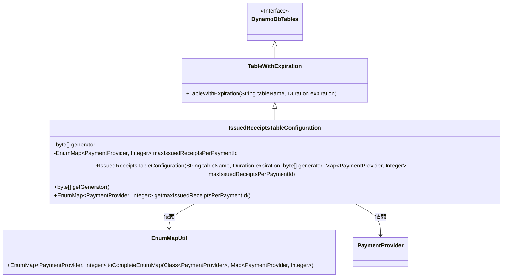
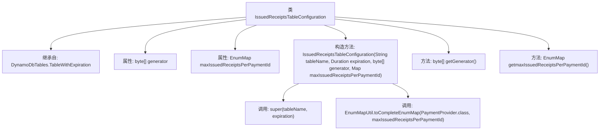

# 基础信息

|      |      |
|------|------|
| 名称 | IssuedReceiptsTableConfiguration |
| 编码语言 | .java |
| 代码路径 | Signal-Server/service/src/main/java/org/whispersystems/textsecuregcm/configuration/IssuedReceiptsTableConfiguration.java |
| 包名 | org.whispersystems.textsecuregcm.configuration |
| 依赖项 | ['com.fasterxml.jackson.annotation.JsonProperty', 'jakarta.validation.constraints.NotEmpty', 'org.whispersystems.textsecuregcm.subscriptions.PaymentProvider', 'org.whispersystems.textsecuregcm.util.EnumMapUtil', 'java.time.Duration', 'java.util.EnumMap', 'java.util.Map'] |
| 概述说明 | IssuedReceiptsTableConfiguration继承DynamoDbTables.TableWithExpiration，配置生成器和支付提供商最大收据数。 |

# 说明

IssuedReceiptsTableConfiguration类继承自DynamoDbTables.TableWithExpiration，该类主要负责配置生成器和支付提供商的最大收据数。通过继承TableWithExpiration，该类能够处理带有过期时间的DynamoDB表配置，确保收据数据在一定时间后自动失效。生成器配置用于定义收据的生成规则，而支付提供商最大收据数配置则限制了每个支付提供商可生成的收据数量，从而有效管理资源并防止滥用。

# 类列表 Class Summary

| 名称   | 类型  | 说明 |
|-------|------|-------------|
| IssuedReceiptsTableConfiguration | class | IssuedReceiptsTableConfiguration类继承DynamoDbTables.TableWithExpiration，包含生成器和支付提供商最大收据数配置。 |

## 类 IssuedReceiptsTableConfiguration

|      |      |
|------|------|
| 访问范围 | public |
| 类型 | class |
| 名称 | IssuedReceiptsTableConfiguration |
| 说明 | IssuedReceiptsTableConfiguration类继承DynamoDbTables.TableWithExpiration，包含生成器和支付提供商最大收据数配置。 |

### UML类图

这段代码定义了一个名为 `IssuedReceiptsTableConfiguration` 的类，该类继承自 `TableWithExpiration`，并包含两个主要属性：`generator` 和 `maxIssuedReceiptsPerPaymentId`。`generator` 是一个字节数组，而 `maxIssuedReceiptsPerPaymentId` 是一个 `EnumMap`，用于存储每个 `PaymentProvider` 的最大收据数量。该类通过构造函数初始化这些属性，并提供了相应的 getter 方法。此外，`IssuedReceiptsTableConfiguration` 依赖于 `EnumMapUtil` 和 `PaymentProvider` 类来完成其功能。

### 内部方法调用关系图

**描述**：  
`IssuedReceiptsTableConfiguration`类继承自`DynamoDbTables.TableWithExpiration`，包含两个主要属性：`generator`和`maxIssuedReceiptsPerPaymentId`。构造方法接收表名、过期时间、生成器和最大收据数量的映射，并调用父类构造方法和`EnumMapUtil.toCompleteEnumMap`方法进行初始化。类中还提供了获取`generator`和`maxIssuedReceiptsPerPaymentId`的方法。

### 字段列表 Field List

| 名称  | 类型  | 说明 |
|-------|-------|------|
| generator | byte[] | 私有字节数组生成器。 |
| maxIssuedReceiptsPerPaymentId | EnumMap<PaymentProvider, Integer> | 私有枚举映射存储支付提供者与最大收据发行数的对应关系。 |

### 方法列表 Method List

| 名称  | 类型  | 说明 |
|-------|-------|------|
| getGenerator | byte[] | 获取生成器字节数组的方法。 |
| getmaxIssuedReceiptsPerPaymentId | EnumMap<PaymentProvider, Integer> | 获取支付提供者与最大收据数的映射关系。 |

