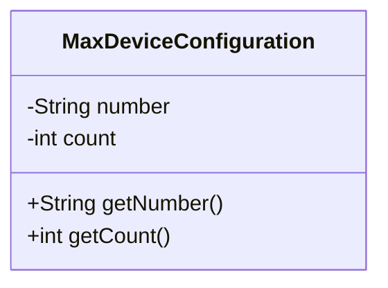
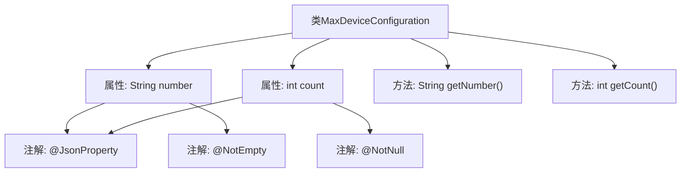

# 基础信息

|      |      |
|------|------|
| 名称 | MaxDeviceConfiguration |
| 编码语言 | .java |
| 代码路径 | Signal-Server/service/src/main/java/org/whispersystems/textsecuregcm/configuration/MaxDeviceConfiguration.java |
| 包名 | org.whispersystems.textsecuregcm.configuration |
| 依赖项 | ['com.fasterxml.jackson.annotation.JsonProperty', 'jakarta.validation.constraints.NotEmpty', 'jakarta.validation.constraints.NotNull'] |
| 概述说明 | MaxDeviceConfiguration类含字符串number和整数count，提供getter方法。 |

# 说明

MaxDeviceConfiguration类包含两个属性：一个名为number的字符串和一个名为count的整数。该类提供了用于获取这两个属性的getter方法。这些方法允许外部代码访问number和count的值，确保数据的安全性和封装性。通过这种方式，类可以控制对内部数据的访问，同时提供必要的接口以获取这些数据。

# 类列表 Class Summary

| 名称   | 类型  | 说明 |
|-------|------|-------------|
| MaxDeviceConfiguration | class | MaxDeviceConfiguration类包含字符串number和整数count，提供getter方法。 |

## 类 MaxDeviceConfiguration

|      |      |
|------|------|
| 访问范围 | public |
| 类型 | class |
| 名称 | MaxDeviceConfiguration |
| 说明 | MaxDeviceConfiguration类包含字符串number和整数count，提供getter方法。 |

### UML类图

这段代码定义了一个名为 `MaxDeviceConfiguration` 的类，该类包含两个私有属性：`number` 和 `count`。`number` 是一个字符串类型，使用 `@JsonProperty` 和 `@NotEmpty` 注解进行标记，表示该属性在序列化和反序列化过程中会被处理，并且不能为空。`count` 是一个整型属性，使用 `@JsonProperty` 和 `@NotNull` 注解进行标记，表示该属性在序列化和反序列化过程中会被处理，并且不能为 null。类中还提供了两个公有方法 `getNumber()` 和 `getCount()`，分别用于获取 `number` 和 `count` 的值。这个类主要用于存储和获取设备配置的最大数量信息。

### 内部方法调用关系图

该流程图描述了`MaxDeviceConfiguration`类的结构，包括两个属性`number`和`count`，以及对应的`getNumber`和`getCount`方法。属性`number`使用了`@JsonProperty`和`@NotEmpty`注解，而属性`count`使用了`@JsonProperty`和`@NotNull`注解。这些注解用于确保属性的有效性和序列化行为。

### 字段列表 Field List

| 名称  | 类型  | 说明 |
|-------|-------|------|
| number | String | 属性number必须为非空字符串且支持JSON序列化。 |
| count | int | 使用@JsonProperty和@NotNull注解的私有整型变量count。 |

### 方法列表 Method List

| 名称  | 类型  | 说明 |
|-------|-------|------|
| getNumber | String | 获取并返回number变量的值。 |
| getCount | int | 获取计数值的方法。 |

