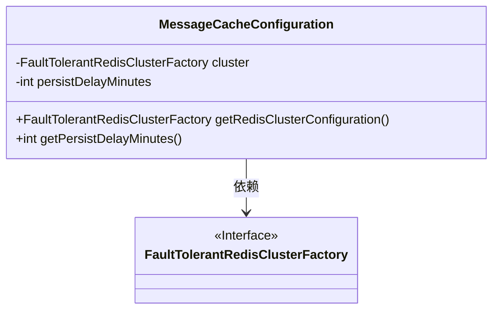
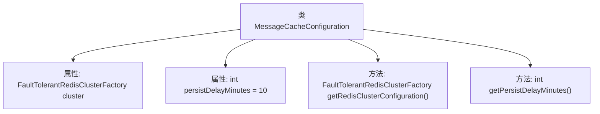

# 基础信息

|      |      |
|------|------|
| 名称 | MessageCacheConfiguration |
| 编码语言 | .java |
| 代码路径 | Signal-Server/service/src/main/java/org/whispersystems/textsecuregcm/configuration/MessageCacheConfiguration.java |
| 包名 | org.whispersystems.textsecuregcm.configuration |
| 依赖项 | ['com.fasterxml.jackson.annotation.JsonProperty', 'jakarta.validation.Valid', 'jakarta.validation.constraints.NotNull'] |
| 概述说明 | MessageCacheConfiguration类配置Redis集群和持久化延迟时间。 |

# 说明

MessageCacheConfiguration类主要用于配置Redis集群的相关参数，并设置持久化操作的延迟时间，以分钟为单位。该类的设计旨在确保Redis集群的高效运行和数据持久化的可靠性，通过灵活配置延迟时间，可以优化系统性能和数据一致性。

# 类列表 Class Summary

| 名称   | 类型  | 说明 |
|-------|------|-------------|
| MessageCacheConfiguration | class | MessageCacheConfiguration类包含Redis集群配置和持久化延迟分钟数。 |

## 类 MessageCacheConfiguration

|      |      |
|------|------|
| 访问范围 | public |
| 类型 | class |
| 名称 | MessageCacheConfiguration |
| 说明 | MessageCacheConfiguration类包含Redis集群配置和持久化延迟分钟数。 |

### UML类图

这段代码定义了一个名为 `MessageCacheConfiguration` 的类，用于配置消息缓存的相关参数。该类包含一个 `FaultTolerantRedisClusterFactory` 类型的私有成员 `cluster`，用于管理 Redis 集群的容错配置，以及一个 `persistDelayMinutes` 的整型私有成员，用于设置持久化延迟时间，默认值为 10 分钟。类提供了两个公有方法：`getRedisClusterConfiguration` 用于获取 Redis 集群配置，`getPersistDelayMinutes` 用于获取持久化延迟时间。`FaultTolerantRedisClusterFactory` 是一个接口，`MessageCacheConfiguration` 类依赖于该接口来实现 Redis 集群的配置。

### 内部方法调用关系图

这段代码定义了一个名为 `MessageCacheConfiguration` 的类，其中包含两个属性：`cluster` 和 `persistDelayMinutes`。`cluster` 是一个 `FaultTolerantRedisClusterFactory` 类型的对象，使用了 `@JsonProperty`、`@NotNull` 和 `@Valid` 注解进行配置。`persistDelayMinutes` 是一个整数类型的属性，默认值为 10。类中还定义了两个方法：`getRedisClusterConfiguration()` 用于返回 `cluster` 对象，`getPersistDelayMinutes()` 用于返回 `persistDelayMinutes` 的值。

### 字段列表 Field List

| 名称  | 类型  | 说明 |
|-------|-------|------|
| persistDelayMinutes = 10 | int | 属性persistDelayMinutes默认值为10分钟。 |
| cluster | FaultTolerantRedisClusterFactory | 包含NotNull和Valid注解的FaultTolerantRedisClusterFactory类属性。 |

### 方法列表 Method List

| 名称  | 类型  | 说明 |
|-------|-------|------|
| getRedisClusterConfiguration | FaultTolerantRedisClusterFactory | 获取Redis集群配置的工厂方法。 |
| getPersistDelayMinutes | int | 方法返回持久化延迟分钟数。 |

