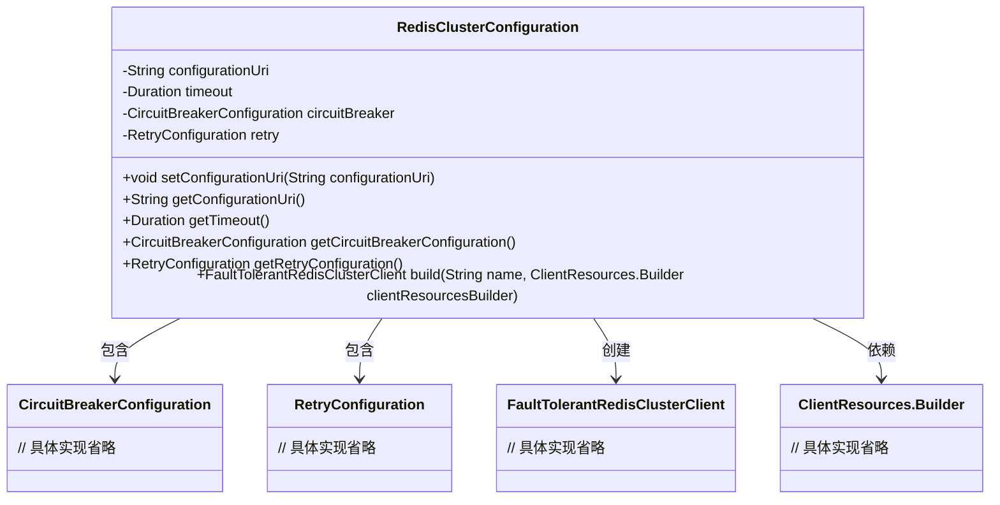
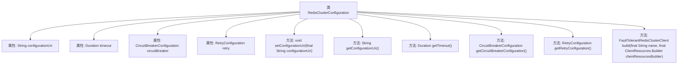

# 基础信息

|      |      |
|------|------|
| 名称 | RedisClusterConfiguration |
| 编码语言 | .java |
| 代码路径 | Signal-Server/service/src/main/java/org/whispersystems/textsecuregcm/configuration/RedisClusterConfiguration.java |
| 包名 | org.whispersystems.textsecuregcm.configuration |
| 依赖项 | ['com.fasterxml.jackson.annotation.JsonProperty', 'com.fasterxml.jackson.annotation.JsonTypeName', 'com.google.common.annotations.VisibleForTesting', 'io.lettuce.core.resource.ClientResources', 'jakarta.validation.Valid', 'jakarta.validation.constraints.NotEmpty', 'jakarta.validation.constraints.NotNull', 'java.time.Duration', 'org.whispersystems.textsecuregcm.redis.FaultTolerantRedisClusterClient'] |
| 概述说明 | Redis集群配置类，支持URI、超时、熔断器和重试，构建容错客户端。 |

# 说明

Redis集群配置类用于管理Redis集群的连接和操作设置。该类包含URI、超时、熔断器和重试配置等关键参数，确保客户端具备容错能力。通过URI指定集群地址，超时设置控制连接和操作的响应时间，熔断器防止系统过载，重试机制提高操作成功率。这些配置共同构建了一个稳定且可靠的Redis客户端，适用于高可用性和高并发场景。

# 类列表 Class Summary

| 名称   | 类型  | 说明 |
|-------|------|-------------|
| RedisClusterConfiguration | class | Redis集群配置类，包含URI、超时、熔断器和重试配置，支持构建容错客户端。 |

## 类 RedisClusterConfiguration

|      |      |
|------|------|
| 访问范围 | @JsonTypeName("default");public |
| 类型 | class |
| 名称 | RedisClusterConfiguration |
| 说明 | Redis集群配置类，包含URI、超时、熔断器和重试配置，支持构建容错客户端。 |

### UML类图

**描述：**  
`RedisClusterConfiguration` 类用于配置 Redis 集群的相关参数，包括 URI、超时时间、断路器配置和重试配置。它实现了 `FaultTolerantRedisClusterFactory` 接口，并通过 `build` 方法创建 `FaultTolerantRedisClusterClient` 实例。该类依赖于 `ClientResources.Builder` 来构建客户端资源，并包含 `CircuitBreakerConfiguration` 和 `RetryConfiguration` 作为其内部配置组件。

### 内部方法调用关系图

这段代码定义了一个名为 `RedisClusterConfiguration` 的类，用于配置 Redis 集群的相关参数。类中包含多个属性，如 `configurationUri`、`timeout`、`circuitBreaker` 和 `retry`，分别用于存储配置 URI、超时时间、断路器配置和重试配置。类中还提供了多个 getter 方法和一个 setter 方法，用于获取和设置这些属性的值。此外，类中重写了 `build` 方法，用于构建一个 `FaultTolerantRedisClusterClient` 实例。

### 字段列表 Field List

| 名称  | 类型  | 说明 |
|-------|-------|------|
| timeout = Duration.ofSeconds(1) | Duration | 非空属性timeout默认值为1秒。 |
| circuitBreaker = new CircuitBreakerConfiguration() | CircuitBreakerConfiguration | 使用JsonProperty、NotNull和Valid注解配置断路器实例。 |
| configurationUri | String | 配置URI属性，需非空且通过JsonProperty注解映射。 |
| retry = new RetryConfiguration() | RetryConfiguration | 使用@JsonProperty、@NotNull和@Valid注解定义并初始化RetryConfiguration对象retry。 |

### 方法列表 Method List

| 名称  | 类型  | 说明 |
|-------|-------|------|
| getTimeout | Duration | 该方法返回超时时间。 |
| setConfigurationUri | void | 测试可见方法用于设置配置URI。 |
| getCircuitBreakerConfiguration | CircuitBreakerConfiguration | 获取断路器配置的公共方法。 |
| build | FaultTolerantRedisClusterClient | 该方法用于构建具有容错功能的Redis集群客户端实例。 |
| getConfigurationUri | String | 该方法返回配置URI的字符串值。 |
| getRetryConfiguration | RetryConfiguration | 获取重试配置的公共方法。 |

