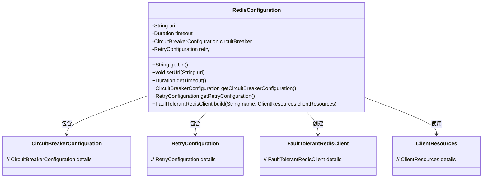
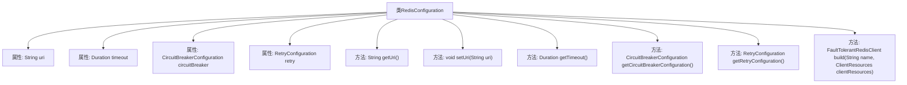

# 基础信息

|      |      |
|------|------|
| 名称 | RedisConfiguration |
| 编码语言 | .java |
| 代码路径 | Signal-Server/service/src/main/java/org/whispersystems/textsecuregcm/configuration/RedisConfiguration.java |
| 包名 | org.whispersystems.textsecuregcm.configuration |
| 依赖项 | ['com.fasterxml.jackson.annotation.JsonProperty', 'com.fasterxml.jackson.annotation.JsonTypeName', 'com.google.common.annotations.VisibleForTesting', 'io.lettuce.core.resource.ClientResources', 'jakarta.validation.Valid', 'jakarta.validation.constraints.NotEmpty', 'jakarta.validation.constraints.NotNull', 'java.time.Duration', 'org.whispersystems.textsecuregcm.redis.FaultTolerantRedisClient'] |
| 概述说明 | Redis配置类含URI、超时、熔断、重试，支持容错客户端。 |

# 说明

Redis配置类是一个用于构建容错Redis客户端的关键组件，它包含了URI、超时、熔断和重试等核心配置项。URI用于指定Redis服务器的连接地址，超时配置确保在指定时间内完成操作，避免长时间等待。熔断机制在服务出现故障时自动切断请求，防止系统过载。重试配置则允许在连接失败或操作超时的情况下进行多次尝试，提高系统的稳定性和可靠性。通过这些配置，Redis配置类能够有效构建一个具备容错能力的Redis客户端，确保在复杂网络环境下仍能稳定运行。

# 类列表 Class Summary

| 名称   | 类型  | 说明 |
|-------|------|-------------|
| RedisConfiguration | class | Redis配置类，包含URI、超时、熔断和重试配置，支持构建容错Redis客户端。 |

## 类 RedisConfiguration

|      |      |
|------|------|
| 访问范围 | @JsonTypeName("default");public |
| 类型 | class |
| 名称 | RedisConfiguration |
| 说明 | Redis配置类，包含URI、超时、熔断和重试配置，支持构建容错Redis客户端。 |

### UML类图

**描述**：  
`RedisConfiguration` 类实现了 `FaultTolerantRedisClientFactory` 接口，用于配置 Redis 客户端的连接参数。它包含 `uri`、`timeout`、`circuitBreaker` 和 `retry` 等私有成员，并提供相应的 getter 和 setter 方法。`build` 方法用于创建 `FaultTolerantRedisClient` 实例。`RedisConfiguration` 类依赖于 `CircuitBreakerConfiguration` 和 `RetryConfiguration` 类来配置断路器和重试机制，同时使用 `ClientResources` 类来管理客户端资源。

### 内部方法调用关系图

这段代码定义了一个名为`RedisConfiguration`的类，该类实现了`FaultTolerantRedisClientFactory`接口。类中包含多个属性，如`uri`、`timeout`、`circuitBreaker`和`retry`，并提供了相应的getter和setter方法。`build`方法用于构建并返回一个`FaultTolerantRedisClient`实例。代码通过注解`@JsonProperty`、`@NotEmpty`、`@NotNull`和`@Valid`来确保属性的有效性和正确性。

### 字段列表 Field List

| 名称  | 类型  | 说明 |
|-------|-------|------|
| uri | String | 类属性uri使用JsonProperty注解，并标记为非空。 |
| timeout = Duration.ofSeconds(1) | Duration | 属性timeout默认1秒，不可为空。 |
| retry = new RetryConfiguration() | RetryConfiguration | 包含NotNull和Valid注解的RetryConfiguration私有变量retry。 |
| circuitBreaker = new CircuitBreakerConfiguration() | CircuitBreakerConfiguration | 定义并初始化一个非空且有效的断路器配置对象。 |

### 方法列表 Method List

| 名称  | 类型  | 说明 |
|-------|-------|------|
| getUri | String | 获取URI字符串的方法。 |
| build | FaultTolerantRedisClient | 构建容错Redis客户端，接收名称和客户端资源参数。 |
| getCircuitBreakerConfiguration | CircuitBreakerConfiguration | 获取并返回非空且有效的熔断器配置对象。 |
| getTimeout | Duration | 获取超时时长的方法，返回timeout变量。 |
| getRetryConfiguration | RetryConfiguration | 获取不可为空且有效的重试配置对象。 |
| setUri | void | 公开方法`setUri`用于设置`uri`变量，仅限测试使用。 |

