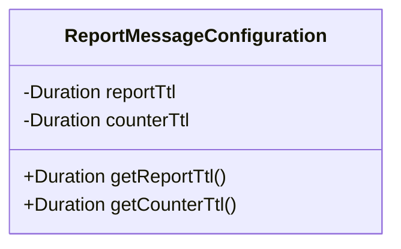
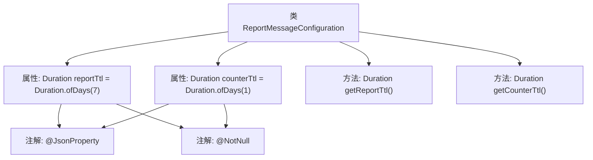

# 基础信息

|      |      |
|------|------|
| 名称 | ReportMessageConfiguration |
| 编码语言 | .java |
| 代码路径 | Signal-Server/service/src/main/java/org/whispersystems/textsecuregcm/configuration/ReportMessageConfiguration.java |
| 包名 | org.whispersystems.textsecuregcm.configuration |
| 依赖项 | ['com.fasterxml.jackson.annotation.JsonProperty', 'jakarta.validation.constraints.NotNull', 'java.time.Duration'] |
| 概述说明 | 报告配置类设置7天报告和1天计数器的生存时间。 |

# 说明

报告配置类包含两个关键参数：7天报告TTL和1天计数器TTL。7天报告TTL用于设置报告的生存时间为7天，确保报告在7天后自动过期。1天计数器TTL用于设置计数器的生存时间为1天，确保计数器在1天后自动重置或过期。这两个参数共同管理报告和计数器的生命周期，确保数据的时效性和系统的资源优化。

# 类列表 Class Summary

| 名称   | 类型  | 说明 |
|-------|------|-------------|
| ReportMessageConfiguration | class | 报告配置类，包含7天报告TTL和1天计数器TTL。 |

## 类 ReportMessageConfiguration

|      |      |
|------|------|
| 访问范围 | public |
| 类型 | class |
| 名称 | ReportMessageConfiguration |
| 说明 | 报告配置类，包含7天报告TTL和1天计数器TTL。 |

### UML类图

这段代码定义了一个名为 `ReportMessageConfiguration` 的类，用于配置报告消息的生存时间（TTL）。该类包含两个私有成员变量 `reportTtl` 和 `counterTtl`，分别表示报告和计数器的生存时间，并通过 `@JsonProperty` 和 `@NotNull` 注解进行标记。类提供了两个公有方法 `getReportTtl` 和 `getCounterTtl`，用于获取这两个生存时间的值。这个类主要用于管理报告消息的生命周期配置，确保其时间设置的有效性和一致性。

### 内部方法调用关系图

这段代码定义了一个名为 `ReportMessageConfiguration` 的类，包含两个不可变的 `Duration` 类型的属性 `reportTtl` 和 `counterTtl`，分别初始化为7天和1天。类中提供了两个公共方法 `getReportTtl` 和 `getCounterTtl` 来获取这两个属性的值。两个属性都使用了 `@JsonProperty` 和 `@NotNull` 注解，确保它们在序列化和反序列化过程中被正确处理，并且不允许为 `null`。

### 字段列表 Field List

| 名称  | 类型  | 说明 |
|-------|-------|------|
| reportTtl = Duration.ofDays(7) | Duration | 报告数据有效期为7天，不可为空。 |
| counterTtl = Duration.ofDays(1) | Duration | 定义了一个不可为空且持续时间为1天的计数器生存期变量。 |

### 方法列表 Method List

| 名称  | 类型  | 说明 |
|-------|-------|------|
| getCounterTtl | Duration | 获取计数器TTL值的方法。 |
| getReportTtl | Duration | 方法返回报告的有效期时长。 |

