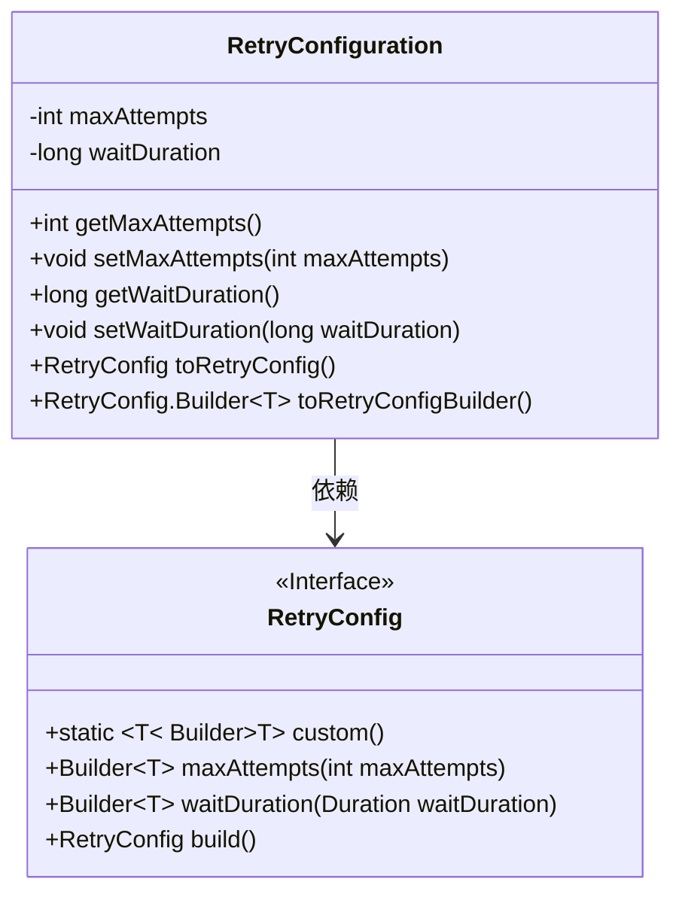
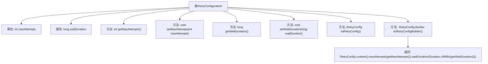

# 基础信息

|      |      |
|------|------|
| 名称 | RetryConfiguration |
| 编码语言 | .java |
| 代码路径 | Signal-Server/service/src/main/java/org/whispersystems/textsecuregcm/configuration/RetryConfiguration.java |
| 包名 | org.whispersystems.textsecuregcm.configuration |
| 依赖项 | ['com.fasterxml.jackson.annotation.JsonProperty', 'io.github.resilience4j.retry.RetryConfig', 'jakarta.validation.constraints.Min', 'java.time.Duration'] |
| 概述说明 | RetryConfiguration类配置重试机制，含最大尝试次数和等待时长，提供转换方法。 |

# 说明

RetryConfiguration类用于配置重试机制，主要包含两个关键参数：最大尝试次数和等待时长。最大尝试次数定义了在失败情况下允许的最大重试次数，而等待时长则指定了每次重试之间的时间间隔。此外，该类还提供了转换方法，用于将配置参数转换为适合实际应用的格式或结构，确保重试机制能够正确执行。

# 类列表 Class Summary

| 名称   | 类型  | 说明 |
|-------|------|-------------|
| RetryConfiguration | class | RetryConfiguration类配置重试机制，包含最大尝试次数和等待时长，并提供转换方法。 |

## 类 RetryConfiguration

|      |      |
|------|------|
| 访问范围 | public |
| 类型 | class |
| 名称 | RetryConfiguration |
| 说明 | RetryConfiguration类配置重试机制，包含最大尝试次数和等待时长，并提供转换方法。 |

### UML类图

这段代码定义了一个 `RetryConfiguration` 类，用于配置重试机制的相关参数，如最大尝试次数和等待时间。该类提供了获取和设置这些参数的方法，并且可以通过 `toRetryConfig` 和 `toRetryConfigBuilder` 方法将配置转换为 `RetryConfig` 对象或构建器。`RetryConfig` 是一个接口，提供了用于构建重试配置的静态方法和链式调用方法。`RetryConfiguration` 类依赖于 `RetryConfig` 接口来实现配置的转换和构建。

### 内部方法调用关系图

这段代码定义了一个名为 `RetryConfiguration` 的类，用于配置重试策略。类中包含两个属性 `maxAttempts` 和 `waitDuration`，分别表示最大重试次数和每次重试的等待时间。类提供了这些属性的 getter 和 setter 方法，以及两个核心方法 `toRetryConfig` 和 `toRetryConfigBuilder`，用于将配置转换为 `RetryConfig` 对象或 `RetryConfig.Builder` 对象。流程图展示了类内部各方法和属性之间的调用关系。

### 字段列表 Field List

| 名称  | 类型  | 说明 |
|-------|-------|------|
| maxAttempts = 3 | int | 属性maxAttempts最小值为1，默认值为3。 |
| waitDuration = RetryConfig.DEFAULT_WAIT_DURATION | long | 定义长整型变量waitDuration，默认值为RetryConfig.DEFAULT_WAIT_DURATION，最小值为1。 |

### 方法列表 Method List

| 名称  | 类型  | 说明 |
|-------|-------|------|
| getMaxAttempts | int | 获取最大尝试次数的整数值。 |
| setWaitDuration | void | 设置等待时长的Java方法。 |
| setMaxAttempts | void | 设置最大尝试次数的Java方法。 |
| getWaitDuration | long | 获取等待时长的方法，返回值为长整型。 |
| toRetryConfig | RetryConfig | 将RetryConfigBuilder转换为RetryConfig对象。 |
| toRetryConfigBuilder | RetryConfig.Builder<T> | 将当前配置转换为重试配置构建器，设置最大尝试次数和等待时长。 |

