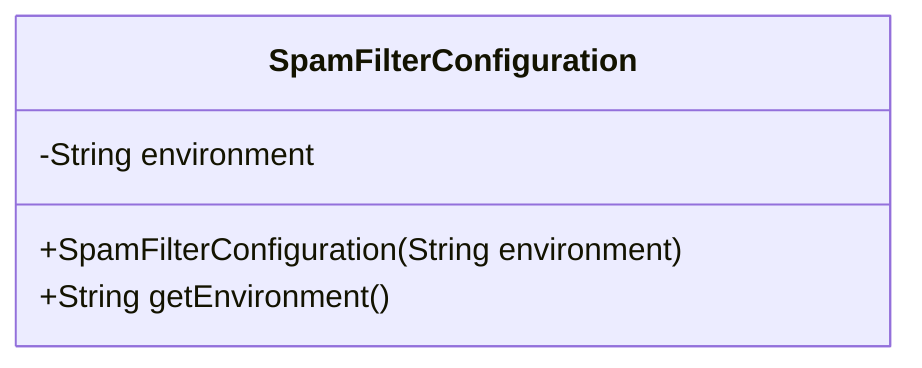
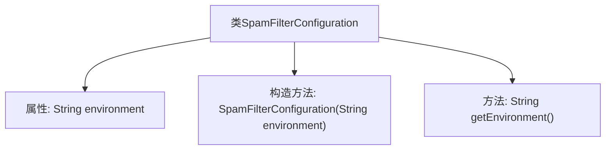

# 基础信息

|      |      |
|------|------|
| 名称 | SpamFilterConfiguration |
| 编码语言 | .java |
| 代码路径 | Signal-Server/service/src/main/java/org/whispersystems/textsecuregcm/configuration/SpamFilterConfiguration.java |
| 包名 | org.whispersystems.textsecuregcm.configuration |
| 依赖项 | ['com.fasterxml.jackson.annotation.JsonCreator', 'com.fasterxml.jackson.annotation.JsonProperty', 'jakarta.validation.constraints.NotBlank'] |
| 概述说明 | SpamFilterConfiguration类包含环境属性和构造方法。 |

# 说明

SpamFilterConfiguration类是一个用于配置垃圾邮件过滤功能的类。该类包含环境属性，这些属性用于定义和存储与垃圾邮件过滤相关的环境设置。此外，该类还包含一个构造方法，用于初始化类的实例并设置必要的环境属性。通过这些属性和构造方法，SpamFilterConfiguration类能够有效地管理和配置垃圾邮件过滤的行为和参数。

# 类列表 Class Summary

| 名称   | 类型  | 说明 |
|-------|------|-------------|
| SpamFilterConfiguration | class | SpamFilterConfiguration类包含环境属性及构造方法。 |

## 类 SpamFilterConfiguration

|      |      |
|------|------|
| 访问范围 | public |
| 类型 | class |
| 名称 | SpamFilterConfiguration |
| 说明 | SpamFilterConfiguration类包含环境属性及构造方法。 |

### UML类图

这段代码定义了一个名为 `SpamFilterConfiguration` 的类，用于配置垃圾邮件过滤器的环境。类中包含一个私有的 `environment` 字符串字段，并通过构造函数进行初始化。类还提供了一个公有的 `getEnvironment` 方法，用于获取当前的环境配置。该类使用了 `@JsonProperty` 和 `@JsonCreator` 注解，表明它可以通过 JSON 进行序列化和反序列化。

### 内部方法调用关系图

这段代码定义了一个名为`SpamFilterConfiguration`的类，该类包含一个名为`environment`的私有最终字符串属性。类通过构造方法初始化该属性，并提供了一个公共的`getEnvironment`方法来获取该属性的值。代码使用了Jackson库的注解`@JsonProperty`和`@JsonCreator`，以便在序列化和反序列化时正确处理`environment`属性。`@NotBlank`注解确保`environment`属性不为空或空白。

### 字段列表 Field List

| 名称  | 类型  | 说明 |
|-------|-------|------|
| environment | String | 属性environment为不可为空且映射JSON字段的字符串。 |

### 方法列表 Method List

| 名称  | 类型  | 说明 |
|-------|-------|------|
| getEnvironment | String | 获取环境信息的方法。 |

