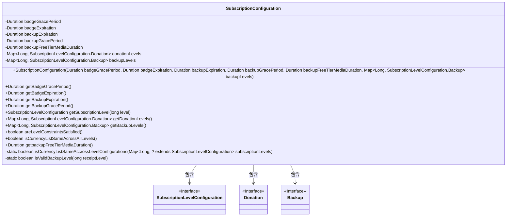

# 基础信息

|      |      |
|------|------|
| 名称 | SubscriptionConfiguration |
| 编码语言 | .java |
| 代码路径 | Signal-Server/service/src/main/java/org/whispersystems/textsecuregcm/configuration/SubscriptionConfiguration.java |
| 包名 | org.whispersystems.textsecuregcm.configuration |
| 依赖项 | ['com.fasterxml.jackson.annotation.JsonCreator', 'com.fasterxml.jackson.annotation.JsonIgnore', 'com.fasterxml.jackson.annotation.JsonProperty', 'com.google.common.collect.Sets', 'io.dropwizard.validation.ValidationMethod', 'jakarta.validation.Valid', 'jakarta.validation.constraints.Min', 'jakarta.validation.constraints.NotNull', 'java.time.Duration', 'java.util.Collections', 'java.util.Map', 'java.util.Optional', 'java.util.Set', 'java.util.function.Predicate', 'org.whispersystems.textsecuregcm.backup.BackupLevelUtil'] |
| 概述说明 | 订阅配置类包含徽章、备份期限、捐赠等级及验证方法。 |

# 说明

订阅配置类主要用于管理用户订阅的相关设置，包括徽章显示、备份期限、捐赠状态及备份等级等核心信息。该类还提供了验证方法，确保各项配置的准确性和合法性。通过此类，用户可以灵活配置订阅内容，同时系统能够有效管理和验证这些配置，保障订阅服务的正常运行。

# 类列表 Class Summary

| 名称   | 类型  | 说明 |
|-------|------|-------------|
| SubscriptionConfiguration | class | 订阅配置类，包含徽章和备份的期限、捐赠和备份等级及其验证方法。 |

## 类 SubscriptionConfiguration

|      |      |
|------|------|
| 访问范围 | public |
| 类型 | class |
| 名称 | SubscriptionConfiguration |
| 说明 | 订阅配置类，包含徽章和备份的期限、捐赠和备份等级及其验证方法。 |

### UML类图

这段代码定义了一个 `SubscriptionConfiguration` 类，用于管理订阅配置的相关信息。该类包含多个 `Duration` 类型的字段，用于表示不同配置的时间周期，以及两个 `Map` 类型的字段，分别存储捐赠级别和备份级别的配置。类中提供了多个公共方法用于获取这些配置信息，并包含一些验证方法，如 `areLevelConstraintsSatisfied` 和 `isCurrencyListSameAcrossAllLevels`，用于确保配置的合法性和一致性。

### 内部方法调用关系图

```mermaid
graph TD
    A["类SubscriptionConfiguration"]
    B["属性: Duration badgeGracePeriod"]
    C["属性: Duration badgeExpiration"]
    D["属性: Duration backupExpiration"]
    E["属性: Duration backupGracePeriod"]
    F["属性: Duration backupFreeTierMediaDuration"]
    G["属性: Map<Long, SubscriptionLevelConfiguration.Donation> donationLevels"]
    H["属性: Map<Long, SubscriptionLevelConfiguration.Backup> backupLevels"]
    I["构造方法: SubscriptionConfiguration"]
    J["方法: Duration getBadgeGracePeriod()"]
    K["方法: Duration getBadgeExpiration()"]
    L["方法: Duration getBackupExpiration()"]
    M["方法: Duration getBackupGracePeriod()"]
    N["方法: SubscriptionLevelConfiguration getSubscriptionLevel(long level)"]
    O["方法: Map<Long, SubscriptionLevelConfiguration.Donation> getDonationLevels()"]
    P["方法: Map<Long, SubscriptionLevelConfiguration.Backup> getBackupLevels()"]
    Q["方法: boolean areLevelConstraintsSatisfied()"]
    R["方法: boolean isCurrencyListSameAcrossAllLevels()"]
    S["方法: Duration getbackupFreeTierMediaDuration()"]
    T["方法: boolean isCurrencyListSameAccrossLevelConfigurations(Map<Long, ? extends SubscriptionLevelConfiguration> subscriptionLevels)"]
    U["方法: boolean isValidBackupLevel(final long receiptLevel)"]

    A --> B
    A --> C
    A --> D
    A --> E
    A --> F
    A --> G
    A --> H
    A --> I
    A --> J
    A --> K
    A --> L
    A --> M
    A --> N
    A --> O
    A --> P
    A --> Q
    A --> R
    A --> S
    A --> T
    A --> U
```

这段代码定义了一个名为`SubscriptionConfiguration`的类，用于管理订阅配置。类中包含多个`Duration`类型的属性和两个`Map`类型的属性，分别用于存储捐赠级别和备份级别的配置。构造方法通过`@JsonCreator`注解接收这些属性的初始化值，并提供了多个getter方法来获取这些属性的值。此外，类中还包含一些验证方法，如`areLevelConstraintsSatisfied()`和`isCurrencyListSameAcrossAllLevels()`，用于确保配置的合法性和一致性。

### 字段列表 Field List

| 名称  | 类型  | 说明 |
|-------|-------|------|
| backupGracePeriod | Duration | 备份宽限期为私有不可变类型。 |
| badgeGracePeriod | Duration | 私有常量badgeGracePeriod表示徽章宽限期的时长。 |
| donationLevels | Map<Long, SubscriptionLevelConfiguration.Donation> | 私有成员变量donationLevels存储捐赠级别配置。 |
| backupExpiration | Duration | 私有常量用于设置备份过期时间。 |
| backupFreeTierMediaDuration | Duration | 私有变量，存储免费层媒体备份时长。 |
| backupLevels | Map<Long, SubscriptionLevelConfiguration.Backup> | 私有映射存储订阅级别配置的备份信息。 |
| badgeExpiration | Duration | 私有成员变量，类型为Duration，名称为badgeExpiration。 |

### 方法列表 Method List

| 名称  | 类型  | 说明 |
|-------|-------|------|
| getbackupFreeTierMediaDuration | Duration | 获取备份免费层媒体时长的方法。 |
| getBadgeExpiration | Duration | 获取徽章过期时间的公共方法。 |
| isCurrencyListSameAccrossLevelConfigurations | boolean | 检查订阅级别配置中货币列表是否一致。 |
| getBackupLevels | Map<Long, SubscriptionLevelConfiguration.Backup> | 该方法返回备份级别的映射。 |
| isCurrencyListSameAcrossAllLevels | boolean | 该方法检查所有级别支持的货币列表是否一致。 |
| getBadgeGracePeriod | Duration | 获取徽章宽限期的公共方法。 |
| getDonationLevels | Map<Long, SubscriptionLevelConfiguration.Donation> | 获取捐赠级别配置的映射方法。 |
| getBackupExpiration | Duration | 该方法返回备份过期时间。 |
| getSubscriptionLevel | SubscriptionLevelConfiguration | 获取订阅级别配置，优先使用捐赠级别，无则使用备用级别。 |
| areLevelConstraintsSatisfied | boolean | 验证备份级别和捐赠级别不重叠，确保配置有效。 |
| getBackupGracePeriod | Duration | 获取备份宽限期的时长。 |
| isValidBackupLevel | boolean | 验证备份级别有效性，捕获异常返回布尔值。 |

