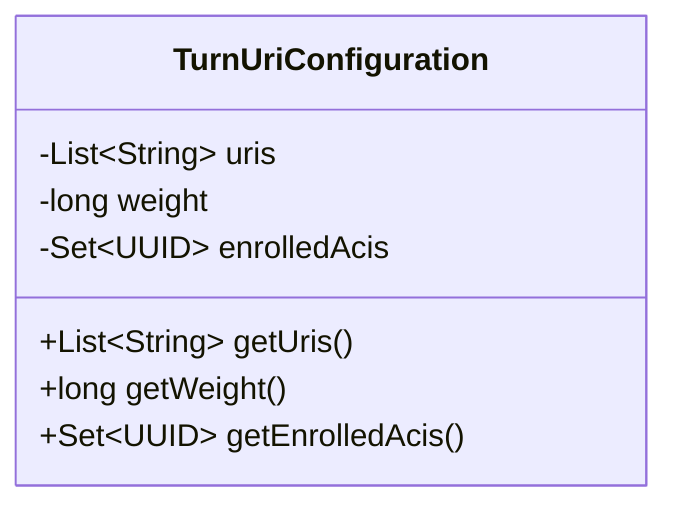
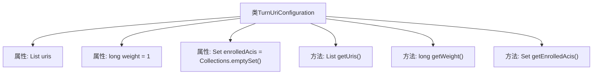

# 基础信息

|      |      |
|------|------|
| 名称 | TurnUriConfiguration |
| 编码语言 | .java |
| 代码路径 | Signal-Server/service/src/main/java/org/whispersystems/textsecuregcm/configuration/TurnUriConfiguration.java |
| 包名 | org.whispersystems.textsecuregcm.configuration |
| 依赖项 | ['com.fasterxml.jackson.annotation.JsonProperty', 'jakarta.validation.constraints.Min', 'jakarta.validation.constraints.NotNull', 'java.util.Collections', 'java.util.List', 'java.util.Set', 'java.util.UUID'] |
| 概述说明 | TurnUriConfiguration类管理URI列表、权重和注册ACIs，并提供获取方法。 |

# 说明

TurnUriConfiguration类用于管理URI列表、权重和注册ACIs集合。该类提供了获取这些信息的方法，确保能够准确访问和操作URI配置。通过该类的设计，用户可以方便地管理和调整URI的相关参数，包括权重和注册的ACIs集合，从而优化系统配置和性能。

# 类列表 Class Summary

| 名称   | 类型  | 说明 |
|-------|------|-------------|
| TurnUriConfiguration | class | TurnUriConfiguration类包含URI列表、权重和注册ACIs集合，提供相应获取方法。 |

## 类 TurnUriConfiguration

|      |      |
|------|------|
| 访问范围 | public |
| 类型 | class |
| 名称 | TurnUriConfiguration |
| 说明 | TurnUriConfiguration类包含URI列表、权重和注册ACIs集合，提供相应获取方法。 |

### UML类图

这段代码定义了一个名为 `TurnUriConfiguration` 的类，用于配置 URI 列表、权重和已注册的 ACIs。类中包含三个私有成员变量：`uris` 是一个字符串列表，`weight` 是一个长整型变量，`enrolledAcis` 是一个 UUID 集合。类提供了三个公有方法用于获取这些成员变量的值：`getUris()` 返回 URI 列表，`getWeight()` 返回权重值，`getEnrolledAcis()` 返回不可修改的已注册 ACIs 集合。这个类主要用于管理和访问 URI 配置相关的数据。

### 内部方法调用关系图

这段代码定义了一个名为`TurnUriConfiguration`的类，包含了三个属性：`uris`、`weight`和`enrolledAcis`，分别表示URI列表、权重和已注册的ACIs集合。类中提供了三个getter方法，用于获取这些属性的值。`getEnrolledAcis`方法返回一个不可修改的`enrolledAcis`集合，确保集合的不可变性。代码使用了`@JsonProperty`和`@NotNull`等注解，表明这些属性在序列化和反序列化时的行为以及非空约束。

### 字段列表 Field List

| 名称  | 类型  | 说明 |
|-------|-------|------|
| weight = 1 | long | 属性weight，类型long，默认值1，最小值为0。 |
| enrolledAcis = Collections.emptySet() | Set<UUID> | 属性enrolledAcis为UUID类型的空集合。 |
| uris | List<String> | 包含非空字符串列表的属性，使用JsonProperty注解。 |

### 方法列表 Method List

| 名称  | 类型  | 说明 |
|-------|-------|------|
| getUris | List<String> | 获取URI列表的方法。 |
| getWeight | long | 获取当前对象的重量值。 |
| getEnrolledAcis | Set<UUID> | 返回不可修改的已注册ACIs集合。 |

