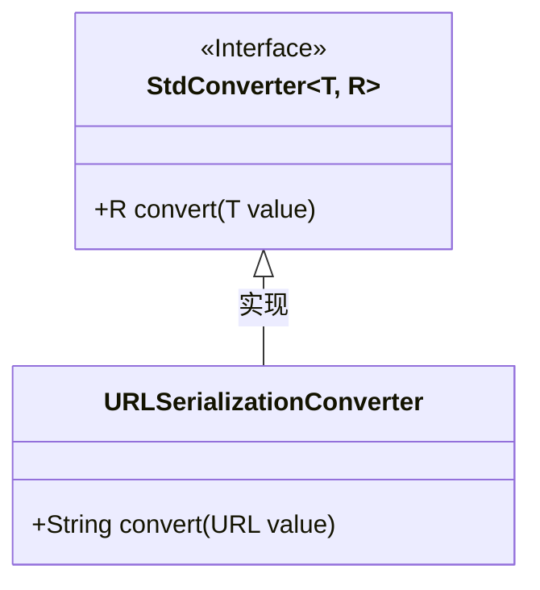
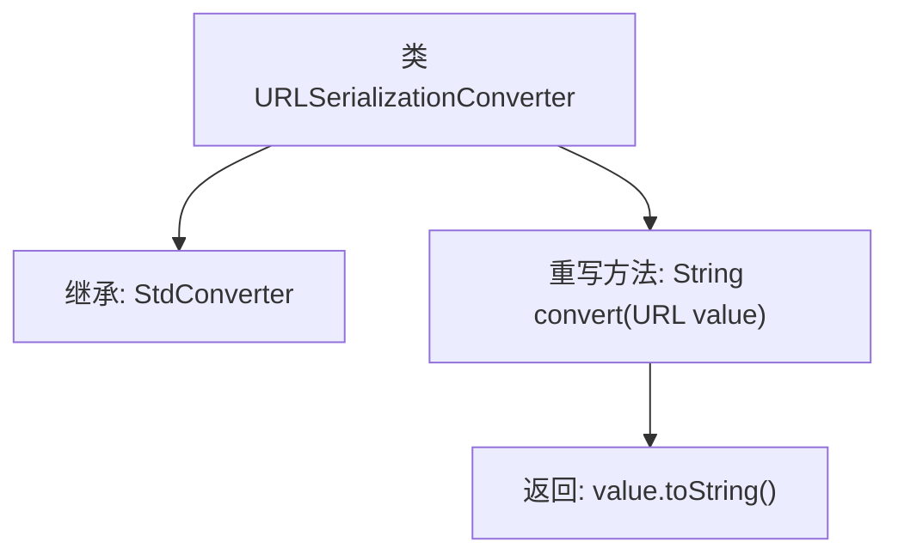

# 基础信息

|      |      |
|------|------|
| 名称 | URLSerializationConverter |
| 编码语言 | .java |
| 代码路径 | Signal-Server/service/src/main/java/org/whispersystems/textsecuregcm/configuration/URLSerializationConverter.java |
| 包名 | org.whispersystems.textsecuregcm.configuration |
| 依赖项 | ['com.fasterxml.jackson.databind.util.StdConverter', 'java.net.URL'] |
| 概述说明 | URLSerializationConverter类实现URL到字符串的转换。 |

# 说明

URLSerializationConverter类的主要功能是将URL对象转换为字符串。该类通过处理URL对象的各种属性和结构，将其转换为适合存储或传输的字符串格式。转换过程确保URL的所有关键信息，如协议、主机、路径、查询参数等，都被完整地保留在生成的字符串中。这个类在处理需要将URL对象序列化的场景中非常有用，例如在网络请求或数据持久化时。

# 类列表 Class Summary

| 名称   | 类型  | 说明 |
|-------|------|-------------|
| URLSerializationConverter | class | URLSerializationConverter类将URL对象转换为字符串。 |

## 类 URLSerializationConverter

|      |      |
|------|------|
| 访问范围 | final |
| 类型 | class |
| 名称 | URLSerializationConverter |
| 说明 | URLSerializationConverter类将URL对象转换为字符串。 |

### UML类图

这段代码展示了一个名为 `URLSerializationConverter` 的类，它继承自泛型接口 `StdConverter`。`URLSerializationConverter` 实现了 `StdConverter` 接口中的 `convert` 方法，将 `URL` 类型的对象转换为 `String` 类型。`StdConverter` 是一个泛型接口，定义了 `convert` 方法，接受一个泛型类型 `T` 的参数并返回泛型类型 `R` 的结果。`URLSerializationConverter` 通过实现该接口，提供了具体的转换逻辑，即将 `URL` 对象转换为字符串形式。

### 内部方法调用关系图

这段代码定义了一个名为`URLSerializationConverter`的最终类，它继承了`StdConverter<URL, String>`类。该类重写了`convert`方法，该方法接收一个`URL`类型的参数并返回其字符串表示形式。流程图展示了类的继承关系和方法的调用流程，清晰地描述了代码的结构和功能。

### 字段列表 Field List

| 名称  | 类型  | 说明 |
|-------|-------|------|

### 方法列表 Method List

| 名称  | 类型  | 说明 |
|-------|-------|------|
| convert | String | 重写convert方法，将URL对象转换为字符串。 |

