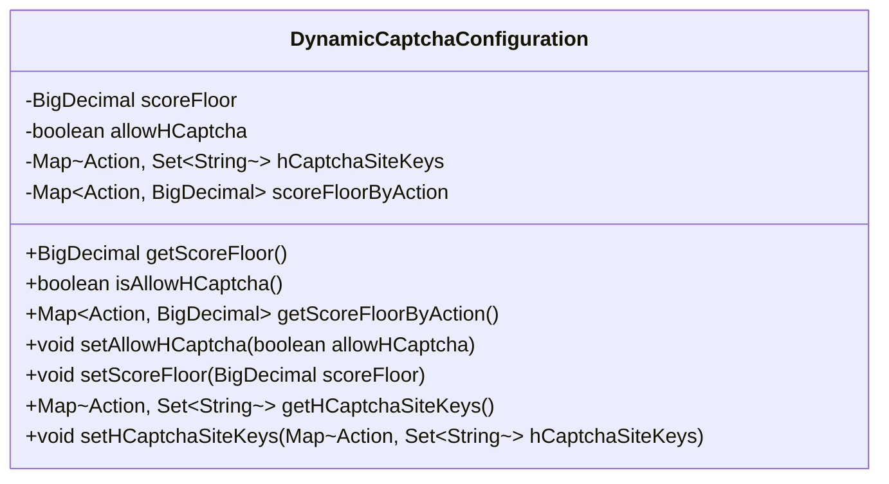

# 基础信息

|      |      |
|------|------|
| 名称 | DynamicCaptchaConfiguration |
| 编码语言 | .java |
| 代码路径 | Signal-Server/service/src/main/java/org/whispersystems/textsecuregcm/configuration/dynamic/DynamicCaptchaConfiguration.java |
| 包名 | org.whispersystems.textsecuregcm.configuration.dynamic |
| 依赖项 | ['com.fasterxml.jackson.annotation.JsonProperty', 'com.google.common.annotations.VisibleForTesting', 'jakarta.validation.constraints.DecimalMax', 'jakarta.validation.constraints.DecimalMin', 'jakarta.validation.constraints.NotNull', 'java.math.BigDecimal', 'java.util.Collections', 'java.util.Map', 'java.util.Set', 'org.whispersystems.textsecuregcm.captcha.Action'] |
| 概述说明 | 动态验证码配置类：含分数下限、hCaptcha状态及站点密钥映射。 |

# 说明

动态验证码配置类是一个用于管理验证码相关设置的类，主要包含三个关键配置项。首先是分数下限，用于设定验证码通过的最低分数标准，确保验证的严格性。其次是hCaptcha允许状态，用于控制是否启用hCaptcha验证码服务。最后是站点密钥映射，用于存储和管理不同站点的hCaptcha密钥，确保各站点的验证码服务能够独立配置和运行。

# 类列表 Class Summary

| 名称   | 类型  | 说明 |
|-------|------|-------------|
| DynamicCaptchaConfiguration | class | 动态验证码配置类，包含分数下限、hCaptcha允许状态及站点密钥映射。 |

## 类 DynamicCaptchaConfiguration

|      |      |
|------|------|
| 访问范围 | public |
| 类型 | class |
| 名称 | DynamicCaptchaConfiguration |
| 说明 | 动态验证码配置类，包含分数下限、hCaptcha允许状态及站点密钥映射。 |

### UML类图

**描述：**  
`DynamicCaptchaConfiguration` 类用于配置动态验证码的相关参数，包括验证分数阈值、是否允许使用 hCaptcha、hCaptcha 的站点密钥集合以及按操作类型划分的分数阈值。类中提供了对这些参数的获取和设置方法，并使用了泛型集合来存储不同类型的数据。该类主要用于管理和调整验证码配置，确保验证码的安全性和灵活性。

### 内部方法调用关系图

```mermaid
graph TD
    A["类DynamicCaptchaConfiguration"]
    B["属性: BigDecimal scoreFloor"]
    C["属性: boolean allowHCaptcha"]
    D["属性: Map<Action, Set<String>> hCaptchaSiteKeys"]
    E["属性: Map<Action, BigDecimal> scoreFloorByAction"]
    F["方法: BigDecimal getScoreFloor()"]
    G["方法: boolean isAllowHCaptcha()"]
    H["方法: Map<Action, BigDecimal> getScoreFloorByAction()"]
    I["方法: void setAllowHCaptcha(boolean allowHCaptcha)"]
    J["方法: void setScoreFloor(BigDecimal scoreFloor)"]
    K["方法: Map<Action, Set<String>> getHCaptchaSiteKeys()"]
    L["方法: void setHCaptchaSiteKeys(Map<Action, Set<String>> hCaptchaSiteKeys)"]

    A --> B
    A --> C
    A --> D
    A --> E
    A --> F
    A --> G
    A --> H
    A --> I
    A --> J
    A --> K
    A --> L
```

该流程图展示了`DynamicCaptchaConfiguration`类的结构和其内部方法之间的关系。类包含四个主要属性：`scoreFloor`、`allowHCaptcha`、`hCaptchaSiteKeys`和`scoreFloorByAction`，分别用于存储不同的配置信息。类提供了多个getter和setter方法，用于访问和修改这些属性。其中，`setAllowHCaptcha`、`setScoreFloor`和`setHCaptchaSiteKeys`方法被标记为`@VisibleForTesting`，表示它们主要用于测试目的。整体结构清晰，方法之间的调用关系明确。

### 字段列表 Field List

| 名称  | 类型  | 说明 |
|-------|-------|------|
| scoreFloor | BigDecimal | 属性scoreFloor需为0到1之间非空的小数。 |
| allowHCaptcha = false | boolean | 允许HCaptcha功能设置为默认关闭。 |
| hCaptchaSiteKeys = Collections.emptyMap() | Map<Action, Set<String>> | 定义非空Map，键为Action，值为String集合，初始为空。 |
| scoreFloorByAction = Collections.emptyMap() | Map<Action, BigDecimal> | 非空属性scoreFloorByAction存储Action与BigDecimal的映射，默认空映射。 |

### 方法列表 Method List

| 名称  | 类型  | 说明 |
|-------|-------|------|
| getScoreFloorByAction | Map<Action, BigDecimal> | 方法返回动作与最低分数的映射。 |
| getHCaptchaSiteKeys | Map<Action, Set<String>> | 获取hCaptcha站点密钥的映射关系。 |
| getScoreFloor | BigDecimal | 该方法返回scoreFloor的BigDecimal值。 |
| setHCaptchaSiteKeys | void | 公开测试方法，用于设置HCaptcha站点密钥映射。 |
| isAllowHCaptcha | boolean | 该方法返回是否允许使用HCaptcha的布尔值。 |
| setScoreFloor | void | 公开方法设置评分下限为指定值。 |
| setAllowHCaptcha | void | 公开方法用于设置允许HCaptcha的布尔值。 |

