# 基础信息

|      |      |
|------|------|
| 名称 | DynamicConfiguration |
| 编码语言 | .java |
| 代码路径 | Signal-Server/service/src/main/java/org/whispersystems/textsecuregcm/configuration/dynamic/DynamicConfiguration.java |
| 包名 | org.whispersystems.textsecuregcm.configuration.dynamic |
| 依赖项 | ['com.fasterxml.jackson.annotation.JsonProperty', 'com.vdurmont.semver4j.Semver', 'jakarta.validation.Valid', 'java.util.Collections', 'java.util.HashMap', 'java.util.List', 'java.util.Map', 'java.util.Optional', 'org.whispersystems.textsecuregcm.limits.RateLimiterConfig', 'org.whispersystems.textsecuregcm.util.ua.ClientPlatform'] |
| 概述说明 | DynamicConfiguration类提供实验、限速、支付、验证码等动态配置项及其获取方法。 |

# 说明

DynamicConfiguration类负责管理多个动态配置项，包括实验、限速、支付和验证码等功能模块。该类提供了相应的获取方法，以便在应用程序中动态获取和调整这些配置项，确保系统能够灵活响应不同的业务需求。

# 类列表 Class Summary

| 名称   | 类型  | 说明 |
|-------|------|-------------|
| DynamicConfiguration | class | DynamicConfiguration类包含多个动态配置项，如实验、限速、支付、验证码等，并提供相应获取方法。 |

## 类 DynamicConfiguration

|      |      |
|------|------|
| 访问范围 | public |
| 类型 | class |
| 名称 | DynamicConfiguration |
| 说明 | DynamicConfiguration类包含多个动态配置项，如实验、限速、支付、验证码等，并提供相应获取方法。 |

### UML类图

```mermaid
classDiagram
    class DynamicConfiguration {
        -Map~String, DynamicExperimentEnrollmentConfiguration~ experiments
        -Map~String, DynamicE164ExperimentEnrollmentConfiguration~ e164Experiments
        -Map~String, RateLimiterConfig~ limits
        -DynamicRemoteDeprecationConfiguration remoteDeprecation
        -DynamicPaymentsConfiguration payments
        -DynamicCaptchaConfiguration captcha
        -DynamicMessagePersisterConfiguration messagePersister
        -DynamicRateLimitPolicy rateLimitPolicy
        -DynamicRegistrationConfiguration registrationConfiguration
        -DynamicVirtualThreadConfiguration virtualThreads
        -DynamicMetricsConfiguration metricsConfiguration
        -List~String~ svrStatusCodesToIgnoreForAccountDeletion
        -Map~ClientPlatform, Semver~ minimumRestFreeVersion
        +Optional~DynamicExperimentEnrollmentConfiguration~ getExperimentEnrollmentConfiguration(String experimentName)
        +Optional~DynamicE164ExperimentEnrollmentConfiguration~ getE164ExperimentEnrollmentConfiguration(String experimentName)
        +Map~String, RateLimiterConfig~ getLimits()
        +DynamicRemoteDeprecationConfiguration getRemoteDeprecationConfiguration()
        +DynamicPaymentsConfiguration getPaymentsConfiguration()
        +DynamicCaptchaConfiguration getCaptchaConfiguration()
        +DynamicMessagePersisterConfiguration getMessagePersisterConfiguration()
        +DynamicRateLimitPolicy getRateLimitPolicy()
        +DynamicRegistrationConfiguration getRegistrationConfiguration()
        +DynamicVirtualThreadConfiguration getVirtualThreads()
        +DynamicMetricsConfiguration getMetricsConfiguration()
        +List~String~ getSvrStatusCodesToIgnoreForAccountDeletion()
        +Map~ClientPlatform, Semver~ minimumRestFreeVersion()
    }

    class DynamicExperimentEnrollmentConfiguration {
        <<Interface>>
    }

    class DynamicE164ExperimentEnrollmentConfiguration {
        <<Interface>>
    }

    class RateLimiterConfig {
        <<Interface>>
    }

    class DynamicRemoteDeprecationConfiguration {
        <<Interface>>
    }

    class DynamicPaymentsConfiguration {
        <<Interface>>
    }

    class DynamicCaptchaConfiguration {
        <<Interface>>
    }

    class DynamicMessagePersisterConfiguration {
        <<Interface>>
    }

    class DynamicRateLimitPolicy {
        <<Interface>>
    }

    class DynamicRegistrationConfiguration {
        <<Interface>>
    }

    class DynamicVirtualThreadConfiguration {
        <<Interface>>
    }

    class DynamicMetricsConfiguration {
        <<Interface>>
    }

    class ClientPlatform {
        <<Interface>>
    }

    class Semver {
        <<Interface>>
    }

    DynamicConfiguration --> DynamicExperimentEnrollmentConfiguration : 依赖
    DynamicConfiguration --> DynamicE164ExperimentEnrollmentConfiguration : 依赖
    DynamicConfiguration --> RateLimiterConfig : 依赖
    DynamicConfiguration --> DynamicRemoteDeprecationConfiguration : 依赖
    DynamicConfiguration --> DynamicPaymentsConfiguration : 依赖
    DynamicConfiguration --> DynamicCaptchaConfiguration : 依赖
    DynamicConfiguration --> DynamicMessagePersisterConfiguration : 依赖
    DynamicConfiguration --> DynamicRateLimitPolicy : 依赖
    DynamicConfiguration --> DynamicRegistrationConfiguration : 依赖
    DynamicConfiguration --> DynamicVirtualThreadConfiguration : 依赖
    DynamicConfiguration --> DynamicMetricsConfiguration : 依赖
    DynamicConfiguration --> ClientPlatform : 依赖
    DynamicConfiguration --> Semver : 依赖
```

这段代码定义了一个 `DynamicConfiguration` 类，该类包含多个配置项，如实验配置、限速器配置、远程弃用配置等。这些配置项通过 `@JsonProperty` 注解进行序列化和反序列化。类中的方法主要用于获取这些配置项的值。类图展示了 `DynamicConfiguration` 类与多个接口之间的依赖关系，这些接口代表了不同的配置类型。

### 内部方法调用关系图

这段代码定义了一个名为 `DynamicConfiguration` 的类，该类包含了多个配置相关的属性和方法。属性主要是一些配置项，如实验配置、限流配置、支付配置等，每个属性都有对应的 `@JsonProperty` 和 `@Valid` 注解。类中还提供了多个 `get` 方法，用于获取这些配置项的值。这些方法通常返回 `Optional` 或直接返回配置对象，确保调用者可以安全地访问这些配置。

### 字段列表 Field List

| 名称  | 类型  | 说明 |
|-------|-------|------|
| virtualThreads = new DynamicVirtualThreadConfiguration(Collections.emptySet()) | DynamicVirtualThreadConfiguration | 动态虚拟线程配置使用空集合初始化。 |
| experiments = Collections.emptyMap() | Map<String, DynamicExperimentEnrollmentConfiguration> | 私有实验配置映射，初始为空，使用JsonProperty和Valid注解。 |
| registrationConfiguration = new DynamicRegistrationConfiguration(false) | DynamicRegistrationConfiguration | 动态注册配置实例化，默认禁用。 |
| svrStatusCodesToIgnoreForAccountDeletion = Collections.emptyList() | List<String> | 忽略账户删除的无效状态码列表为空。 |
| remoteDeprecation = new DynamicRemoteDeprecationConfiguration() | DynamicRemoteDeprecationConfiguration | 动态远程弃用配置初始化为新实例。 |
| metricsConfiguration = new DynamicMetricsConfiguration(false, false) | DynamicMetricsConfiguration | 动态指标配置初始化，禁用默认设置。 |
| rateLimitPolicy = new DynamicRateLimitPolicy(false) | DynamicRateLimitPolicy | 动态限速策略初始化，未启用验证。 |
| limits = new HashMap<>() | Map<String, RateLimiterConfig> | 使用JsonProperty和Valid注解，定义私有Map变量limits，存储RateLimiterConfig对象。 |
| payments = new DynamicPaymentsConfiguration() | DynamicPaymentsConfiguration | 属性payments使用JsonProperty和Valid注解，初始化为DynamicPaymentsConfiguration实例。 |
| captcha = new DynamicCaptchaConfiguration() | DynamicCaptchaConfiguration | 使用@JsonProperty和@Valid注解初始化DynamicCaptchaConfiguration对象。 |
| minimumRestFreeVersion = Map.of() | Map<ClientPlatform, Semver> | 包含验证的最小REST版本映射，键为客户端平台，值为版本号。 |
| messagePersister = new DynamicMessagePersisterConfiguration() | DynamicMessagePersisterConfiguration | 使用@JsonProperty和@Valid注解初始化DynamicMessagePersisterConfiguration实例。 |
| e164Experiments = Collections.emptyMap() | Map<String, DynamicE164ExperimentEnrollmentConfiguration> | 使用JsonProperty和Valid注解，定义私有Map变量e164Experiments，初始化为空Map。 |

### 方法列表 Method List

| 名称  | 类型  | 说明 |
|-------|-------|------|
| getCaptchaConfiguration | DynamicCaptchaConfiguration | 获取动态验证码配置的方法。 |
| getMessagePersisterConfiguration | DynamicMessagePersisterConfiguration | 该方法返回消息持久化配置对象。 |
| minimumRestFreeVersion | Map<ClientPlatform, Semver> | 方法返回客户端平台与最低版本要求的映射。 |
| getLimits | Map<String, RateLimiterConfig> | 获取限流配置映射的方法。 |
| getPaymentsConfiguration | DynamicPaymentsConfiguration | 该方法返回动态支付配置对象。 |
| getRateLimitPolicy | DynamicRateLimitPolicy | 获取动态速率限制策略的方法。 |
| getRegistrationConfiguration | DynamicRegistrationConfiguration | 获取动态注册配置的方法。 |
| getVirtualThreads | DynamicVirtualThreadConfiguration | 获取虚拟线程配置的方法。 |
| getSvrStatusCodesToIgnoreForAccountDeletion | List<String> | 获取忽略删除账户的服务器状态码列表。 |
| getRemoteDeprecationConfiguration | DynamicRemoteDeprecationConfiguration | 获取远程弃用配置的公共方法。 |
| getMetricsConfiguration | DynamicMetricsConfiguration | 获取动态指标配置的方法，返回当前配置对象。 |
| getExperimentEnrollmentConfiguration | Optional<DynamicExperimentEnrollmentConfiguration> | 获取指定实验的配置信息，若存在则返回。 |
| getE164ExperimentEnrollmentConfiguration | Optional<DynamicE164ExperimentEnrollmentConfiguration> | 获取指定实验名的E164实验注册配置。 |

