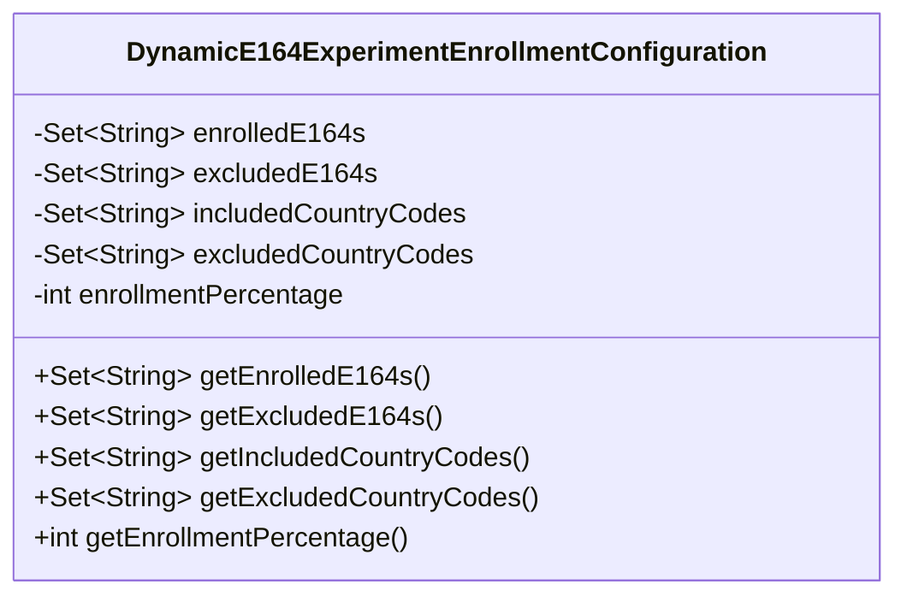
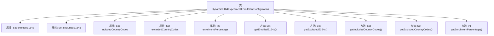

# 基础信息

|      |      |
|------|------|
| 名称 | DynamicE164ExperimentEnrollmentConfiguration |
| 编码语言 | .java |
| 代码路径 | Signal-Server/service/src/main/java/org/whispersystems/textsecuregcm/configuration/dynamic/DynamicE164ExperimentEnrollmentConfiguration.java |
| 包名 | org.whispersystems.textsecuregcm.configuration.dynamic |
| 依赖项 | ['com.fasterxml.jackson.annotation.JsonProperty', 'jakarta.validation.Valid', 'jakarta.validation.constraints.Max', 'jakarta.validation.constraints.Min', 'java.util.Collections', 'java.util.Set'] |
| 概述说明 | 动态E164实验配置类管理注册、排除号码、国家代码及注册百分比。 |

# 说明

动态E164实验配置类主要用于管理和配置与E164号码相关的实验设置。该类包含多个关键功能，包括号码注册、排除特定号码、设置国家代码以及定义注册百分比。通过这些功能，用户可以灵活地控制实验中的号码使用情况，确保实验在不同国家或地区的号码分布和注册比例符合预期要求。该类设计旨在提供精确的配置选项，以支持复杂的实验场景和需求。

# 类列表 Class Summary

| 名称   | 类型  | 说明 |
|-------|------|-------------|
| DynamicE164ExperimentEnrollmentConfiguration | class | 动态E164实验配置类，包含注册、排除号码、国家代码及注册百分比。 |

## 类 DynamicE164ExperimentEnrollmentConfiguration

|      |      |
|------|------|
| 访问范围 | public |
| 类型 | class |
| 名称 | DynamicE164ExperimentEnrollmentConfiguration |
| 说明 | 动态E164实验配置类，包含注册、排除号码、国家代码及注册百分比。 |

### UML类图

**描述：**  
`DynamicE164ExperimentEnrollmentConfiguration` 类用于配置动态E164实验的注册信息。它包含五个私有属性：`enrolledE164s`（已注册的E164号码集合）、`excludedE164s`（排除的E164号码集合）、`includedCountryCodes`（包含的国家代码集合）、`excludedCountryCodes`（排除的国家代码集合）和`enrollmentPercentage`（注册百分比）。每个属性都有对应的getter方法，用于获取其值。该类主要用于管理和查询实验的注册配置信息。

### 内部方法调用关系图

这段代码定义了一个名为`DynamicE164ExperimentEnrollmentConfiguration`的类，用于管理实验配置。类中包含五个属性：`enrolledE164s`、`excludedE164s`、`includedCountryCodes`、`excludedCountryCodes`和`enrollmentPercentage`，分别表示已注册的E164号码、排除的E164号码、包含的国家代码、排除的国家代码以及注册百分比。每个属性都有对应的getter方法，用于获取属性的值。该类主要用于存储和检索实验配置相关的数据。

### 字段列表 Field List

| 名称  | 类型  | 说明 |
|-------|-------|------|
| enrolledE164s = Collections.emptySet() | Set<String> | 属性enrolledE164s为空的字符串集合，使用JsonProperty和Valid注解。 |
| excludedE164s = Collections.emptySet() | Set<String> | 包含验证的私有字符串集合，默认空集。 |
| excludedCountryCodes = Collections.emptySet() | Set<String> | 定义私有变量excludedCountryCodes，类型为Set<String>，初始值为空集合，并添加JsonProperty和Valid注解。 |
| enrollmentPercentage = 0 | int | 属性为注册百分比，范围0到100，默认值0。 |
| includedCountryCodes = Collections.emptySet() | Set<String> | 该代码定义了一个私有集合变量，用于存储国家代码，初始为空集，并通过注解进行属性绑定和验证。 |

### 方法列表 Method List

| 名称  | 类型  | 说明 |
|-------|-------|------|
| getExcludedCountryCodes | Set<String> | 获取排除的国家代码集合。 |
| getEnrollmentPercentage | int | 获取注册百分比的方法。 |
| getIncludedCountryCodes | Set<String> | 该方法返回包含的国家代码集合。 |
| getEnrolledE164s | Set<String> | 获取已注册的E164号码集合。 |
| getExcludedE164s | Set<String> | 获取排除的E164号码集合。 |

