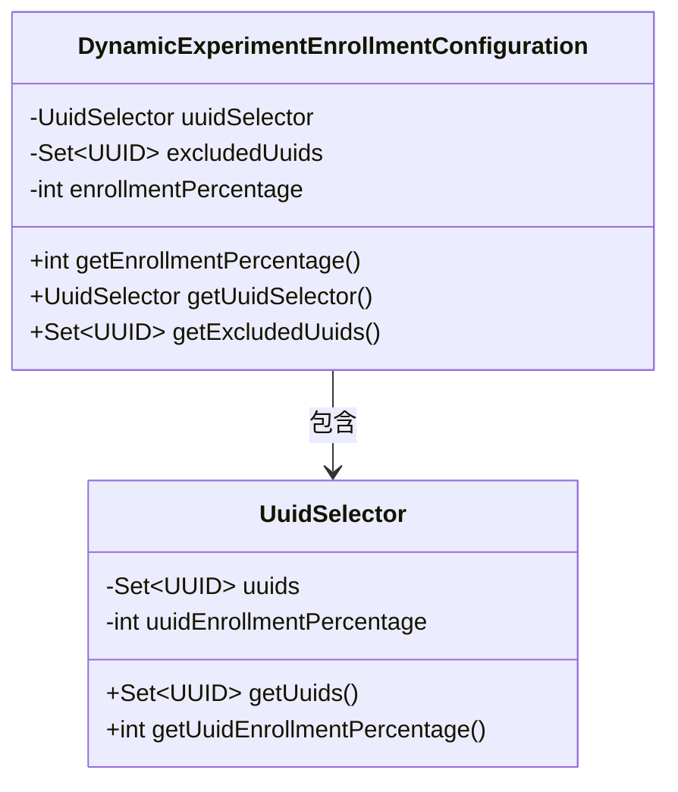
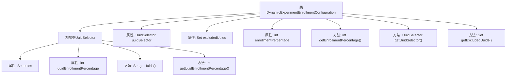

# 基础信息

|      |      |
|------|------|
| 名称 | DynamicExperimentEnrollmentConfiguration |
| 编码语言 | .java |
| 代码路径 | Signal-Server/service/src/main/java/org/whispersystems/textsecuregcm/configuration/dynamic/DynamicExperimentEnrollmentConfiguration.java |
| 包名 | org.whispersystems.textsecuregcm.configuration.dynamic |
| 依赖项 | ['com.fasterxml.jackson.annotation.JsonProperty', 'jakarta.validation.Valid', 'jakarta.validation.constraints.Max', 'jakarta.validation.constraints.Min', 'jakarta.validation.constraints.NotNull', 'java.util.Collections', 'java.util.Set', 'java.util.UUID'] |
| 概述说明 | 动态实验配置类含UUID选择器、排除集和启用百分比。 |

# 说明

动态实验配置类是一个用于管理和控制实验配置的类，主要包含三个核心组件。首先，UUID选择器用于筛选和指定参与实验的用户唯一标识符。其次，排除UUID集用于明确排除不参与实验的用户，确保这些用户不会受到实验影响。最后，实验启用百分比用于设定实验的启用比例，即决定有多少比例的用户会参与该实验。通过这些组件，动态实验配置类能够灵活地管理和调整实验范围，确保实验的精准性和可控性。

# 类列表 Class Summary

| 名称   | 类型  | 说明 |
|-------|------|-------------|
| DynamicExperimentEnrollmentConfiguration | class | 动态实验配置类，包含UUID选择器、排除UUID集和实验启用百分比。 |

## 类 DynamicExperimentEnrollmentConfiguration

|      |      |
|------|------|
| 访问范围 | public |
| 类型 | class |
| 名称 | DynamicExperimentEnrollmentConfiguration |
| 说明 | 动态实验配置类，包含UUID选择器、排除UUID集和实验启用百分比。 |

### UML类图

这段代码定义了一个名为 `DynamicExperimentEnrollmentConfiguration` 的类，该类用于配置动态实验的参与情况。它包含一个内部类 `UuidSelector`，用于选择参与实验的UUID集合及其参与百分比。`DynamicExperimentEnrollmentConfiguration` 类还包含一个排除UUID的集合和一个全局的参与百分比。通过这些配置，可以灵活地控制哪些UUID参与实验以及它们的参与概率。

### 内部方法调用关系图

**描述：**  
该代码定义了一个名为`DynamicExperimentEnrollmentConfiguration`的类，其中包含一个内部类`UuidSelector`。`UuidSelector`类用于管理一组UUID及其相关的注册百分比。`DynamicExperimentEnrollmentConfiguration`类还包含一些属性，如`uuidSelector`、`excludedUuids`和`enrollmentPercentage`，并提供了相应的getter方法。这些属性和方法共同构成了一个动态实验注册配置的管理系统。

### 字段列表 Field List

| 名称  | 类型  | 说明 |
|-------|-------|------|
| excludedUuids = Collections.emptySet() | Set<UUID> | 非空且有效的UUID集合，默认初始化为空集。 |
| enrollmentPercentage = 0 | int | 属性enrollmentPercentage，范围0到100，默认值为0。 |
| uuidSelector = new UuidSelector() | UuidSelector | 定义了不可为空且最终类型的UuidSelector实例。 |

### 方法列表 Method List

| 名称  | 类型  | 说明 |
|-------|-------|------|
| getEnrollmentPercentage | int | 该方法返回注册百分比。 |
| getExcludedUuids | Set<UUID> | 获取排除的UUID集合。 |
| getUuidSelector | UuidSelector | 该方法返回UuidSelector类型的uuidSelector对象。 |

