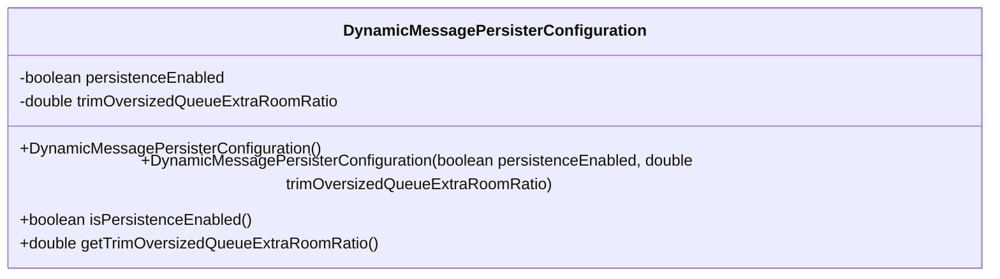
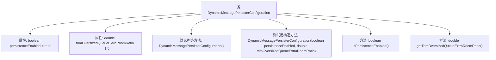

# 基础信息

|      |      |
|------|------|
| 名称 | DynamicMessagePersisterConfiguration |
| 编码语言 | .java |
| 代码路径 | Signal-Server/service/src/main/java/org/whispersystems/textsecuregcm/configuration/dynamic/DynamicMessagePersisterConfiguration.java |
| 包名 | org.whispersystems.textsecuregcm.configuration.dynamic |
| 依赖项 | ['com.fasterxml.jackson.annotation.JsonProperty', 'com.google.common.annotations.VisibleForTesting'] |
| 概述说明 | 动态消息持久化配置类含开关和队列修剪比例。 |

# 说明

动态消息持久化配置类用于管理消息的持久化行为，包含两个关键参数：持久化开关和队列修剪比例。持久化开关控制消息是否进行持久化存储，确保消息在系统重启后仍可恢复。队列修剪比例用于调整消息队列的修剪策略，通过设定比例值来清理队列中的旧消息，优化存储空间和性能。该配置类为消息处理提供了灵活性和可控性，适用于需要高可靠性和高效消息管理的场景。

# 类列表 Class Summary

| 名称   | 类型  | 说明 |
|-------|------|-------------|
| DynamicMessagePersisterConfiguration | class | 动态消息持久化配置类，包含持久化开关和队列修剪比例参数。 |

## 类 DynamicMessagePersisterConfiguration

|      |      |
|------|------|
| 访问范围 | public |
| 类型 | class |
| 名称 | DynamicMessagePersisterConfiguration |
| 说明 | 动态消息持久化配置类，包含持久化开关和队列修剪比例参数。 |

### UML类图

**描述：**  
`DynamicMessagePersisterConfiguration` 类用于配置动态消息持久化的相关参数。它包含两个私有属性：`persistenceEnabled` 用于控制是否启用持久化，`trimOversizedQueueExtraRoomRatio` 用于指定在需要修剪客户端持久化队列时，额外保留的空间比例。类提供了两个构造函数，一个默认构造函数和一个用于测试的构造函数，以及获取这两个属性的公有方法。

### 内部方法调用关系图

这段代码定义了一个名为 `DynamicMessagePersisterConfiguration` 的类，用于配置消息持久化的相关参数。类中包含两个属性：`persistenceEnabled` 用于控制是否启用持久化，`trimOversizedQueueExtraRoomRatio` 用于设置当需要从 Redis 持久化到 DynamoDB 时，如何裁剪客户端队列的额外空间比例。类提供了默认构造方法和一个用于测试的构造方法，以及获取这两个属性的方法。

### 字段列表 Field List

| 名称  | 类型  | 说明 |
|-------|-------|------|
| trimOversizedQueueExtraRoomRatio = 1.5 | double | trimOversizedQueueExtraRoomRatio默认值为1.5。 |
| persistenceEnabled = true | boolean | 属性persistenceEnabled默认值为true。 |

### 方法列表 Method List

| 名称  | 类型  | 说明 |
|-------|-------|------|
| isPersistenceEnabled | boolean | 检查持久化功能是否启用。 |
| getTrimOversizedQueueExtraRoomRatio | double | 获取修剪过大队列额外空间比例的方法。 |

