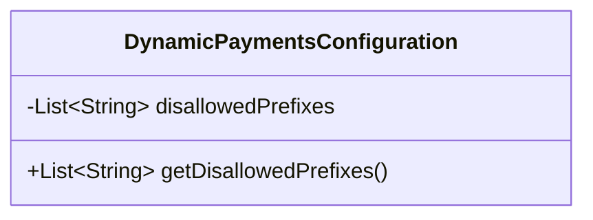
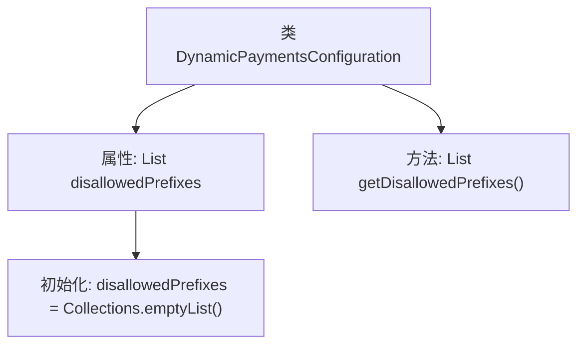

# 基础信息

|      |      |
|------|------|
| 名称 | DynamicPaymentsConfiguration |
| 编码语言 | .java |
| 代码路径 | Signal-Server/service/src/main/java/org/whispersystems/textsecuregcm/configuration/dynamic/DynamicPaymentsConfiguration.java |
| 包名 | org.whispersystems.textsecuregcm.configuration.dynamic |
| 依赖项 | ['com.fasterxml.jackson.annotation.JsonProperty', 'java.util.Collections', 'java.util.List'] |
| 概述说明 | 动态支付配置类，含禁止前缀列表及其获取方法。 |

# 说明

动态支付配置类是一个用于管理支付相关设置的类，主要功能包括维护禁止前缀列表。禁止前缀列表用于限制某些特定前缀的支付操作，确保支付系统的安全性和合规性。该类提供了获取禁止前缀列表的方法，以便在需要时能够动态地访问和更新这些限制。通过这种方式，系统可以灵活地应对不同的支付场景和需求，确保支付流程的顺畅和安全。

# 类列表 Class Summary

| 名称   | 类型  | 说明 |
|-------|------|-------------|
| DynamicPaymentsConfiguration | class | 动态支付配置类，包含禁止前缀列表及其获取方法。 |

## 类 DynamicPaymentsConfiguration

|      |      |
|------|------|
| 访问范围 | public |
| 类型 | class |
| 名称 | DynamicPaymentsConfiguration |
| 说明 | 动态支付配置类，包含禁止前缀列表及其获取方法。 |

### UML类图

这段代码定义了一个名为 `DynamicPaymentsConfiguration` 的类，该类包含一个私有成员 `disallowedPrefixes`，它是一个字符串列表，初始化为空列表。类中还提供了一个公有方法 `getDisallowedPrefixes()`，用于返回 `disallowedPrefixes` 列表。这个类主要用于配置动态支付的相关设置，特别是处理不允许的前缀列表。

### 内部方法调用关系图

这段代码定义了一个名为 `DynamicPaymentsConfiguration` 的类，其中包含一个 `disallowedPrefixes` 属性，该属性是一个字符串列表，初始化为空列表。类中提供了一个 `getDisallowedPrefixes` 方法，用于返回 `disallowedPrefixes` 属性的值。代码通过 `@JsonProperty` 注解将 `disallowedPrefixes` 属性与 JSON 数据进行映射，以便在序列化和反序列化过程中使用。

### 字段列表 Field List

| 名称  | 类型  | 说明 |
|-------|-------|------|
| disallowedPrefixes = Collections.emptyList() | List<String> | 私有字符串列表disallowedPrefixes初始化为空集合。 |

### 方法列表 Method List

| 名称  | 类型  | 说明 |
|-------|-------|------|
| getDisallowedPrefixes | List<String> | 获取禁止前缀列表的方法。 |

