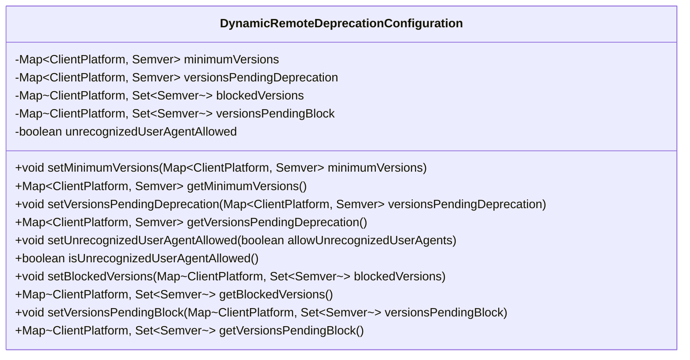

# 基础信息

|      |      |
|------|------|
| 名称 | DynamicRemoteDeprecationConfiguration |
| 编码语言 | .java |
| 代码路径 | Signal-Server/service/src/main/java/org/whispersystems/textsecuregcm/configuration/dynamic/DynamicRemoteDeprecationConfiguration.java |
| 包名 | org.whispersystems.textsecuregcm.configuration.dynamic |
| 依赖项 | ['com.fasterxml.jackson.annotation.JsonProperty', 'com.google.common.annotations.VisibleForTesting', 'com.vdurmont.semver4j.Semver', 'org.whispersystems.textsecuregcm.util.ua.ClientPlatform', 'java.util.Collections', 'java.util.Map', 'java.util.Set'] |
| 概述说明 | 动态远程弃用配置类管理客户端版本和用户代理状态。 |

# 说明

动态远程弃用配置类是一个用于管理客户端平台版本控制和用户代理允许状态的工具。它通过动态调整配置，确保不同版本的客户端平台能够正常运行，同时控制用户代理的访问权限。该工具的核心功能包括版本管理和状态监控，旨在提升系统的兼容性和安全性。通过远程配置，可以灵活应对不同客户端的需求，确保系统的稳定性和用户体验。

# 类列表 Class Summary

| 名称   | 类型  | 说明 |
|-------|------|-------------|
| DynamicRemoteDeprecationConfiguration | class | 动态远程弃用配置类，管理客户端平台版本控制和用户代理允许状态。 |

## 类 DynamicRemoteDeprecationConfiguration

|      |      |
|------|------|
| 访问范围 | public |
| 类型 | class |
| 名称 | DynamicRemoteDeprecationConfiguration |
| 说明 | 动态远程弃用配置类，管理客户端平台版本控制和用户代理允许状态。 |

### UML类图

这段代码定义了一个名为 `DynamicRemoteDeprecationConfiguration` 的类，用于管理客户端平台的版本控制策略。该类包含多个私有属性，分别用于存储最低版本、待弃用版本、已阻止版本和待阻止版本的映射关系，以及一个布尔值用于控制是否允许未识别的用户代理。类中提供了相应的 `getter` 和 `setter` 方法，允许对这些属性进行读取和修改。这些方法主要用于测试和配置管理，确保客户端版本的更新和弃用策略能够灵活调整。

### 内部方法调用关系图

```mermaid
graph TD
    A["类DynamicRemoteDeprecationConfiguration"]
    B["属性: Map<ClientPlatform, Semver> minimumVersions"]
    C["属性: Map<ClientPlatform, Semver> versionsPendingDeprecation"]
    D["属性: Map<ClientPlatform, Set<Semver>> blockedVersions"]
    E["属性: Map<ClientPlatform, Set<Semver>> versionsPendingBlock"]
    F["属性: boolean unrecognizedUserAgentAllowed"]
    G["方法: setMinimumVersions(Map<ClientPlatform, Semver> minimumVersions)"]
    H["方法: getMinimumVersions()"]
    I["方法: setVersionsPendingDeprecation(Map<ClientPlatform, Semver> versionsPendingDeprecation)"]
    J["方法: getVersionsPendingDeprecation()"]
    K["方法: setUnrecognizedUserAgentAllowed(boolean allowUnrecognizedUserAgents)"]
    L["方法: isUnrecognizedUserAgentAllowed()"]
    M["方法: setBlockedVersions(Map<ClientPlatform, Set<Semver>> blockedVersions)"]
    N["方法: getBlockedVersions()"]
    O["方法: setVersionsPendingBlock(Map<ClientPlatform, Set<Semver>> versionsPendingBlock)"]
    P["方法: getVersionsPendingBlock()"]

    A --> B
    A --> C
    A --> D
    A --> E
    A --> F
    A --> G
    A --> H
    A --> I
    A --> J
    A --> K
    A --> L
    A --> M
    A --> N
    A --> O
    A --> P
```

这段代码定义了一个名为`DynamicRemoteDeprecationConfiguration`的类，该类包含多个属性，分别用于存储不同客户端平台的最低版本、待弃用版本、被阻止版本、待阻止版本以及是否允许未识别的用户代理。类中还提供了多个`setter`和`getter`方法，用于设置和获取这些属性的值。这些方法主要用于测试和配置管理，确保在不同环境下能够灵活地调整和获取这些配置信息。

### 字段列表 Field List

| 名称  | 类型  | 说明 |
|-------|-------|------|
| versionsPendingDeprecation = Collections.emptyMap() | Map<ClientPlatform, Semver> | 客户端平台版本待弃用映射初始化为空。 |
| minimumVersions = Collections.emptyMap() | Map<ClientPlatform, Semver> | 该代码定义了一个私有的Map变量，用于存储客户端平台及其对应的最低版本号。 |
| blockedVersions = Collections.emptyMap() | Map<ClientPlatform, Set<Semver>> | 该代码定义了一个私有映射，存储被阻止的客户端平台及其版本集合。 |
| unrecognizedUserAgentAllowed = true | boolean | 允许未识别用户代理的布尔属性设为真。 |
| versionsPendingBlock = Collections.emptyMap() | Map<ClientPlatform, Set<Semver>> | 属性`versionsPendingBlock`存储待阻止的客户端平台与版本集合的映射。 |

### 方法列表 Method List

| 名称  | 类型  | 说明 |
|-------|-------|------|
| getMinimumVersions | Map<ClientPlatform, Semver> | 获取客户端平台与最低版本号的映射关系。 |
| isUnrecognizedUserAgentAllowed | boolean | 该方法返回是否允许未识别的用户代理。 |
| setBlockedVersions | void | 公开测试方法，设置客户端平台与版本号的映射。 |
| setMinimumVersions | void | 公开方法用于设置客户端平台的最低版本映射。 |
| setUnrecognizedUserAgentAllowed | void | 测试可见方法，设置是否允许未知用户代理。 |
| setVersionsPendingDeprecation | void | 测试可见方法，设置待弃用版本映射。 |
| getVersionsPendingDeprecation | Map<ClientPlatform, Semver> | 该方法返回待弃用版本的客户端平台与版本号映射。 |
| getBlockedVersions | Map<ClientPlatform, Set<Semver>> | 方法返回被阻止的客户端平台及其版本集合。 |
| setVersionsPendingBlock | void | 公开方法用于设置待阻止版本的映射关系。 |
| getVersionsPendingBlock | Map<ClientPlatform, Set<Semver>> | 获取待阻止版本映射，返回客户端平台与版本集合的对应关系。 |

