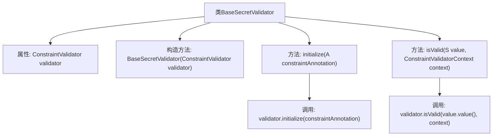

# 基础信息

|      |      |
|------|------|
| 名称 | BaseSecretValidator |
| 编码语言 | .java |
| 代码路径 | Signal-Server/service/src/main/java/org/whispersystems/textsecuregcm/configuration/secrets/BaseSecretValidator.java |
| 包名 | org.whispersystems.textsecuregcm.configuration.secrets |
| 依赖项 | ['java.util.Objects.requireNonNull', 'jakarta.validation.ConstraintValidator', 'jakarta.validation.ConstraintValidatorContext', 'java.lang.annotation.Annotation'] |
| 概述说明 | BaseSecretValidator类实现ConstraintValidator接口，封装验证逻辑并委托内部处理。 |

# 说明

BaseSecretValidator类通过实现ConstraintValidator接口，封装了具体的验证逻辑，并将实际的验证任务委托给内部的validator进行处理。这种方式使得验证逻辑更加模块化和可复用，便于维护和扩展。

# 类列表 Class Summary

| 名称   | 类型  | 说明 |
|-------|------|-------------|
| BaseSecretValidator | class | BaseSecretValidator类实现ConstraintValidator接口，封装验证逻辑并委托给内部validator处理。 |


## 类 BaseSecretValidator

|      |      |
|------|------|
| 访问范围 | public abstract |
| 类型 | class |
| 名称 | BaseSecretValidator |
| 说明 | BaseSecretValidator类实现ConstraintValidator接口，封装验证逻辑并委托给内部validator处理。 |


### UML类图

```mermaid
classDiagram
    class BaseSecretValidator~A extends Annotation, T, S extends Secret~? extends T~~ {
        -ConstraintValidator~A, T~ validator
        +BaseSecretValidator(ConstraintValidator~A, T~ validator)
        +void initialize(A constraintAnnotation)
        +boolean isValid(S value, ConstraintValidatorContext context)
    }
    class ConstraintValidator~A, T~ <<Interface>> {
        +void initialize(A constraintAnnotation)
        +boolean isValid(T value, ConstraintValidatorContext context)
    }
    class Secret~T~ <<Interface>> {
        +T value()
    }
    BaseSecretValidator --> ConstraintValidator : 依赖
    BaseSecretValidator --> Secret : 依赖
```

类图描述：`BaseSecretValidator` 是一个抽象泛型类，实现了 `ConstraintValidator` 接口。它依赖于 `ConstraintValidator` 和 `Secret` 接口，用于验证 `Secret` 类型的值。`BaseSecretValidator` 通过构造函数接收一个 `ConstraintValidator` 实例，并在 `isValid` 方法中使用该实例来验证 `Secret` 的值。


### 内部方法调用关系图



该流程图描述了`BaseSecretValidator`类的结构和主要方法调用关系。`BaseSecretValidator`是一个泛型抽象类，包含一个`ConstraintValidator`类型的属性`validator`。构造方法接收并初始化该属性。`initialize`方法调用`validator`的`initialize`方法，而`isValid`方法则调用`validator`的`isValid`方法，并传入`value`的值。整体流程展示了类内部方法的依赖关系和调用顺序。

### 字段列表 Field List

| 名称  | 类型  | 说明 |
|-------|-------|------|
| validator | ConstraintValidator<A, T> | 私有常量约束验证器，用于验证类型T的属性A。 |

### 方法列表 Method List

| 名称  | 类型  | 说明 |
|-------|-------|------|
| isValid | boolean | 重写方法验证给定值是否有效。 |
| initialize | void | 重写initialize方法，调用validator的initialize方法。 |


