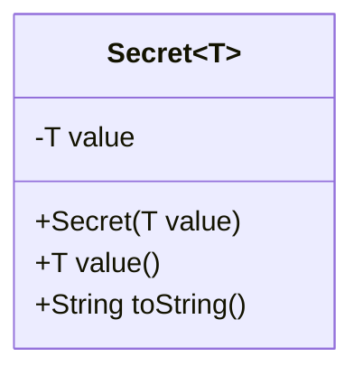
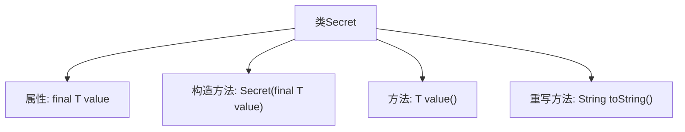

# 基础信息

|      |      |
|------|------|
| 名称 | Secret |
| 编码语言 | .java |
| 代码路径 | Signal-Server/service/src/main/java/org/whispersystems/textsecuregcm/configuration/secrets/Secret.java |
| 包名 | org.whispersystems.textsecuregcm.configuration.secrets |
| 依赖项 | [] |
| 概述说明 | 泛型类Secret封装值，支持访问和隐藏显示功能。 |

# 说明

定义了一个名为Secret的泛型类，用于封装值并提供访问和隐藏显示功能。该类允许用户通过特定方法获取封装的值，同时也支持隐藏值的显示，确保数据的安全性和隐私性。通过泛型设计，Secret类可以灵活地处理不同类型的数据，增强了代码的通用性和可复用性。

# 类列表 Class Summary

| 名称   | 类型  | 说明 |
|-------|------|-------------|
| Secret | class | 定义了一个泛型类Secret，封装值并提供访问和隐藏显示功能。 |

## 类 Secret

|      |      |
|------|------|
| 访问范围 | public |
| 类型 | class |
| 名称 | Secret |
| 说明 | 定义了一个泛型类Secret，封装值并提供访问和隐藏显示功能。 |

### UML类图

这段代码定义了一个泛型类 `Secret<T>`，用于封装一个私有的、不可变的值 `value`。类提供了构造函数用于初始化 `value`，并提供了一个公有方法 `value()` 用于获取该值。`toString()` 方法被重写，返回固定的字符串 `"[REDACTED]"`，隐藏了实际值的细节。这个类适用于需要对外隐藏内部数据的情况。

### 内部方法调用关系图

这段代码定义了一个泛型类 `Secret<T>`，包含一个私有且不可变的属性 `value`，一个构造方法用于初始化该属性，一个方法 `value()` 用于返回 `value`，以及重写的 `toString()` 方法，该方法始终返回 `"[REDACTED]"`。流程图展示了类的结构及其内部方法之间的关系。

### 字段列表 Field List

| 名称  | 类型  | 说明 |
|-------|-------|------|
| value | T | 私有不可变的T类型变量value。 |

### 方法列表 Method List

| 名称  | 类型  | 说明 |
|-------|-------|------|
| value | T | 该方法返回类型为T的value值。 |
| toString | String | 重写toString方法，返回"[REDACTED]"字符串。 |

