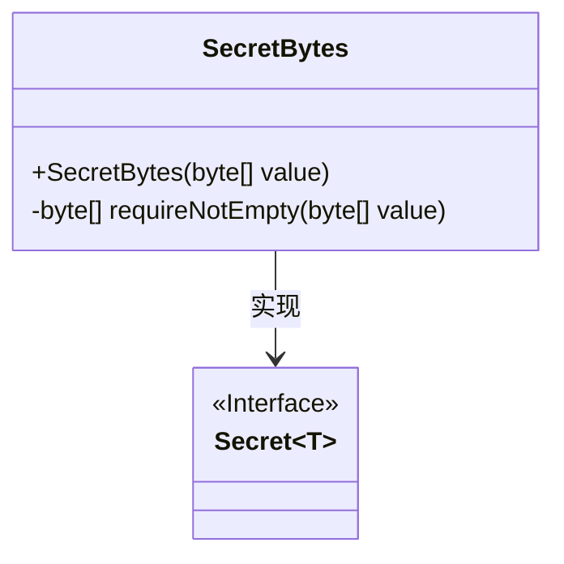
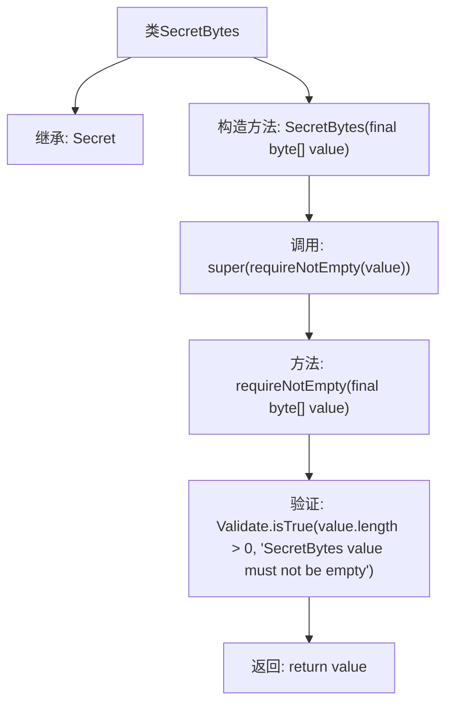

# 基础信息

|      |      |
|------|------|
| 名称 | SecretBytes |
| 编码语言 | .java |
| 代码路径 | Signal-Server/service/src/main/java/org/whispersystems/textsecuregcm/configuration/secrets/SecretBytes.java |
| 包名 | org.whispersystems.textsecuregcm.configuration.secrets |
| 依赖项 | ['org.apache.commons.lang3.Validate'] |
| 概述说明 | SecretBytes类继承Secret，确保字节数组非空。 |

# 说明

SecretBytes类继承自Secret类，其主要功能是确保字节数组非空。通过继承关系，SecretBytes类继承了Secret类的属性和方法，同时增加了对字节数组非空性的验证，以确保数据的完整性和安全性。这种设计使得SecretBytes类在处理敏感数据时更加可靠和健壮。

# 类列表 Class Summary

| 名称   | 类型  | 说明 |
|-------|------|-------------|
| SecretBytes | class | SecretBytes类继承Secret，确保字节数组非空。 |

## 类 SecretBytes

|      |      |
|------|------|
| 访问范围 | public |
| 类型 | class |
| 名称 | SecretBytes |
| 说明 | SecretBytes类继承Secret，确保字节数组非空。 |

### UML类图

这段代码定义了一个 `SecretBytes` 类，它继承自泛型类 `Secret`，并且 `Secret` 是一个接口。`SecretBytes` 类包含一个构造函数 `SecretBytes`，它接受一个 `byte[]` 类型的参数，并通过 `requireNotEmpty` 方法确保传入的字节数组不为空。`requireNotEmpty` 方法是一个私有方法，用于验证字节数组的长度是否大于0，如果为空则抛出异常。`SecretBytes` 类实现了 `Secret` 接口，表明它遵循了 `Secret` 接口的规范。

### 内部方法调用关系图

这段代码定义了一个名为 `SecretBytes` 的类，它继承自 `Secret<byte[]>`。类的构造方法 `SecretBytes` 接受一个 `byte[]` 类型的参数，并通过调用 `requireNotEmpty` 方法确保传入的字节数组不为空。`requireNotEmpty` 方法使用 `Validate.isTrue` 进行验证，如果数组为空则抛出异常，否则返回该数组。这段代码的主要作用是确保 `SecretBytes` 对象的初始值不为空。

### 字段列表 Field List

| 名称  | 类型  | 说明 |
|-------|-------|------|

### 方法列表 Method List

| 名称  | 类型  | 说明 |
|-------|-------|------|
| requireNotEmpty | byte[] | 检查字节数组非空，若为空则抛出异常。 |

