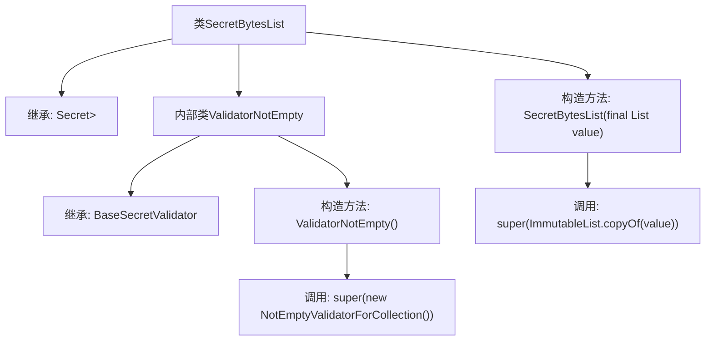

# 基础信息

|      |      |
|------|------|
| 名称 | SecretBytesList |
| 编码语言 | .java |
| 代码路径 | Signal-Server/service/src/main/java/org/whispersystems/textsecuregcm/configuration/secrets/SecretBytesList.java |
| 包名 | org.whispersystems.textsecuregcm.configuration.secrets |
| 依赖项 | ['com.google.common.collect.ImmutableList', 'jakarta.validation.constraints.NotEmpty', 'java.util.Collection', 'java.util.List', 'org.hibernate.validator.internal.constraintvalidators.bv.notempty.NotEmptyValidatorForCollection'] |
| 概述说明 | SecretBytesList继承Secret，存储字节列表并验证非空。 |

# 说明

SecretBytesList类继承自Secret类，专门用于存储字节列表数据。该类包含一个非空验证器，确保存储的字节列表不为空。通过继承Secret类，SecretBytesList继承了Secret的安全性和隐私保护特性，同时增加了对字节列表的特定处理能力。非空验证器的存在进一步增强了数据的完整性和可靠性，确保在使用过程中不会出现空值问题。

# 类列表 Class Summary

| 名称   | 类型  | 说明 |
|-------|------|-------------|
| SecretBytesList | class | SecretBytesList类继承Secret，存储字节列表，包含非空验证器。 |


## 类 SecretBytesList

|      |      |
|------|------|
| 访问范围 | public |
| 类型 | class |
| 名称 | SecretBytesList |
| 说明 | SecretBytesList类继承Secret，存储字节列表，包含非空验证器。 |


### UML类图

```mermaid
classDiagram
    class Secret~T~ {
        <<Interface>>
    }

    class SecretBytesList {
        +SecretBytesList(List~byte[]~ value)
    }

    class BaseSecretValidator~A, B, C~ {
        <<Interface>>
    }

    class ValidatorNotEmpty {
        +ValidatorNotEmpty()
    }

    class NotEmpty {
    }

    class NotEmptyValidatorForCollection {
    }

    SecretBytesList --> Secret~List~byte[]~~ : 继承
    ValidatorNotEmpty --> BaseSecretValidator~NotEmpty, Collection, SecretBytesList~ : 继承
    ValidatorNotEmpty --> NotEmptyValidatorForCollection : 依赖
```

**描述**：`SecretBytesList` 是一个继承自 `Secret<List<byte[]>>` 的类，用于存储字节列表。它包含一个内部类 `ValidatorNotEmpty`，该类继承自 `BaseSecretValidator`，并依赖于 `NotEmptyValidatorForCollection` 进行验证。`ValidatorNotEmpty` 用于确保集合不为空。整体设计通过泛型和接口实现了灵活的类型安全验证机制。


### 内部方法调用关系图



这段代码定义了一个名为`SecretBytesList`的类，它继承自`Secret<List<byte[]>>`。该类包含一个内部类`ValidatorNotEmpty`，继承自`BaseSecretValidator`，并在其构造方法中调用了父类的构造方法。`SecretBytesList`类本身也有一个构造方法，用于初始化其父类，并确保传入的`List<byte[]>`是不可变的。整体结构展示了类的继承关系和内部类的调用逻辑。

### 字段列表 Field List

| 名称  | 类型  | 说明 |
|-------|-------|------|

### 方法列表 Method List

| 名称  | 类型  | 说明 |
|-------|-------|------|


